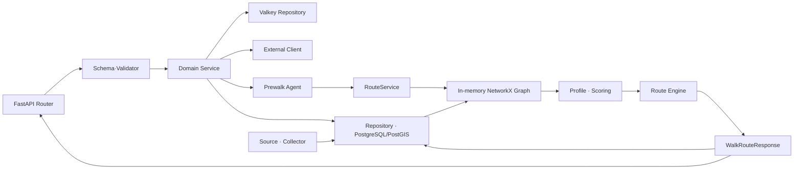

# ROUDI 백엔드 시스템 구조

> 상태: Current  
> 기준일: 2026-07-26  
> 관련 코드: `src/main.py`, `src/interfaces/`, `src/service/`, `src/agent/`, `src/route_engine/`, `src/data/`, `src/repository/`, `src/infrastructure/`, `scripts/`, `tests/`, `benchmarks/`

이 문서는 현재 구현된 ROUDI 백엔드의 작업 단위와 연결 경계를 설명합니다.
미래 구조를 제안하지 않으며 `frontend/`는 조사·문서화 범위에 포함하지 않습니다.

## 1. 책임

ROUDI 백엔드는 다음 작업을 담당합니다.

1. FastAPI 요청 수신과 요청·응답 스키마 검증
2. Kakao 로그인, JWT 발급·검증과 refresh token 관리
3. 사용자 정보, 온보딩 설문과 경로 기록 관리
4. 좌표의 서울 범위·수계·고속도로 여부 검증
5. 지도 Layer와 주변 시설 조회
6. 날씨·대기질과 배너 데이터 조합
7. 대화 State를 기반으로 한 산책 조건 수집
8. PostGIS 도보 네트워크를 이용한 경로 생성
9. 원본 데이터의 RAW·Layer·Score·NODE·LINK 적재
10. 단위·통합 테스트와 경로 알고리즘 벤치마크

다음은 현재 책임에 포함하지 않습니다.

- `frontend/`의 화면, 상태 관리와 백엔드 호출 코드
- 아직 구현되지 않은 이상적 아키텍처
- `analysis/`의 실험 과정과 판단 근거

## 2. 입력

| 입력 종류 | 대표 입력 | 처음 받는 영역 |
|---|---|---|
| HTTP 요청 | 쿠키, JSON body, query/path parameter | `src/interfaces/api/` |
| 환경변수 | PostgreSQL, Valkey, Kakao, 공공데이터, OpenAI, JWT, LangSmith 설정 | `src/config/settings.py`, 각 infrastructure client |
| 관계형 데이터 | 사용자, 선호도, 채팅 세션, 경로 기록, 배너, RAW, Layer, NODE·LINK | `src/repository/` |
| 캐시 데이터 | refresh token, 직렬화된 챗봇 `State` | `src/infrastructure/cache/` |
| 로컬 원본 | 도보 네트워크 CSV, 공원 Shapefile 등 | `src/data/sources/csv_source.py`, 각 Collector |
| 외부 응답 | Kakao 장소·주소, 기상청 날씨, AirKorea 대기질, OpenAI 응답, 마라톤 일정 | `src/infrastructure/external/` |
| 경로 요청 | 출발지, 목적지, 목표 거리, `WalkMode`, `ScoringProfile`, 가중치 | `src/service/route/route_service.py` |
| 대화 입력 | `thread_id`, 사용자 발화, 저장된 `State` | `src/service/chat/prewalk_service.py` |
| 검증 입력 | pytest fixture, API 요청, fixture graph, solver와 benchmark parameter | `tests/`, `benchmarks/` |

## 3. 출력

| 출력 종류 | 대표 출력 | 사용하는 다음 영역 |
|---|---|---|
| API 응답 | 인증 상태, 사용자 정보, 지도 데이터, 배너, 날씨, 챗봇 State, 경로 좌표 | API 호출자 |
| 인증 상태 | access JWT, refresh JWT, `Status` | Router, 사용자·경로·챗봇 서비스 |
| 영속 상태 | PostgreSQL row, Valkey key | 서비스와 다음 HTTP 요청 |
| 표준 그래프 | node/edge 속성을 가진 `networkx.Graph` | Scoring·경로 엔진 |
| 경로 결과 | `WalkRouteResponse(status, mode, coordinates, total_km, id)` | 직접 경로 API, 챗봇, 경로 기록 |
| 적재 결과 | RAW·Layer·Score·NODE·LINK 테이블 변경 | 지도 조회, 좌표 검증, 그래프 로딩 |
| 검증 결과 | pytest 성공·실패, benchmark 지표와 CSV | 개발자와 알고리즘 비교 작업 |

## 4. 실행 진입점

### 4.1 서버

서버의 코드 진입점은 `src/main.py`의 `app`과 `lifespan()`입니다.

시작 순서는 다음과 같습니다.

```text
설정 import와 LangSmith 환경변수 반영
→ 로깅 설정
→ init_db()
→ Banner seed
→ GraphRepository.load_graph()
→ RouteService 생성
→ PrewalkOrchestrator와 LangGraph 생성
→ HTTP 요청 수신
```

`src/interfaces/dependencies.py`는 서비스와 외부 client를 모듈 전역 싱글톤으로 보관합니다. `RouteService`와 `PrewalkOrchestrator`는 전체 그래프가 필요한 관계로 lifespan 안에서 늦게 초기화됩니다.

### 4.2 API

| 영역 | prefix 또는 경로 | Router | 다음 작업 단위 |
|---|---|---|---|
| 상태 확인 | `/`, `/api/health` | `src/main.py`, `health_router.py` | PostgreSQL health check |
| 인증 | `/api/auth` | `auth_router.py` | `AuthService`, Valkey |
| Kakao 로그인 | `/api/login` | `login_router.py` | `KakaoLoginService`, Kakao, 사용자 저장소, Valkey |
| 사용자 | `/api/user` | `user_router.py` | 사용자·선호도·경로 기록 저장소 |
| 날씨 | `/api/weather` | `weather_router.py` | `WeatherClient` |
| 배너 | `/api/banner` | `banner_router.py` | `BannerService`, DB, 날씨, 마라톤 |
| 지도 | `/api/map` | `map_router.py` | `MapService`, Kakao, Layer·Edge 저장소 |
| 직접 경로 | `/api/walk/route` | `walk_router.py` | 좌표 검증, `RouteService`, 경로 엔진 |
| 챗봇 | `/api/prewalk` | `prewalk_router.py` | 좌표 검증, `PrewalkOrchestrator` |

HTTP 필드 계약은 `src/interfaces/schema/`, 서비스 내부 경로·대화 계약은 `src/schema/`에 있습니다.

### 4.3 데이터 적재

| 진입점 | 범위 | 결과 |
|---|---|---|
| `src/data/source_collector.py` | `v1` 또는 `legacy-all` RAW | V1은 외부 RAW 적재를 건너뜀. Legacy는 OSM·Kakao·공공데이터·CSV RAW 적재 |
| `src/data/data_collector.py` | `v1` 또는 `legacy-all` 도메인 데이터 | NODE·LINK, Layer, Score, 경계·수계 적재 |
| `BaseNetworkCollector.upsert()` | 증분 네트워크 갱신 | 원본 필드를 갱신하고 기존 score와 사라진 행을 보존 |
| `BaseNetworkCollector.rebuild()` | 전체 네트워크 교체 | NODE·LINK와 기존 score를 삭제한 뒤 원본 스냅샷 적재 |
| 각 Collector의 `save()` | 개별 데이터셋 | Layer 저장과 관련 LINK score 갱신 |

현재 V1은 도보 네트워크, 공원 Polygon, 서울 행정 경계와 수계를 실행합니다. 나머지 자연·안전·어린이·랜드마크·러닝 Collector는 `legacy-all` 영역입니다.

### 4.4 운영·검증

| 진입점 | 역할 |
|---|---|
| `scripts/stage_raw_data.py` | 다운로드한 원본을 `src/data/raw/`에 배치 |
| `scripts/migrate_weights_baseline.py` | 기존 사용자 가중치의 의미를 일회성 변환 |
| `scripts/insert_test_route_history.py` | 수동 확인용 사용자·경로 기록 생성 |
| `tests/` | API, 서비스, Collector, Graph, Scoring, 경로 엔진 검증 |
| `benchmarks/benchmark.py` | solver 실행 격리, 시간·거리·형상 지표 수집 |
| `benchmarks/build_fixtures.py` | DB 그래프를 benchmark fixture로 생성 |

실행 명령과 정상 결과는 실제 실행 확인 후 `docs/operations/`에서 관리합니다.

## 5. 의존하는 영역

### 5.1 내부 작업 단위

| 작업 단위 | 실제 코드 | 직접 의존 |
|---|---|---|
| 서버 조립 | `src/main.py`, `src/interfaces/dependencies.py` | 설정, DB 초기화, GraphRepository, 모든 Router·Service |
| API 계약·검증 | `src/interfaces/schema/`, `src/interfaces/validators/` | Pydantic, PostGIS session |
| 인증·로그인 | `src/service/user/auth_service.py`, `login_service.py` | 사용자 저장소, Valkey, Kakao OAuth |
| 사용자·설문 | `src/service/user/user_service.py`, `survey_service.py` | 인증, 사용자·선호도 저장소, `Weights` |
| 좌표 보호 | `src/interfaces/validators/` | 서울 경계, 수계, 도보 NODE·LINK PostGIS 데이터 |
| 지도 조회 | `src/service/route/map_service.py` | Kakao client, Layer·Edge 저장소 |
| 배너 | `src/service/route/banner_service.py` | 배너 저장소, 날씨 client, 마라톤 client |
| 챗봇 | `src/service/chat/prewalk_service.py`, `src/agent/` | 인증, PostgreSQL 세션, Valkey State, LLM, Kakao, 경로 서비스 |
| 경로 서비스 | `src/service/route/route_service.py` | 인증, 메모리 Graph, 경로 엔진, 경로 기록 |
| 그래프 | `src/repository/network/graph_repository.py` | PostGIS NODE·LINK, PathUtils |
| 경로 엔진 | `src/route_engine/` | NetworkX Graph, profile, score, schema |
| 데이터 | `src/data/` | 원본, 외부 client, RAW·Layer·Network 저장소 |

### 5.2 외부 런타임

| 의존성 | 사용 영역 | 중단 시 현재 영향 |
|---|---|---|
| PostgreSQL/PostGIS | 거의 모든 영속 데이터, 좌표 검증, 그래프 로딩 | 시작 실패 또는 해당 API·적재 실패 |
| Valkey | refresh token, 챗봇 State | token 갱신·로그아웃 또는 대화 지속 실패 |
| Kakao API | OAuth, 주소 변환, 장소 검색 | 로그인·지도 시설·챗봇 장소 보완·대기 측정소 탐색 영향 |
| 기상청·AirKorea API | 날씨·대기질 | 날씨 API 영향, 챗봇·배너 일부 fallback |
| OpenAI API | 챗봇 인사·추출·질문 | 챗봇 품질 저하 또는 현재 State 유지 |
| 마라톤 웹사이트 | 이벤트 배너 | 이벤트 배너만 생략 |
| 로컬 RAW 파일 | V1·Legacy 적재 | 해당 Collector 시작 또는 파싱 실패 |

## 6. 결과를 전달하는 영역

### 6.1 전체 연결



### 6.2 직접 경로 흐름

```text
WalkRouteRequest
→ Pydantic 좌표·거리·모드 검증
→ PostGIS 서울 경계 검증
→ 수계 좌표 snap
→ 고속도로·전용도로 차단
→ access token 검증
→ 모드별 엔진 선택
→ profile과 custom weights 병합
→ edge custom_score 계산
→ 경로 탐색과 좌표 직렬화
→ 성공 경로 기록 저장
→ WalkRouteResponse
```

현재 API에 연결된 엔진은 다음 세 개입니다.

| `WalkMode` | 활성 엔진 |
|---|---|
| `circular_random` | `CircularBeamEngine` |
| `oneway_shortest` | `OnewayDijkstraEngine` |
| `oneway_random` | `OnewayBeamEngine` |

RCSP·GRASP·ALNS 계열은 코드와 benchmark에는 존재하지만 `RouteService.base_engines`에 연결되지 않은 대안 알고리즘입니다.

### 6.3 챗봇 경로 흐름

```text
init 요청
→ 사용자 인증
→ PostgreSQL ChatSession 생성
→ 날씨·대기질과 현재 주소 조회
→ 초기 State를 Valkey에 저장

intent 요청
→ State 조회
→ State 사용자와 token 사용자 일치 확인
→ Extractor: 모드·장소·테마 추출
→ Interviewer: 누락 정보 질문 또는 장소 후보 보완
→ 경로 조건 확인 대기
→ 긍정 응답 시 RouteExecutor 직접 실행
→ 사용자 설문 가중치 + 대화 테마 가중치
→ RouteTool → RouteService → 활성 경로 엔진
→ 최종 State를 Valkey에 저장
```

### 6.4 데이터에서 런타임 그래프까지

```text
원본 파일·외부 데이터
→ Source
→ RAW Repository
→ Collector
→ Layer·NODE·LINK Repository
→ PostgreSQL/PostGIS
→ 서버 시작 시 GraphRepository.load_graph()
→ 최대 연결 컴포넌트 선택·막다른 노드 제거
→ RouteService의 메모리 Graph
```

DB 적재 후 실행 중인 서버의 Graph는 자동으로 갱신되지 않습니다. 새로운 NODE·LINK·Score를 경로 생성에 반영하는 현재 연결 지점은 서버 재시작입니다.

## 7. 변경 시 영향 범위

| 변경 대상 | 함께 확인할 영역 |
|---|---|
| HTTP 요청·응답 필드 | Router, `src/interfaces/schema/`, 서비스, API 통합 테스트, 호출자 계약 |
| JWT payload·cookie·만료 | Auth/Login Service, Valkey key, 모든 인증 사용 API |
| `State` 필드 | PrewalkOrchestrator, Node, Tool, Valkey 직렬화, `ChatResponse` |
| `WalkMode` | API schema, ModeTool, RouteTool, RouteService engine map, 엔진 응답, 경로 기록 |
| `Weights`·태그 | survey baseline, `TAG_WEIGHT_MAP`, RouteExecutor, profile, scoring formula, DB preference |
| Graph node/edge 필드 | Entity, Collector, Repository, graph contract, scoring, 모든 엔진, fixture |
| LINK score 산식 | Layer 원본, Collector, Repository, ScoringEngine, profile, 회귀 테스트 |
| 좌표 검증 규칙 | API schema, validator, 경계·수계·NODE/LINK 적재, walk/prewalk Router |
| DB entity 컬럼 | startup `init_db()`, Repository, migration·복구 절차 |
| V1 데이터 범위 | `source_collector.py`, `data_collector.py`, 데이터 문서, rebuild 절차 |
| 외부 API 응답 schema | external schema/client, Service·Agent, fallback과 mock |
| 활성 엔진 | RouteService, RouteTool, benchmark, 경로 상태와 품질 검증 |

## 8. 실패·복구 방법

| 실패 지점 | 현재 동작 | 현재 복구 경계 |
|---|---|---|
| DB 연결·초기화 실패 | 서버 startup 또는 DB 사용 API 실패 | PostgreSQL·환경변수·스키마를 복구한 뒤 서버 재시작 |
| DB entity 불일치 | startup이 컬럼을 추가하거나 entity에 없는 컬럼을 삭제 | 시작 전 백업 필요. 자동 동기화 결과 확인 후 복구 |
| 그래프가 없거나 로드 실패 | RouteService·Prewalk 초기화 또는 경로 탐색 실패 가능 | NODE·LINK 적재 확인 후 서버 재시작 |
| 네트워크 `upsert` 실패 | 트랜잭션 rollback | 원본과 오류 행을 수정하고 재실행 |
| 네트워크 `rebuild` 실패 | 한 트랜잭션 안의 삭제·삽입은 rollback | DB 상태 확인 후 재실행. 성공 시 활성 Layer·Score 재적재 |
| Valkey refresh token 없음 | refresh 검증 실패 | 다시 로그인하여 token 재생성 |
| 챗봇 State 없음·TTL 만료 | `session_not_found` | `/api/prewalk/init`부터 새 세션 시작 |
| 챗봇 날씨·주소 실패 | 기본 인사 또는 좌표만 있는 Location 사용 | 다음 요청에서 계속 가능하나 장소 정보 보완 필요 |
| 챗봇 LLM·Tool 실패 | State 유지, fallback 응답 또는 `internal_error` | 같은 세션 재시도 또는 새 세션 시작 |
| 경로 없음 | `no_nearest_*` 또는 `no_path` 상태 반환 | 좌표·데이터·그래프 연결성 확인 후 재요청 |
| 경로 이력 저장 실패 | 경로 응답은 성공, `id`는 없을 수 있음 | 로그 확인 후 별도 재저장 또는 재요청 |
| 날씨·마라톤 실패 | 배너는 가능한 항목만 반환 | 외부 서비스 복구 후 다음 요청에서 자동 재시도 |
| 지도 Layer 없음 | 빈 결과 또는 해당 조회 실패 | Layer 적재 여부와 공간 인덱스 확인 |

현재 `/api/health`는 PostgreSQL 연결만 검사합니다. Valkey, Graph, 외부 API 상태는 포함하지 않습니다.

현재 코드에서 별도 확인이 필요한 연결은 다음과 같습니다.

- `RunningCourseCollector.update_outdoor_exercise()`가 호출하는 `RunningRepository.is_course_type_populated()`는 현재 저장소 구현에서 확인되지 않습니다.
- 루트 `README.md`의 Streamlit `app.py` 실행 안내는 현재 FastAPI 진입점과 일치하지 않습니다.
- 일부 API 통합 테스트는 현재 `AuthService` 메서드 인자 계약과 다른 과거 호출 형태를 포함합니다.

## 9. 검증 방법

검증은 작업 단위의 변경 범위에 맞춰 선택합니다.

| 검증 대상 | 현재 검증 위치 | 확인할 결과 |
|---|---|---|
| 인증 | `tests/unit/test_auth_service.py` | JWT 상태, 만료, refresh token |
| 설문·가중치 | `tests/unit/test_survey_service.py` | baseline, 태그 delta, 저장 계약 |
| V1 적재 범위 | `tests/unit/test_data_collector_scope.py` | V1과 Legacy 실행 경계 |
| 도보 원본 파싱 | `tests/unit/test_base_collector.py` | NODE·LINK와 원본 flag 변환 |
| Graph | `tests/unit/test_graph_repository.py`, `test_graph_filter.py` | 표준 속성, 필터링, 연결 그래프 |
| Scoring·Profile | `tests/unit/test_scoring_engine.py`, `tests/unit/test_scoring_engine_regression.py`, `tests/unit/test_profiles.py` | 점수 공식, 회귀, profile 병합 |
| 경로 엔진·서비스 | `tests/unit/test_path_utils.py`, `test_oneway_random.py`, `test_routue_service.py` | 노드 탐색, 거리, 실패 상태, 엔진 연결 |
| 배너 | `tests/unit/test_banner_service.py` | 우선순위와 외부 실패 fallback |
| API | `tests/integration/test_api.py` | HTTP status와 response schema |
| 알고리즘 품질 | `benchmarks/tests/`, `benchmarks/benchmark.py` | 시간 제한, 목표 거리 오차, 폐곡선, spike, edge 중복 |

테스트 파일의 존재를 현재 통과 확인으로 간주하지 않습니다. 실제 실행 명령, 필요한 PostgreSQL·Valkey·fixture와 정상 결과는 `docs/operations/testing.md`에서 관리합니다.

## 10. 완료 기준

이 시스템 구조 문서는 다음 조건을 만족할 때 현재 코드와 일치합니다.

- 서버 startup부터 API·Service·Repository·외부 시스템까지의 연결이 포함되어 있다.
- 직접 경로와 챗봇 경로가 같은 `RouteService`로 합류하는 사실이 드러난다.
- V1과 `legacy-all`, 활성 엔진과 대안 엔진이 구분되어 있다.
- PostgreSQL 영속 상태, Valkey 임시 상태와 메모리 Graph의 수명이 구분되어 있다.
- 주요 입력·출력·실패·복구·변경 영향·검증 위치가 기록되어 있다.
- `frontend/` 내용을 포함하지 않는다.
- 상세 계약은 각 영역 문서로 연결하고 이 문서에 중복 정의하지 않는다.

startup, 로그인, 직접 경로, 챗봇 경로, 지도 조회, V1 적재의 단계별 성공·실패 분기는 [전체 Workflow 지도](system_workflows.md)와 개별 Workflow에서 관리합니다.
