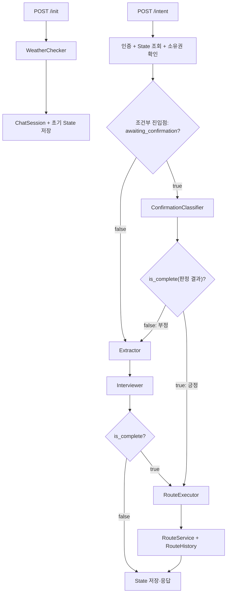

# 챗봇 Agent 하네스

> 상태: Current  
> 기준일: 2026-08-07  
> 관련 코드: `src/agent/`, `src/service/chat/prewalk_service.py`, `src/schema/prewalk_schema.py`  
> 검증 상태: 코드 정적 대조 완료(2026-07-30, `ConfirmationClassifier` 추가·Graph 재배선·dev PR #310 profile/nearby_pois 반영) + `ConfirmationClassifier`·조건부 진입점 실행 검증 완료(2026-07-30, 로컬 PostgreSQL·Valkey·실제 Kakao·OpenAI, 프런트엔드 연동 안드로이드 기기 테스트). profile/nearby_pois(dev PR #310)는 정적 대조만 했고 격리 환경 실행 검증은 별도로 안 함. GPS Art 모드 배선(2026-08-06)은 정적 대조·문법 체크만 했고 실행 검증은 안 함(전용 테스트도 아직 없음) — 상세는 [경로 생성 엔진 GPS Art](../route_engine/README.md#gps-art) 참고. Waypoint 모드 배선(2026-08-07)은 정적 대조 + 단위 테스트(mock 엔진 기반)까지 확인했고, 추출·인터뷰 prompt 가이드(2026-08-07 추가)도 정적 대조(YAML 파싱·렌더링 확인)만 했다 — 실제 LLM·Kakao·그래프 실행 검증은 아직 없다 — 상세는 [경로 생성 엔진](../route_engine/README.md) 참고

## 1. 책임

이 문서는 현재 챗봇의 파일 구조와 State·Node·Edge·Tool 계약을 정의한다. 사람이나 AI가 한 구성요소를 변경할 때 입력·출력·연결·저장·검증 범위를 찾는 기준이다.

미래 업그레이드 방향은 다루지 않는다. 현재 흐름의 실행 증거는 [챗봇 경로 추천 Workflow](../architecture/workflows/prewalk_conversation.md)에서 관리한다.

## 2. 입력

HTTP 입력:

| 진입점 | 입력 |
|---|---|
| `POST /api/prewalk/init` | `lat`, `lon`, `access_token` cookie |
| `POST /api/prewalk/intent` | `thread_id`, 공백이 아닌 `user_prompt`, `access_token` cookie |

공유 `State` 계약:

| 필드 | 최초 작성자 | 주요 소비·변경 주체 |
|---|---|---|
| `user_id` | Orchestrator init | 소유권 확인, `RouteExecutor` |
| `current_location` | Orchestrator init | `Extractor`, `Interviewer` |
| `access_token` | intent Orchestrator | `RouteExecutor` → `RouteService` |
| `user_prompt` | intent Orchestrator | `Extractor`, `Interviewer` |
| `mode` | `Extractor` | `RouteExecutor` |
| `user_context` | `Extractor` | `Interviewer`, `RouteExecutor` |
| `origin_candidate` | `Interviewer` | 다음 `Interviewer`(첫 번째 후보 자동 확정용) |
| `destination_candidate` | `Interviewer` | 다음 `Interviewer`(첫 번째 후보 자동 확정용) |
| `waypoint_candidates` | `Interviewer` | 다음 `Interviewer`(경유지 인덱스별 첫 번째 후보 자동 확정용, `waypoint` 모드 전용) |
| `themes` | `Extractor` | `RouteExecutor` 가중치 |
| `profile` | API State 또는 `RouteExecutor` | 명시값 우선, 없으면 테마에서 결정 |
| `awaiting_confirmation` | `Interviewer`(True로 설정)·`ConfirmationClassifier`(False로 해제) | 다음 intent의 Graph 진입점 분기(`ConfirmationClassifier` vs `Extractor`) |
| `is_complete` | `Interviewer`·`ConfirmationClassifier` | Graph 분기(`RouteExecutor` 진입 여부)·완료 상태 |
| `response` | 각 대화 Node·Orchestrator | `ChatResponse.state` |
| `route_result` | `RouteExecutor` | API 응답·Valkey 저장 |

`user_context`는 모드에 따라 `CircularPreference`, `OnewayPreference`, `OnewayShortestPreference`, `GPSArtPreference`, `WayPointPreference` 중 하나다.

명시 `profile`이 없으면 `유모차`·`계단이 불편한` 테마는 내부 `accessible`,
`활기찬`·`힙한` 테마는 `convenient`를 선택한다. 접근성 테마가 편의 테마보다
우선한다. 사용자에게는 `accessible`을 `이동이 편한 길`로 안내하며 완전한 무장애
경로를 뜻하지 않는다. 저장된 설문값은 선택 프로필을 교체하지 않고 공통 baseline과의
차이만 더한다.

## 3. 출력

- API 출력: `ChatResponse(status, thread_id, state)`
- PostgreSQL: init마다 `ChatSession(user_id, thread_id, START)` 추가
- Valkey: `chat_state:{thread_id}`에 전체 State JSON 저장, TTL 3,600초
- 경로 성공: `RouteService`가 `RouteHistory`를 저장하고 `route_result.id` 반환
- 경로 성공: 경로 50m 안의 도보망 연결 POI를 `route_result.nearby_pois`로 반환
- LLM 출력: 초기 인사, 모드·거리·위치·테마 추출, 누락 질문, 확인 질문 긍정·부정 판정

현재 intent State에는 access JWT가 포함되며 API 응답과 Valkey JSON 양쪽으로 전달된다. `ChatSession.current_state`는 경로 완료 후에도 `START`로 남는다.

## 4. 실행 진입점

### 파일 구조

```text
src/agent/
├── nodes/
│   ├── weather_checker.py      # init 환경 인사, Graph 밖에서 실행
│   ├── extractor.py            # 모드·위치·거리·테마 추출
│   ├── interviewer.py          # 누락 질문·장소 검색·확인 질문
│   ├── confirmation_classifier.py  # 확인 질문에 대한 긍정/부정 LLM 판정
│   └── route_executor.py       # 가중치 조합·경로 실행
├── tools/
│   ├── mode_tools.py           # preference 생성
│   ├── place_tools.py          # Kakao 주소·장소 검색
│   └── route_tools.py          # RouteService 비동기 호출
└── utils/
    └── chatbot_utils.py        # Pydantic 직렬화·Prompt 문자열 변환

src/service/chat/prewalk_service.py              # Orchestrator·Graph 조립
src/schema/prewalk_schema.py                     # State·Location·Preference
src/interfaces/api/prewalk_router.py             # HTTP 진입점
src/interfaces/schema/prewalk_schema.py          # 요청·응답·상태 schema
src/infrastructure/cache/repository/
└── chat_state_repository.py                     # Valkey State 저장
src/repository/chat/chat_session_repository.py   # PostgreSQL 세션 저장
src/prompt/                                      # LLM Prompt
```

**알려진 제약(2026-08-07): `WeatherCacheRepository` 미병합**

- `weather_checker.py`가 import하는 `src/infrastructure/cache/repository/weather_cache_repository.py`가 이 브랜치에는 아직 없다 — 다른 브랜치에서 추가될 예정이다.
- 그 모듈이 합쳐지기 전까지 `weather_checker.py`를 import하는 모든 경로(`src.agent.nodes` 패키지 전체, `src.service.chat.prewalk_service`, 이를 거치는 `src.service` 하위 대부분)가 `ModuleNotFoundError`로 즉시 실패한다 — 실제 서버 기동(`src/main.py`)과 `python -c "from src.service...`처럼 직접 import하는 스크립트 모두 영향을 받는다.
- `tests/`는 영향받지 않는다 — `tests/conftest.py`가 `src.agent.nodes.weather_checker`를 통째로 `MagicMock`으로 미리 등록해 real import를 우회한다.
- `WeatherCacheRepository`가 합쳐지면 이 제약은 자동으로 해소된다. 그 전까지 이 브랜치 단독으로 로컬 서버를 띄우거나 `src.service`를 직접 import하는 수동 확인은 할 수 없다.

### Node 입출력

| Node | 입력 | 출력·State 변경 | 외부 호출 |
|---|---|---|---|
| `WeatherChecker.run` | `lat`, `lon` | `init_message`(문자열) | 기상청·에어코리아·OpenAI |
| `Extractor.run` | `State` | `mode`, `user_context`, `themes`(GPS Art는 `themes.yaml` 호출 자체를 건너뛰고 빈 리스트) | OpenAI, `ModeTool` |
| `Interviewer.run` | `State` | 후보 위치, 보완된 context, `response`, 확인 상태 | OpenAI, `PlaceTool` |
| `ConfirmationClassifier.run` | `State` | `is_complete`(긍정/부정 판정 결과), `awaiting_confirmation=False` | OpenAI(`PydanticOutputParser`, tool 미바인딩) |
| `RouteExecutor.run` | `State` | `profile`, `route_result` | 사용자 설문, `RouteTool`(GPS Art는 내부에서 `GpsArtService`도 호출) |

모든 대화 Node는 전달받은 State 객체를 변경해 반환한다. Node별 별도 입출력 schema는 없다.

### Edge와 실제 분기



Graph 선언은 조건부 진입점(`awaiting_confirmation` 기준)에서 시작한다.

- `awaiting_confirmation=False` → `Extractor → Interviewer → (is_complete ? RouteExecutor : END)`
- `awaiting_confirmation=True` → `ConfirmationClassifier → (is_complete ? RouteExecutor : Extractor)`

`Interviewer`는 정보가 충분하면 `awaiting_confirmation=True`, `is_complete=False`로 확인 질문을 만들고 END로 끝난다. 다음 intent 턴에서 조건부 진입점이 이를 보고 `ConfirmationClassifier`로 보낸다. `ConfirmationClassifier`는 `confirmation.yaml`(`PydanticOutputParser`, tool 미바인딩)로 긍정/부정을 LLM 판정해 `is_complete`에 그대로 반영하고 `awaiting_confirmation`을 해제한다. 부정 판정이면 `Interviewer`로 바로 가지 않고 `Extractor`를 다시 거치는데, 부정 응답에 수정 정보가 섞여 있을 수 있어서다("아니, 5km로 바꿔줘"의 "5km"는 `Interviewer`가 아니라 `Extractor`의 `ModeTool`만 파싱 가능).

이전에는(2026-07-29 이전) `Interviewer`가 정보 충분 시 만든 `awaiting_confirmation=True` 상태를 Orchestrator가 Python if/else로 직접 처리하며 Graph 자체를 우회했고(긍정 시 `route_executor.run()` 직접 호출, 부정 시 하드코딩 문구 반환), 그래서 Graph에 선언된 조건부 Edge가 실행되지 않는 죽은 코드였다. 2026-07-30 `ConfirmationClassifier` 도입과 함께 이 우회 코드를 제거하고 확인 판정 자체를 Graph 안의 정식 Node·조건부 Edge로 옮겼다(근거: [챗봇 하드코딩 문구 처리 방안 제안](../proposals/chatbot_hardcoding_proposal.md) 1, 3번 항목).

### Tool과 Prompt

| 소유 Node | Tool | 입력 → 출력 |
|---|---|---|
| `Extractor` | `ModeTool` 5종(`select_gps_art`, `select_waypoint` 포함) | 위치·거리·도형(shape)·경유지·leg별 이동 방식 → 모드별 Preference |
| `Interviewer` | `PlaceTool` 2종(`target`에 `waypoint`+`waypoint_index` 추가 지원) | keyword·category → Kakao 장소 결과 |
| `RouteExecutor` | `RouteTool` 5종(`gps_art_route`, `waypoint_route` 포함) | 좌표·거리·JWT·Profile·Weights → `WalkRouteResponse`. `gps_art_route`는 실행 전 `GpsArtService.get_shape_points`로 도형 이름을 좌표로 먼저 변환한다. `waypoint_route`는 `waypoints`/`leg_modes`/`leg_target_km`를 그대로 `RouteService.get_route`에 전달한다 |

| Node | 현재 사용하는 Prompt |
|---|---|
| `WeatherChecker` | `weather_checker.yaml` |
| `Extractor` | `extraction.yaml`, `themes.yaml` |
| `Interviewer` | `interview.yaml`(도구 바인딩 1차 호출 + 검색 결과 반영용 2차 재호출, 2차는 도구 미바인딩) |
| `ConfirmationClassifier` | `confirmation.yaml`(도구 미바인딩, `PydanticOutputParser`로 `ConfirmationResult.is_positive` 파싱) |
| `RouteExecutor` | 없음 |

`extraction.yaml`에 `select_waypoint` 선택 규칙, `interview.yaml`에 경유지 장소 검색(`target="waypoint"`+`waypoint_index`) 가이드가 추가됐다(2026-08-07, GPS Art 때의 `select_gps_art` 선택 규칙과 같은 패턴). 다만 정적 대조(YAML 파싱·`load_prompt(...).format(...)` 렌더링 확인)만 했고, 실제 대화에서 LLM이 이 모드를 언제 선택하고 경유지를 얼마나 정확히 태깅하는지는 아직 검증되지 않았다.

## 5. 의존하는 영역

- 인증: JWT 사용자 식별
- PostgreSQL: User, ChatSession, UserPreference, RouteHistory
- Valkey: 대화 State
- 외부 API: OpenAI `gpt-4o-mini`, Kakao Local, 기상청, 에어코리아
- 경로 영역: `RouteService`, 모드별 Engine, 메모리 Graph
- Prompt: `src/prompt/*.yaml`

## 6. 결과를 전달하는 영역

- `prewalk_router`가 State와 상태를 API 사용자에게 반환한다.
- `RouteExecutor`가 경로 입력을 `RouteService`에 전달한다.
- 최종 경로는 State·Valkey·RouteHistory에 연결된다.
- 다음 intent가 Valkey State와 후보 위치·context를 이어받는다.

## 7. 변경 시 영향 범위

| 변경 | 함께 확인할 대상 |
|---|---|
| State 필드 | API schema, Valkey 기존 JSON, 모든 Node, 직렬화 |
| Node 입출력 | Graph Edge, 조건부 진입점, Prompt |
| 확인 상태 | `ConfirmationClassifier` LLM 판정(`confirmation.yaml`), `is_complete`, Graph 조건부 Edge, RouteExecutor 진입 |
| Mode/Preference | ModeTool, Extractor prompt, Interviewer 완료 조건, RouteTool |
| 장소 필드 | Kakao schema, 후보 선택, 서울 bbox 검증 |
| 가중치·테마 | 설문 `TAG_WEIGHT_MAP`, `Weights`, 경로 scoring |
| Prompt | tool 이름·인자, parser, fallback, LLM 검증 |
| 저장 방식 | TTL, 세션 소유권, 만료·복구, API 응답 |

## 8. 실패·복구 방법

| 실패 지점 | 현재 동작 | 복구 |
|---|---|---|
| init 인증 실패 | 인증 상태 반환 | refresh·재로그인 |
| 날씨·주소 실패 | 빈 환경·기본 인사 또는 좌표 Location | 새 init 또는 계속 진행 |
| State 없음·만료 | `session_not_found` | init부터 재시작 |
| 타 사용자 State | `unaccessible` | 자신의 thread 사용 |
| Extractor LLM 실패 | 기존 State 유지 | 다음 intent에서 재시도 |
| Interviewer LLM 실패 | fallback 문장 | 다음 intent에서 재시도 |
| ConfirmationClassifier LLM 실패 | `is_complete=False`로 처리해 `Extractor`로 진행(안전 측 기본값, 별도 fallback 문구 없음) | 다음 intent에서 재확인 질문 재생성 |
| RouteTool 실패 | 예외를 기록하고 기존 State 유지 | 조건 확인 후 재확인 |
| State 저장 실패 | 응답은 반환될 수 있음 | Valkey 복구 후 init 재시작 |

HTTP 200만으로 성공을 판단하지 않는다. `status`, `awaiting_confirmation`, `is_complete`, `route_result.status`를 함께 확인한다.

## 9. 검증 방법

**2026-07-27 (Orchestrator 우회 방식 기준, 격리 PostgreSQL·Valkey + 실제 Kakao·OpenAI·경로 엔진)**

이 실행 증거는 `ConfirmationClassifier` 도입 이전 구조 기준이라, 아래 관측값은 대화 흐름 자체(정보 수집·확인 대기)의 근거로만 유효하다.

- init → ChatSession 1건, Valkey TTL 3,600초
- 없는 thread → `session_not_found`
- 타 사용자 thread → `unaccessible`
- 발화 → 순환 모드·거리 추출 → 확인 대기
- 긍정 확인 → 당시 격리 실행(Orchestrator 우회 방식)에서 61좌표·3.10km 경로와 RouteHistory 저장 관측
- 경로 완료 State에 `is_complete=True`, PostgreSQL 세션은 `START`

위 경로 좌표 수와 거리는 2026-07-27 일회성 관측값이며 고정 회귀 기대값이 아니다. 재현 조건과 상세 결과는 [챗봇 경로 추천 Workflow](../architecture/workflows/prewalk_conversation.md)에서 관리한다.

**2026-07-30 (현재 Graph 구조, 로컬 PostgreSQL·Valkey + 실제 Kakao·OpenAI, 프런트엔드 연동 안드로이드 기기)**

격리된 일회성 환경이 아니라 로컬 개발 DB·Valkey를 그대로 사용한 실행 확인이다. 다음을 확인했다:

- 확인 질문에 긍정 응답 → `ConfirmationClassifier`가 긍정 판정 → `RouteExecutor` 진입까지 정상 동작
- 확인 질문에 부정 + 수정 정보(예: "아니, Nkm로 바꿔줘") 응답 → `ConfirmationClassifier`가 부정 판정 → `Extractor`로 재진입해 수정 정보 반영까지 정상 동작
- `awaiting_confirmation` 값에 따라 조건부 진입점이 `confirmation_classifier`/`extractor`로 정확히 분기함

**아직 확인 안 된 항목**: `confirmation.yaml` 프롬프트가 애매한 응답(명시적 긍/부정 단어가 없는 경우)을 얼마나 잘 판정하는지, `ConfirmationClassifier` LLM 호출 실패 시 fallback 동작(`is_complete=False` 처리), 격리된(공유 상태 없는) 환경에서의 재현. 인증·세션·소유권 실패 경로는 이번 확인 범위에 포함되지 않았다.

`tests/integration/test_api.py`는 router를 mock Orchestrator로 확인한다. 현재 실제 Node·Edge·State 저장·LLM tool call을 자동 검증하는 챗봇 전용 테스트는 없다.

**2026-08-07 (Waypoint 모드 배선, 격리 실행 없이 정적 대조 + 단위 테스트)**

- `prewalk_schema.py`(`WayPointPreference`/`WaypointLegPreference`/`State.user_context` Union·`waypoint_candidates`), `mode_tools.py`(`select_waypoint`), `place_tools.py`(`target="waypoint"`+`waypoint_index`), `interviewer.py`(완료 조건·확인 문구·경유지 장소 검색 보완), `route_tools.py`(`waypoint_route`), `route_executor.py`(`MODE_TOOL_MAP`, `legs`→`leg_modes`/`leg_target_km` 변환), `route_service.py`(`base_engines`·`_build_engine`의 `WaypointRouteInput` 구성과 leg 패딩)까지 코드 정적 대조를 마쳤다.
- `tests/unit/test_routue_service.py::TestWaypointRouting`(4개: leg 패딩 2개, nearest-node 없음, 경유지 없는 단일 leg) + `TestOnewayWithoutDestination`/`TestModeRouting` 파라미터라이즈에 `WAYPOINT` 추가 + 기존 `test_waypoint_engine.py`(엔진 자체 단위 테스트)까지 총 38개 테스트 통과.
- `extraction.yaml`/`interview.yaml`에 waypoint 관련 prompt 가이드를 추가했다(2026-08-07, YAML 파싱·렌더링만 정적 확인).
- **아직 확인 안 된 것**: 실제 PostgreSQL 그래프·Valkey·OpenAI·Kakao를 사용한 실행 검증(prompt 가이드가 실제 LLM 판단에 얼마나 효과적인지 포함), 프런트엔드 연동.

## 10. 완료 기준

- 파일·State·Node·Edge·Tool 표가 현재 코드와 일치한다.
- 선언 Graph가 실제 실행 경로와 일치한다(2026-07-30 기준 Orchestrator 우회 코드 제거됨).
- State 작성자·소비자·저장소가 추적 가능하다.
- 정상 대화와 인증·세션·소유권 실패를 실행 증거로 확인한다.
- 변경 시 영향 대상과 복구 시작점을 찾을 수 있다.
- 미래 구조 제안은 이 Current 문서와 분리한다.
