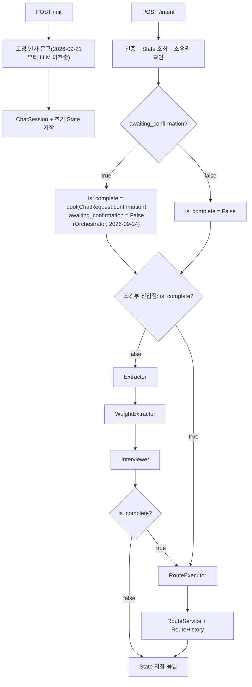

# 챗봇 Agent 하네스

> 상태: Current  
> 2026-09-20 WeightExtractor 갱신: 이전 선호를 프롬프트에 전달하고, 이번 턴에 언급하지 않은 축은 유지하며, 다시 언급한 축은 갱신하고, 명시적으로 취소한 축은 삭제한다. GPS Art·최단경로로 전환해도 기존 라벨을 유지한다. 실제 OpenAI 평가와 멀티턴 검증 결과·알려진 한계는 §9의 “2026-09-20” 및 “2026-09-20 후속” 기록을 참고한다.  
> 2026-09-21 WeatherChecker 제거: 날씨·대기질 기반 LLM 초기 인사 Node를 없애고 고정 문구로 대체했다. `weather_checker.py`/`weather_checker.yaml`/`weather_cache_repository.py`도 함께 삭제했다.  
> 2026-09-21 Interviewer 편도 우회 최단거리 초과 안내: `RouteService.get_shortest_km`(신규)로 목표 거리가 물리적 최단거리보다 짧거나 같은지 확인해, 그럴 때만 확인 질문 대신 최단 경로/거리 조정 여부를 되묻는다. 검증 결과·알려진 한계(모델이 `없음` 신호를 넘겨짚는 잔존 케이스)와, 이 과정에서 발견한 별개의 `extraction.yaml` 기존 결함("최단"만 짧게 답하면 tool 미호출)은 §9의 “2026-09-21 (Interviewer...)” 기록을 참고한다.  
> 2026-09-23 위 기능을 `oneway_shortest`(편도 최단)까지 확장하고 계산값을 `State.shortest_km`(신규 필드)로 영속화했다. `Interviewer._oneway_shortest_conflict`는 `_update_shortest_km`(필드 갱신)·`_is_oneway_shortest_conflict`(판단만) 두 메서드로 분리됐다. 같은 날 `interview.yaml` 지침4(최종 확인)도 FE가 State를 직접 표시하는 쪽으로 바뀌면서 장소·거리 재요약 없이 짧게만 확인하도록 간소화했다(출발=목적지 왕복 요청의 알려진 한계 포함). 지침0(무관한 주제)도 테스터 제보로 "다리(교량)" 지명이 산책 요청을 무관한 주제로 오판하던 버그를 찾아 고쳤다(성산대교 0/5→5/5, 마포대교 0/5→3/3, 반문형 제거 변형 하나는 잔존 한계로 남음). 상세는 §9의 “2026-09-23 후속” 기록을 참고한다.  
> 2026-09-23 후속2 `Interviewer`가 `oneway_shortest`의 최종 경로를 확인 전에 미리 계산해 `state.route_result`에 채우고, `route_executor.py`는 이미 채워져 있으면 재계산 없이 그대로 반환한다. 계산은 `RouteService.get_route()`를 이 async 노드에서 직접(동기) 호출하지 않고 `route_executor`와 똑같이 `RouteTool.oneway_shortest_route`(`asyncio.to_thread` + 타임아웃)를 통해 — DB 호출로 이벤트 루프가 막히지 않게 한다. `RouteService.get_shortest_km`은 시그니처·반환값(`Optional[float]`) 모두 그대로 두고 `oneway_random`의 참고용 거리 전용으로만 쓴다 — `oneway_random`은 이 값으로 `state.shortest_km`만 채우고 `state.route_result`는 채우지 않는다(최종 경로는 GRASP+ALNS로 따로 생성돼 `route_executor`가 실행되면 항상 새로 덮어쓰므로 미리 채워도 의미가 없다). 이에 맞춰 `prewalk_service.py::orchestrator`가 매 턴 `state.route_result`를 `None`으로 초기화하던 로직을 없앴다 — `Interviewer`가 두 모드 모두에서 항상 명시적으로 채우거나 지우므로 더 이상 필요 없다. 상세는 §9의 “2026-09-23 후속2” 기록을 참고한다.  
> 2026-09-24 `ConfirmationClassifier` Node·`confirmation.yaml`을 완전히 삭제했다. FE가 확인 질문에 버튼(예/아니요)으로 답하는 쪽으로 계약이 바뀌면서 자유 텍스트를 LLM으로 분류할 필요가 없어졌기 때문이다. `ChatRequest`에 새 필드 `confirmation: Optional[bool]`을 추가해 이 버튼 값을 `user_prompt`와 분리했다(`user_prompt`는 "아니요"에 곁들이는 교정 내용 전용으로 남김 — 긍정/부정 신호와 자유 텍스트를 한 필드에 같이 실으면 파싱이 더 복잡해지고 깨지기 쉽다는 이유로, 처음 시도했던 `user_prompt=="yes"` 문자열 비교안은 되돌렸다). 판정은 `PrewalkOrchestrator.orchestrator()`가 그래프 실행 전에 `bool(confirmation)`으로 직접 하고, 그 결과를 `state.is_complete`에 반영한 뒤 Graph의 조건부 진입점이 `is_complete`만 보고 `route_executor`/`extractor`로 바로 분기한다(Node 하나가 통째로 없어짐). 상세는 §9의 “2026-09-24” 기록을 참고한다.  
> 2026-09-24 후속 `awaiting_confirmation`은 매 intent 턴 시작 시 먼저 `False`로 초기화한다. 직전 턴이 확인 대기 상태일 때 `confirmation`이 없으면 이를 `아니오`로 간주하지 않고 확인 대기 상태와 안내 응답을 유지한 채 그래프를 실행하지 않는다. `confirmation=False`일 때만 `Extractor`로 재진입하며, 정보가 다시 완비되면 `Interviewer`가 새 확인 질문과 함께 `True`를 설정한다. 상세는 §9의 “2026-09-24 후속” 기록을 참고한다.
> 2026-09-25 `PrewalkOrchestrator.orchestrator()`가 확인 판정 블록을 좌표 갱신 블록보다 먼저 실행하도록 바꾸고, 좌표 갱신 조건에 `not state.is_complete`를 더했다(새 필드 추가 없이 기존 `is_complete` 재사용) — `is_complete=True`인 턴(확인을 받아 `RouteExecutor`가 경로 생성을 호출하는 바로 그 턴)에는 좌표 검증(PostGIS)·Kakao 역지오코딩을 하지 않는다. 그 이후 오는 `user_prompt`는 무언가 수정할 게 있어서 오는 새 요청으로 보고(그 시점엔 `is_complete`가 이미 `False`로 리셋돼 있음) 다시 현위치를 갱신한다 — 즉 "확인 이후 영원히 멈춤"이 아니라 "경로 생성을 부르는 그 턴만" 스킵한다. 상세는 §9의 “2026-09-25” 기록을 참고한다.  
> 2026-09-25 후속 `POST /api/prewalk/intent`가 JSON 한 번 응답에서 SSE(`text/event-stream`)로 바뀌었다 — `event: progress`(텍스트)를, 그래프가 끝나면 `event: result`(JSON `ChatResponse`)를, 처리 중 실패하면 `event: error`(텍스트)를 내려보낸다. `PrewalkOrchestrator.orchestrator()`는 `graph.ainvoke()` 대신 `graph.astream(stream_mode="updates")`를 쓰는 async generator로 바뀌었고, Valkey 저장은 여전히 스트림이 끝나기 직전 한 번만 한다. 스트리밍 시작 뒤에는 HTTP status를 못 바꿔 `/intent`의 실패도 HTTPException 대신 `event: error`로 알린다(`/init`은 영향 없음). 상세는 §9의 “2026-09-25 후속” 기록을 참고한다.  
> 2026-09-25 후속2 위 `event: progress`가 실제로는 "Node가 끝난 시점"이었는데, 필요한 건 "다음 Node가 시작하는 시점"이었다. `astream_events`로 바꾸는 대신 `astream`을 그대로 쓰면서 `NEXT_NODE_AFTER`(신규 모듈 상수, `extractor→weight_extractor→interviewer` 고정 순서)로 알림을 한 단계 당겨 보내도록 바꿨다 — 첫 Node(진입점, `extractor` 또는 `route_executor`)만 `astream` 호출 전에 `state.is_complete`로 직접 판단해서 먼저 알린다. 상세는 §9의 “2026-09-25 후속2” 기록을 참고한다.

## 1. 책임

이 문서는 현재 챗봇의 파일 구조와 State·Node·Edge·Tool 계약을 정의한다. 사람이나 AI가 한 구성요소를 변경할 때 입력·출력·연결·저장·검증 범위를 찾는 기준이다.

미래 업그레이드 방향은 다루지 않는다. 현재 흐름의 실행 증거는 [챗봇 경로 추천 Workflow](../architecture/workflows/prewalk_conversation.md)에서 관리한다.

## 2. 입력

HTTP 입력:

| 진입점 | 입력 |
|---|---|
| `POST /api/prewalk/init` | `lat`, `lon`, access Bearer 우선·header가 없을 때 `access_token` cookie |
| `POST /api/prewalk/intent` | `thread_id`, `user_prompt`(`confirmation`을 안 보내면 공백 불가, 2026-09-24), `confirmation`(`Optional[bool]`, 확인 대기 중 FE 버튼 응답, 2026-09-24 신규), `lat`, `lon`(2026-09-17부터 필수), access Bearer 우선·cookie fallback |

Authorization header가 있으면 Bearer를 사용하고 cookie는 보지 않는다. 잘못된 scheme·빈 값·공백이 섞인 Bearer는 HTTP 401 `invalid_token`이며, 형식은 맞지만 손상·만료된 Bearer도 유효한 cookie로 되돌아가지 않는다. header가 아예 없을 때만 cookie를 사용한다.

공유 `State` 계약:

| 필드 | 최초 작성자 | 주요 소비·변경 주체 |
|---|---|---|
| `user_id` | Orchestrator init | 소유권 확인, `RouteExecutor` |
| `current_location` | Orchestrator init, intent Orchestrator(좌표가 이전 턴과 다를 때만 갱신, 2026-09-17부터. `is_complete=True`인 턴(확인 후 경로 생성을 부르는 턴)에는 갱신하지 않고, 그다음 턴부터는 다시 갱신, 2026-09-25) | `Extractor`, `Interviewer` |
| `access_token` | intent Orchestrator | `RouteExecutor` → `RouteService`; 현재 Graph 실행에서만 사용하고 API 응답·Valkey 직렬화에서는 제외 |
| `user_prompt` | intent Orchestrator | `Extractor`, `Interviewer` |
| `mode` | `Extractor` | `RouteExecutor` |
| `user_context` | `Extractor` | `Interviewer`, `RouteExecutor` |
| `origin_candidate` | `Interviewer` | 다음 `Interviewer`(첫 번째 후보 자동 확정용) |
| `destination_candidate` | `Interviewer` | 다음 `Interviewer`(첫 번째 후보 자동 확정용) |
| `waypoint_candidates` | `Interviewer` | 다음 `Interviewer`(경유지 인덱스별 첫 번째 후보 자동 확정용, `waypoint` 모드 전용) |
| `feature_labels` | `WeightExtractor`(GPS Art·최단경로는 `{}`로 스킵) | `RouteExecutor._build_weights` 가중치 블렌딩 |
| `shortest_km` | `Interviewer._update_shortest_km`(`oneway_shortest`/`oneway_random`에서 위치 확정 시, 2026-09-23) | 편도 우회 최단거리 초과 안내 판단(`_is_oneway_shortest_conflict`), 확인 문구에 참고용 최단거리 표시 |
| `awaiting_confirmation` | `Interviewer`(확인 질문 생성 시 True)·intent Orchestrator(매 턴 시작 시 False로 초기화, 2026-09-24 후속) | 직전 응답이 확인 질문이었는지 판단; 확인 대기 중 `confirmation` 누락 시 True 유지 |
| `is_complete` | intent Orchestrator(확인 응답이면 `ChatRequest.confirmation`(bool)을 그대로 반영, 아니면 항상 `False`로 명시적으로 지움, 2026-09-24) | Graph 조건부 진입점(`RouteExecutor` 직행 여부), intent Orchestrator의 `current_location` 갱신 여부 게이트(다음 턴에서 읽음, 2026-09-25) |
| `response` | 각 대화 Node·Orchestrator | `ChatResponse.state` |
| `route_result` | `RouteExecutor` | API 응답·Valkey 저장 |

`user_context`는 모드에 따라 `CircularPreference`, `OnewayPreference`, `OnewayShortestPreference`, `GPSArtPreference`, `WayPointPreference` 중 하나다. `target_km`이 있는 Preference(`CircularPreference`/`OnewayPreference`/`GPSArtPreference`/`WaypointLegPreference`)는 `TargetKmPositiveMixin`으로 숫자 문자열을 숫자로 변환한 뒤 0 이하·NaN·양/음의 무한대·boolean을 차단한다(직접 경로 API `VAL-DIST-001`과 같은 검증 함수 재사용, 2026-09-20 갱신). 직접 경로 API의 10km 상한은 챗봇 Preference나 경유지 구간에 적용하지 않는다.

(2026-09-19 갱신) `State`에는 애초에 `profile` 필드가 없다 — `route_engine/profiles.py`
(`ScoringProfile`/`get_profile()`)가 8축→2축(safety/comfort) 축소로 완전히 삭제되면서, 위에
있던 "명시 profile이 없으면 ScoringProfile.DEFAULT" 절차 자체가 코드에서 사라졌다(2026-09-17
시점엔 이미 테마 기반 자동 선택만 제거되고 DEFAULT 폴백은 남아 있었으나, 그 이후 profile
개념 자체가 없어졌다). `safety`/`comfort` feature의 `preference_label`(중요도)·
`explicitness_label`(확신도)이 `RouteExecutor._build_weights`에서 연속적인 EMA 블렌딩으로
`Weights`에 반영되는 것이 지금의 유일한 경로다 — 이전에 프로필 전환이 하던 역할(안전·편안함
강조)을 대체한다. 저장된 설문값은 `Weights()`의 기본값과의 차이만 더한다.

## 3. 출력

- API 출력: `POST /api/prewalk/init`은 `ChatResponse(status, thread_id, state)` JSON을 한 번에 반환한다. `POST /api/prewalk/intent`는 2026-09-25 후속부터 SSE(`text/event-stream`)로 바뀌었다 — `event: progress`(텍스트, 다음 Node가 시작하는 시점마다), 마지막에 `event: result`(JSON, `ChatResponse`와 동일 스키마), 처리 중 실패 시 `event: error`(텍스트)를 내려보낸다(상세는 위 "파일 구조" 아래 "SSE 스트리밍 전환" 참고).
- PostgreSQL: init마다 `ChatSession(user_id, thread_id, START)` 추가
- Valkey: `chat_state:{thread_id}`에 전체 State JSON 저장, TTL 3,600초
- 경로 성공: `route_result`(`List[WalkRouteResponse]`)에는 품질 평가 기준상 최종 경로 1개만 담긴다. 엔진 내부 후보는 외부에 노출하지 않는다.
- 경로 성공: `RouteService`가 최종 경로에 대해서만 `RouteHistory`를 저장하고 `route_result[0].id`에 이력 ID를 반영한다. `route_hash`는 동일 좌표 경로 그룹화 용도로 유지한다.
- 경로 성공: 최종 경로 1개에 대해서만 그 경로 50m 안의 도보망 연결 POI를 `nearby_pois`로 반환한다.
- LLM 출력: 모드·거리·위치 추출, feature(safety/comfort)별 `preference_label`·`explicitness_label` 추출, 누락 질문, 최종 확인 요청·검색 실패·서울 밖 안내(2026-08-20부터 전부 `interview.yaml` 생성, 하드코딩 문구 없음). 초기 인사는 2026-09-21부터 `WeatherChecker` 제거와 함께 LLM 호출 없는 고정 문구로 바뀌었다(아래 "파일 구조" 참고). 확인 질문 긍정·부정 판정은 2026-09-24부터 LLM이 아니라 FE가 `ChatRequest.confirmation`(bool)으로 보낸 값을 intent Orchestrator가 그대로 반영해 정한다.
- 오류 출력: `Interviewer`의 LLM·Kakao API 호출이 실패하면 원문 예외 대신 `서버 내부 오류가 발생했습니다.`를 `response`에 넣는다. 실패 로그는 사건명과 예외 형식만 기록한다(2026-09-20).

현재 intent State에는 access JWT가 포함되며 API 응답과 Valkey JSON 양쪽으로 전달된다. `ChatSession.current_state`는 경로 완료 후에도 `START`로 남는다.

## 4. 실행 진입점

### 파일 구조

```text
src/agent/
├── nodes/
│   ├── extractor.py            # 모드·위치·거리 추출
│   ├── weight_extractor.py     # feature(safety/comfort)별 preference_label·explicitness_label 추출
│   ├── interviewer.py          # 누락 질문·장소 검색·확인 질문
│   └── route_executor.py       # 가중치 조합·경로 실행
├── tools/
│   ├── mode_tools.py           # preference 생성
│   ├── place_tools.py          # Kakao 주소·장소 검색
│   └── route_tools.py          # RouteService 비동기 호출
└── utils/
    └── chatbot_utils.py        # Pydantic 직렬화·Prompt 문자열 변환(2026-09-14: PydanticUtils.dump가 Enum을 .value까지 변환하도록 수정, PromptUtils.format_for_prompt의 반환값 누락 버그 수정. 2026-09-17: PromptUtils.sanitize_user_prompt 추가 — Extractor 로컬 함수였던 걸 이관)

src/service/chat/prewalk_service.py              # Orchestrator·Graph 조립
src/schema/prewalk_schema.py                     # State·Location·Preference
src/interfaces/api/prewalk_router.py             # HTTP 진입점
src/interfaces/schema/prewalk_schema.py          # 요청·응답·상태 schema
src/infrastructure/cache/repository/
└── chat_state_repository.py                     # Valkey State 저장
src/repository/chat/chat_session_repository.py   # PostgreSQL 세션 저장
src/prompt/                                      # LLM Prompt
```

**`WeatherChecker` 제거(2026-09-21)**: 날씨·대기질 기반 LLM 초기 인사 Node를 통째로 없애고, `prewalk_service.py::orchestrator`(init)가 고정 문자열("편안하고 안전한 길을 추천해드리는 ROUDI예요! 어떤 산책 코스를 추천해드릴까요? ...")을 바로 반환하도록 바꿨다. `weather_checker.py`/`weather_checker.yaml`과 그 전용 캐시 의존성(`weather_cache_repository.py`)도 함께 삭제했다 — `/api/weather`(배너용 `WeatherClient`)는 완전히 별개 기능이라 영향받지 않는다.

**`ConfirmationClassifier` 제거(2026-09-24)**: `confirmation_classifier.py`/`confirmation.yaml`을 통째로 삭제했다. FE가 확인 질문에 버튼(예/아니요)으로 답하고 그 값을 `ChatRequest.confirmation`(`Optional[bool]`, `user_prompt`와 분리된 별도 필드)으로 보내면서, 자유 텍스트를 LLM으로 긍정/부정 분류할 필요가 없어졌기 때문이다 — `PrewalkOrchestrator.orchestrator()`가 그래프 실행 전에 그 값을 그대로 반영해 직접 판정한다(아래 "Edge와 실제 분기" 참고). `src/schema/prewalk_schema.py`의 `ConfirmationResult`(파서 전용 pydantic 모델)도 더는 쓰이지 않아 함께 삭제했다.

**`POST /api/prewalk/intent` SSE 스트리밍 전환(2026-09-25 후속)**: FE에 "정보를 추출하고 있습니다" 같은 노드별 진행 상황을 실시간으로 보여주기 위해, 이 엔드포인트만 응답을 JSON 한 번에서 SSE(`text/event-stream`)로 바꿨다(`/init`은 그래프를 안 거치므로 그대로 JSON).

- **`PrewalkOrchestrator.orchestrator()`(async generator로 변경)**: `self.graph.ainvoke(state)` 한 번 호출하던 것을 `self.graph.astream(state, stream_mode="updates")`로 바꿨다. `astream`은 Node가 끝나야 이벤트를 주므로(다음 "설계 결정" 참고), "다음 Node가 시작한다"는 진행 알림을 다음처럼 한 단계 당겨서 보낸다: ① `astream` 호출 전, 진입점과 같은 조건(`state.is_complete`)으로 첫 Node 이름을 직접 판단해 그 알림을 먼저 `yield`한다(유일하게 "Node 실행 전"에 보내는 경우). ② 루프 안에서는 방금 끝난 Node 이름이 아니라 `NEXT_NODE_AFTER`(모듈 상수, `extractor→weight_extractor`, `weight_extractor→interviewer`만 있음 — `interviewer`/`route_executor` 뒤로는 고정 Edge가 없어 그래프가 그대로 끝나므로 매핑에 없음)로 찾은 다음 Node의 알림을 보낸다. 문구 자체는 `NODE_PROGRESS_MESSAGE`(Node 이름 → 문구, `extractor`/`weight_extractor`/`interviewer`/`route_executor` 4개 모두 등록)에서 찾는다. 그래프가 끝나면 `("result", ChatResponse)`를 `yield`하고 함수가 끝난다. 인증·소유권 실패 같은 조기 종료 지점도 전부 `yield "result", ChatResponse(status=...)` 뒤 `return`으로 바뀌었다(과거엔 그냥 `return ChatResponse(...)`).
- **`astream`이 왜 전체 State를 주는가**: 각 Node가 부분 필드가 아니라 항상 전체 `State`를 반환하므로(`extractor.run(state) -> state` 패턴), `stream_mode="updates"`가 주는 `{node_name: node_output}`의 `node_output`이 이미 그 시점의 전체 State다. 그래서 루프 안에서 매번 `state = State.model_validate(node_state)`로 누적하면 루프가 끝난 시점의 `state`가 곧 최종 State다.
- **Valkey 저장 시점(변경 없음, 명시적으로 확인)**: `ChatStateRepository.save_state()`는 여전히 Node가 끝날 때마다가 아니라 `astream` 루프가 전부 끝난 뒤, 마지막 `yield "result", ...` 직전 딱 한 번만 호출된다 — 진행 알림은 메모리상의 `state` 변수만 갱신하고 Valkey에는 안 쓴다.
- **`prewalk_router.py::read_message`**: `StreamingResponse(event_stream(), media_type="text/event-stream", headers={"Cache-Control": "no-cache", "X-Accel-Buffering": "no"})`를 반환한다(뒤 두 헤더는 프록시가 응답을 버퍼링해 스트리밍 효과가 없어지는 걸 막기 위함). 내부 `event_stream()`이 `service.orchestrator(...)`를 `async for`로 순회하며 각 항목을 `_sse(event, data)`(같은 파일의 모듈 함수)로 SSE 프레임(`event: 이름\ndata: 내용\n\n`, 내용에 개행이 있으면 줄마다 `data:`를 반복)으로 인코딩해 그대로 흘려보낸다. `kind == "result"`일 때만 `data.model_dump_json(exclude={"state": {"access_token"}})`로 JSON 인코딩하고, 그 외(`progress`)는 문자열 그대로 보낸다.
- **오류 응답 방식이 바뀜**: 스트리밍은 HTTP 200 헤더가 본문보다 먼저 전송되므로, 본문을 만들기 시작한 뒤에는 HTTP status를 더 바꿀 수 없다. 그래서 `/intent`는 `ValueError`(좌표 검증 등)·예상치 못한 예외 전부를 더 이상 `HTTPException`(400/500)으로 올리지 않고 `event: error`(텍스트, `ValueError`는 `str(e)`, 그 외는 `SAFE_INTERNAL_ERROR_DETAIL`)로 내려보낸다. 요청 스키마 자체가 잘못된 401/422(인증 header·`ChatRequest` 검증 실패)는 스트림이 시작되기 전에 걸러지므로 그대로 HTTP 오류로 반환된다. `/init`은 스트리밍하지 않으므로 이 변경과 무관하게 기존 400/500 그대로다.
- **`NODE_PROGRESS_MESSAGE`(신규, `prewalk_service.py` 모듈 상수)**: `{"extractor": "정보를 추출하고 있습니다", "weight_extractor": "선호도를 분석하고 있습니다", "interviewer": "질문을 생성하고 있습니다", "route_executor": "경로를 생성하고 있습니다"}`. key는 `_build_graph()`에서 `builder.add_node(...)`에 등록한 이름과 반드시 일치해야 한다.

### Node 입출력

| Node | 입력 | 출력·State 변경 | 외부 호출 |
|---|---|---|---|
| `Extractor.run` | `State` | `mode`, `user_context` | OpenAI, `ModeTool` |
| `WeightExtractor.run` | `State` | `feature_labels`(GPS Art·최단경로는 `custom_weights`를 안 쓰므로 호출 자체를 건너뛰고 `{}`) | OpenAI(`PydanticOutputParser`, tool 미바인딩) |
| `Interviewer.run` | `State` | 후보 위치, 보완된 context, `response`, 확인 상태, `shortest_km`/`route_result`(oneway_shortest·oneway_random, 2026-09-23 후속2) | OpenAI, `PlaceTool`, `RouteTool.oneway_shortest_route`(oneway_shortest 전용 — POI·RouteHistory까지 포함한 완성된 경로를 `route_executor`와 같은 타임아웃·스레드 오프로딩 경로로 생성), `RouteService.get_shortest_km`(oneway_random 전용 — 참고용 거리만, 가벼운 A*) |
| `RouteExecutor.run` | `State` | `route_result` | 사용자 설문, `RouteTool`(GPS Art는 내부에서 `GpsArtService`도 호출; waypoint 모드는 `_build_weights`가 만든 `Weights`를 그대로 `args["preference"]`로도 함께 전달, 2026-09-17 dev 병합·#445 — 2026-09-19 갱신: 별도 `_build_preference_signal`/`SafetyComfortPreference` 변환 없이 재사용). `mode==oneway_shortest`이고 `state.route_result`가 이미 성공으로 채워져 있으면(Interviewer가 미리 계산) `RouteTool` 호출 없이 그대로 반환한다(2026-09-23 후속2) |

모든 대화 Node는 전달받은 State 객체를 변경해 반환한다. Node별 별도 입출력 schema는 없다. 확인 응답(긍정/부정) 판정은 더 이상 Node가 아니라 `PrewalkOrchestrator.orchestrator()`가 그래프 실행 전에 한다(2026-09-24, 아래 "Edge와 실제 분기" 참고).

### Extractor 후처리(결정론적 보정, 2026-09-14)

`Extractor.run`이 LLM tool_call을 받은 뒤, `_apply_postprocessing`(`extractor.py`)이 `extraction.yaml` 지침만으로 못 잡는 경우를 결정론적 파이썬 로직으로 보정한다. LLM을 새로 호출하지 않는 순수 함수라 `scripts/eval_extraction.py`가 같은 tool_call에 대해 재현할 수 있다.

| 예외 | 보정 내용 |
|---|---|
| 3 | LLM이 필드값으로 문자열 `"null"`을 채운 경우 실제 `None`으로 정규화 |
| 4 | LLM이 스스로 채운 좌표를 검증 — 직전 place_name과 다르면 좌표를 지워 `Interviewer`의 Kakao 재검증을 강제, 같으면 직전에 확정된 좌표로 덮어씀 |
| 5 | origin·destination이 같은 장소명인데 명시적 출발 표현("에서"/"부터"/"출발"/"시작")이 없으면 origin을 null로 보정 |
| 6 | 모드가 바뀌었는데 새 도구의 정체성 필드(`destination`/`waypoints`/`shape`/`legs`)가 새로 채워지지도, 새 도구에 대응하는 명시적 전환 키워드(예: "최단", "편도", "거쳐")도 없으면 이전 도구로 되돌림 |
| 7 | 모드 변경 여부와 무관하게, 최종 도구가 받는 필드 중 이번 턴에 값이 없는 것은 직전 context 값으로 보존 |
| 8 | origin이 없으면 현재 위치(`state.current_location`)로 대체 |
| 9 | `target_minutes`가 있으면 도보 속도(4km/h, 근거: 정책브리핑 "시속 4km" 2011)로 `target_km`을 환산해 이번 턴의 옛 `target_km`보다 우선 적용. 시간·거리 언급이 모두 없으면 온보딩 `UserPreference.default_target_km`으로 채우고, 그마저 없으면 비워둔다(Interviewer 재질문에 맡김). 게이팅 조건은 args에 `target_km` 키가 실제로 있는지가 아니라 해당 도구가 `target_km` 필드를 받는지다(2026-09-14 버그 수정 — 이전 조건은 Context 없는 첫 요청에서 시간만 언급하면 LLM이 tool_call에 `target_km` 키를 아예 안 넣어 환산이 스킵되고 거리가 사라지는 문제가 있었다) |
| 10 | tool invoke 자체가 실패하면 State를 바꾸지 않고 종료 |

발화 정규화(HTML 태그·과도한 공백·반복 문자열 제거)는 더 이상 `Extractor` 내부가 아니라 `PrewalkOrchestrator.orchestrator()`가 그래프 실행 전에 `PromptUtils.sanitize_user_prompt`(`chatbot_utils.py`)로 한 번만 수행하고, 그 결과를 `State.user_prompt`에 직접 덮어쓴다(2026-09-17부터 — 이전에는 `Extractor`가 로컬로 정규화한 사본만 LLM에 넘기고 `State.user_prompt` 원본은 그대로 뒀다). 반복 문자열(`ㅋㅋㅋ`, `!!!` 등)은 강조 표현으로 보고 완전히 지우지 않고 2회로만 축약한다 — `WeightExtractor`가 `explicitness_label`을 판단할 때 이 반복이 신호로 쓰이기 때문이다. `Extractor`·`WeightExtractor`·`Interviewer` 전부 같은 정규화된 `State.user_prompt`를 그대로 읽으며, 정규화 이전 원문을 보존하는 별도 필드는 없다. intent Orchestrator의 확인 응답 판정(2026-09-24)은 `user_prompt`가 아니라 별도 필드 `ChatRequest.confirmation`(bool)을 보므로 이 정규화 대상이 아니다.

`scripts/eval_extraction.py`(100개 — 001~070 첫 요청 강건성 케이스, 071~100 [Current Context]가 이미 채워진 "부분 수정" 시나리오)로 raw tool_call과 후처리 적용 후 결과를 각각 실행 검증했다(§9).

### Edge와 실제 분기



`JUDGE`/`RESET`은 Graph 밖, `PrewalkOrchestrator.orchestrator()`에서 Graph 호출 직전에 실행되는 일반 Python 코드다(Node도 Edge도 아니다) — 매 턴 `awaiting_confirmation`을 먼저 False로 초기화한 뒤, 직전 턴이 확인 대기였을 때만 `confirmation`을 판정한다. 이때 값이 없으면 확인 상태를 유지하고 Graph를 실행하지 않는다. Graph 선언 자체는 그 결과인 `is_complete` 하나만 보는 조건부 진입점에서 시작한다(2026-09-24부터, 이전에는 `awaiting_confirmation`을 직접 보고 `ConfirmationClassifier`/`Extractor`로 갈라졌다).

- `is_complete=True`(직전 턴이 확인 대기 중이었고 이번 `ChatRequest.confirmation=True`) → `RouteExecutor`로 바로 진입, 재추출 없음
- `is_complete=False`(새 정보 수집 턴이거나, 확인 대기 중 `confirmation=False`) → `Extractor → WeightExtractor → Interviewer → (is_complete ? RouteExecutor : END)`
- 확인 대기 중 `confirmation=None` → 안내 응답을 반환하고 기존 `awaiting_confirmation=True`를 유지하며 Graph를 실행하지 않음

`Interviewer`는 정보가 충분하면 `awaiting_confirmation=True`, `is_complete=False`로 확인 질문을 만들고 END로 끝난다. 다음 intent 턴에서 Orchestrator가 이를 보고 `ChatRequest.confirmation`을 판정한다. `confirmation=False`(FE의 "아니요" 버튼)면 `user_prompt`에 교정 내용을 곁들여 보낼 수 있고, 그 값을 그대로 `state.user_prompt`에 실어 `Extractor`부터 다시 거친다 — `user_prompt`가 비어 있으면(FE가 버튼만 보내고 텍스트를 안 실었으면) `Extractor`가 아무것도 새로 추출하지 못해 사실상 같은 확인 질문이 그대로 다시 만들어진다(별도 "무엇을 바꿀지 되묻는" 로직은 없다).

**2026-09-24 `ConfirmationClassifier` 제거**: FE가 확인 질문에 버튼(예/아니요)으로 답하는 쪽으로 계약이 바뀌면서, 자유 텍스트("응", "그걸로 해줘", "아니 5km로 바꿔줘" 등)를 LLM으로 긍정/부정 분류할 필요가 없어졌다. `confirmation_classifier.py`·`confirmation.yaml`·`ConfirmationResult` schema를 전부 삭제하고, 판정을 `PrewalkOrchestrator.orchestrator()`로 옮겼다(사용자 요청). `ChatRequest`에 `confirmation: Optional[bool]` 필드를 새로 추가해 이 버튼 값을 `user_prompt`와 분리했다 — 처음에는 `user_prompt`에 `"yes"`/`"no"`를 그대로 실어 문자열로 비교하는 안을 시도했지만, 그러면 "아니요" 응답에 교정 내용("3km로 바꿔줘")을 실을 자리가 없어진다는 문제를 사용자가 지적해 되돌렸다(제어 신호와 자유 텍스트를 분리하는 게 맞다는 판단). 이전에는(2026-07-29 이전) 같은 판정을 Orchestrator가 Python if/else로 직접 처리하며 Graph 자체를 우회했던 적이 있는데(긍정 시 `route_executor.run()` 직접 호출, 부정 시 하드코딩 문구 반환) 그때는 Graph에 선언된 조건부 Edge가 실행되지 않는 죽은 코드였다는 문제가 있었다(2026-07-30 `ConfirmationClassifier` 도입으로 해소, 근거: [챗봇 하드코딩 문구 처리 방안 제안](../proposals/chatbot_hardcoding_proposal.md) 1, 3번 항목). 이번 되돌림은 그 문제를 재현하지 않는다 — Orchestrator는 문구를 만들지 않고 `is_complete` 판정만 하며, 그 값을 Graph의 조건부 진입점이 그대로 읽어 정식 Edge로 분기하므로 죽은 코드가 생기지 않는다.

2026-08-20에는 `Interviewer` 내부의 나머지 하드코딩 응답 문구(확인 질문 f-string, 검색 실패·서울 밖 안내 f-string)를 제거했다. 확인 질문·검색 실패·서울 밖 안내는 `interview.yaml`에 추가한 우선순위 지침(0: 서울 밖, 1: 검색 실패, 2: 최종 확인)을 통해 LLM이 생성한다(근거: [챗봇 하드코딩 문구 처리 방안 제안](../proposals/chatbot_hardcoding_proposal.md) 2, 6, 9번 항목). 당시 LLM/Kakao 예외 원문도 `response`에 노출했으나, 2026-09-20 안전 오류 계약에 따라 공통 문구로 교체했다. 정상 LLM 생성 문구와 `no_path` 등 경로 업무 상태는 이 변경의 대상이 아니다.

### Tool과 Prompt

| 소유 Node | Tool | 입력 → 출력 |
|---|---|---|
| `Extractor` | `ModeTool` 5종(`select_gps_art`, `select_waypoint` 포함) | 위치·거리(`target_km`/`target_minutes`)·도형(shape)·경유지·leg별 이동 방식 → 모드별 Preference |
| `Interviewer` | `PlaceTool` 2종(`target`에 `waypoint`+`waypoint_index` 추가 지원) | keyword·category → Kakao 장소 결과 |
| `RouteExecutor` | `RouteTool` 5종(`gps_art_route`, `waypoint_route` 포함) | 좌표·거리·JWT·Profile·Weights → `WalkRouteResponse`. `gps_art_route`는 실행 전 `GpsArtService.get_shape_points`로 도형 이름을 좌표로 먼저 변환한다. `waypoint_route`는 `waypoints`/`leg_modes`/`leg_target_km`를 그대로 `RouteService.get_route`에 전달한다 |

| Node | 현재 사용하는 Prompt |
|---|---|
| `Extractor` | `extraction.yaml` |
| `WeightExtractor` | `weight_extraction.yaml`(도구 미바인딩, `PydanticOutputParser`로 `FeatureLabelMap`(`dict[FeatureTag, FeatureLabelEntry]` `RootModel`, `FeatureLabelEntry = Union[FeatureLabel, Literal["cancelled"]]`, 2026-09-20) 파싱. `previous_labels` input variable로 `[이전 라벨]`도 함께 받음) |
| `Interviewer` | `interview.yaml` 단일 파일 — 도구 바인딩 1차 호출(장소 검색)과, 확인 요청·검색 실패·서울 밖 안내·편도 우회 최단거리 초과 안내(지침3, 2026-09-21)·재질문을 만드는 도구 미바인딩 호출(`_generate_response()`로 통합, `parser=str_parser`) 두 가지 방식으로 호출한다. `input_variables`에 `shortest_km_conflict`가 추가됐다 |
| `RouteExecutor` | 없음 |

확인 응답 판정은 Prompt가 없다(2026-09-24부터 `PrewalkOrchestrator.orchestrator()`의 문자열 비교) — 이전에 쓰던 `confirmation.yaml`은 삭제됐다.

`extraction.yaml`에 `select_waypoint` 선택 규칙, `interview.yaml`에 경유지 장소 검색(`target="waypoint"`+`waypoint_index`) 가이드가 추가됐다(2026-08-07, GPS Art 때의 `select_gps_art` 선택 규칙과 같은 패턴). 다만 정적 대조(YAML 파싱·`load_prompt(...).format(...)` 렌더링 확인)만 했고, 실제 대화에서 LLM이 이 모드를 언제 선택하고 경유지를 얼마나 정확히 태깅하는지는 아직 검증되지 않았다.

**2026-09-14 구조 개편**: `extraction.yaml`이 "[Current Context]가 비어 있는 첫 요청"과 "이미 채워진 부분 수정 요청"을 다른 규칙으로 분기하도록 바뀌었다 — 부분 수정에서는 사용자가 명시적으로 언급한 값만 바꾸고, 언급 안 한 필드는 [Current Context] 값을 그대로 다시 채운다(위 "Extractor 후처리" 예외7이 이를 코드 층에서 한 번 더 보강). 도구(모드)는 순환/편도 우회/최단/도형/경유지를 명시적으로 다르게 요구했을 때만 바뀐다(예외6이 같은 원칙을 코드로 재확인). `interview.yaml`의 지침0(무관한 주제 처리)도 "이 발화의 핵심 의도가 산책과 관련 있는가"라는 판단과 "무관할 때만 선을 긋는다"는 응답 방식을 분리해, 감정·날씨·음식 등이 산책 요청에 곁들여진 경우를 무관한 대화로 오인해 회피 응답을 내던 오탐을 줄였다. `scripts/eval_extraction.py`/`scripts/eval_interviewer.py`로 실제 OpenAI 호출까지 실행 검증했다(§9).

## 5. 의존하는 영역

- 인증: JWT 사용자 식별
- PostgreSQL: User, ChatSession, UserPreference, RouteHistory
- Valkey: 대화 State
- 외부 API: OpenAI `gpt-4o-mini`, Kakao Local, 기상청, 에어코리아
- 경로 영역: `RouteService`, 모드별 Engine, 메모리 Graph
- Prompt: `src/prompt/*.yaml`

## 6. 결과를 전달하는 영역

- `prewalk_router`가 State와 상태를 API 사용자에게 반환한다.
- `RouteExecutor`가 경로 입력을 `RouteService`에 전달한다.
- 최종 경로는 State·Valkey·RouteHistory에 연결된다.
- 다음 intent가 Valkey State와 후보 위치·context를 이어받는다.

## 7. 변경 시 영향 범위

| 변경 | 함께 확인할 대상 |
|---|---|
| State 필드 | API schema, Valkey 기존 JSON, 모든 Node, 직렬화 |
| Node 입출력 | Graph Edge, 조건부 진입점, Prompt |
| 확인 상태 | `PrewalkOrchestrator.orchestrator()`의 `ChatRequest.confirmation`(bool) 판정(2026-09-24, FE 버튼 계약), `is_complete`, Graph 조건부 진입점, RouteExecutor 진입 |
| Mode/Preference | ModeTool, Extractor prompt, Interviewer 완료 조건, RouteTool |
| 장소 필드 | Kakao schema, 후보 선택, 서울 bbox 검증 |
| intent 좌표(`current_location` 갱신) | `ChatRequest.lat/lon` 검증(coord/water/highway validator), `PrewalkOrchestrator.orchestrator()`의 동일 좌표 스킵 조건·`is_complete` 스킵 조건(2026-09-25), Kakao 역지오코딩, `prewalk_router.py`의 `ValueError`→`event: error` 매핑(2026-09-25 후속) |
| `feature_labels`·가중치 | `WeightExtractor` prompt(`weight_extraction.yaml`), `FeatureTag`/`FeatureLabel`/`FeatureLabelMap` 스키마, `RouteExecutor._build_weights`(`_PREFERENCE_TARGET_MAP`, `_EXPLICITNESS_ALPHA_MAP`, `_FEATURE_TO_WEIGHTS_KEY`), 설문 `Weights` delta, 경로 scoring |
| Prompt | tool 이름·인자, parser, fallback, LLM 검증 |
| 저장 방식 | TTL, 세션 소유권, 만료·복구, API 응답 |
| `/intent` SSE 이벤트 포맷(2026-09-25 후속) | `prewalk_router.py::_sse()`/`event_stream()`, `PrewalkOrchestrator.orchestrator()`의 `yield` 튜플 계약(`("progress"|"result", ...)`), `NODE_PROGRESS_MESSAGE`, FE 파서 — Node 이름을 바꾸거나 추가하면 `NODE_PROGRESS_MESSAGE`와 `_build_graph()`의 `add_node(...)` 이름을 같이 맞춰야 한다 |

## 8. 실패·복구 방법

| 실패 지점 | 현재 동작 | 복구 |
|---|---|---|
| init 인증 실패 | 인증 상태 반환 | refresh·재로그인 |
| 날씨·주소 실패 | 빈 환경·기본 인사 또는 좌표 Location | 새 init 또는 계속 진행 |
| intent 좌표 검증 실패(서울 밖·수계·고속도로, 2026-09-17부터) | `ValueError` → `event: error`(텍스트, `str(e)`)로 SSE 스트림에 실림(2026-09-25 후속부터 — 이전엔 HTTP 400이었으나 스트리밍 시작 뒤엔 HTTP status를 못 바꿔 이벤트로 알린다). 좌표가 이전 턴과 같으면 이 검증 자체를 건너뛰므로, 같은 위치를 유지하는 후속 턴에서는 발생하지 않는다 | 유효한 좌표로 재요청 |
| intent Kakao 역지오코딩 실패(좌표가 바뀐 턴이면서 이번 턴 `is_complete=False`일 때만) | 주소·장소명 없이 좌표만 있는 Location으로 대체, 대화는 계속됨 | 다음 intent에서 재시도 |
| State 없음·만료 | `session_not_found` | init부터 재시작 |
| 타 사용자 State | `unaccessible` | 자신의 thread 사용 |
| Extractor LLM 실패 | 기존 State 유지 | 다음 intent에서 재시도 |
| WeightExtractor LLM·파싱 실패 | 직전 턴 `feature_labels`를 그대로 유지한다. 성공한 경우에도 이번 턴에 언급하지 않은 축은 유지한다(§9 “2026-09-20” 참고) | 다음 intent에서 재시도 |
| Interviewer LLM·Kakao API 실패 | 원문 대신 공통 안전 문구를 `response`에 반환 | 다음 intent에서 재시도 |
| 확인 응답 `confirmation`이 `False`거나 없음(2026-09-24) | bool 판정이라 실패할 수 없다 — `True`가 아니면 전부 `is_complete=False`로 처리해 `Extractor`로 진행(안전 측 기본값) | 다음 intent에서 재확인 질문 재생성(교정 내용은 `user_prompt`로 반영) |
| RouteTool 실패 | 예외를 기록하고 기존 State 유지 | 조건 확인 후 재확인 |
| State 저장 실패 | 응답은 반환될 수 있음 | Valkey 복구 후 init 재시작 |

HTTP 200만으로 성공을 판단하지 않는다. `status`, `awaiting_confirmation`, `is_complete`, `route_result.status`를 함께 확인한다.

## 9. 검증 방법

**2026-09-20 (기준 commit `d2eba6d` 이후 미커밋 worktree, Windows 로컬 `.venv`, TestClient·mock 격리 실행)**

- init의 Bearer 단독·cookie 단독·동시 입력(Bearer 우선), 잘못된 Authorization+유효 cookie(401, fallback 없음), 손상 Bearer+유효 cookie(Bearer 판정 유지)를 확인했다.
- intent의 `unaccessible`, 실제 Orchestrator의 State `user_id`와 인증 사용자가 다를 때 Graph 실행 전 차단을 확인했다.
- 챗봇 Preference의 거대 양/음 정수와 `1e400`/`-1e400` 문자열이 `ValidationError`가 되고, HTTP 좌표·공백 입력 422 계약이 유지되는지 확인했다.
- `Interviewer._generate_response()`의 LLM 오류가 공통 안전 문구만 반환하고 로그에는 원문 token 문자열 대신 예외 형식만 남는지 확인했다.
- intent State의 내부 access token이 API body와 Valkey용 직렬화에서 제외되는지 확인했다.
- 실제 OpenAPI에서 `AccessTokenBearer`, 호환 `access_token` cookie, init/intent 예시와 400/401/422/500 설명을 대조했다.
- PostgreSQL 초기화·Graph 로드·Valkey·Kakao·OpenAI·실제 경로 엔진은 호출하지 않았다. 실제 외부 서비스와 실기기 전체 대화는 여전히 별도 검증 대상이다.

**2026-07-27 (Orchestrator 우회 방식 기준, 격리 PostgreSQL·Valkey + 실제 Kakao·OpenAI·경로 엔진)**

이 실행 증거는 `ConfirmationClassifier` 도입 이전 구조 기준이라, 아래 관측값은 대화 흐름 자체(정보 수집·확인 대기)의 근거로만 유효하다.

- init → ChatSession 1건, Valkey TTL 3,600초
- 없는 thread → `session_not_found`
- 타 사용자 thread → `unaccessible`
- 발화 → 순환 모드·거리 추출 → 확인 대기
- 긍정 확인 → 당시 격리 실행(Orchestrator 우회 방식)에서 61좌표·3.10km 경로와 RouteHistory 저장 관측
- 경로 완료 State에 `is_complete=True`, PostgreSQL 세션은 `START`

위 경로 좌표 수와 거리는 2026-07-27 일회성 관측값이며 고정 회귀 기대값이 아니다. 재현 조건과 상세 결과는 [챗봇 경로 추천 Workflow](../architecture/workflows/prewalk_conversation.md)에서 관리한다.

**2026-07-30 (현재 Graph 구조, 로컬 PostgreSQL·Valkey + 실제 Kakao·OpenAI, 프런트엔드 연동 안드로이드 기기)**

격리된 일회성 환경이 아니라 로컬 개발 DB·Valkey를 그대로 사용한 실행 확인이다. 다음을 확인했다:

- 확인 질문에 긍정 응답 → `ConfirmationClassifier`가 긍정 판정 → `RouteExecutor` 진입까지 정상 동작
- 확인 질문에 부정 + 수정 정보(예: "아니, Nkm로 바꿔줘") 응답 → `ConfirmationClassifier`가 부정 판정 → `Extractor`로 재진입해 수정 정보 반영까지 정상 동작
- `awaiting_confirmation` 값에 따라 조건부 진입점이 `confirmation_classifier`/`extractor`로 정확히 분기함

**아직 확인 안 된 항목**: `confirmation.yaml` 프롬프트가 애매한 응답(명시적 긍/부정 단어가 없는 경우)을 얼마나 잘 판정하는지, `ConfirmationClassifier` LLM 호출 실패 시 fallback 동작(`is_complete=False` 처리), 격리된(공유 상태 없는) 환경에서의 재현. 인증·세션·소유권 실패 경로는 이번 확인 범위에 포함되지 않았다.

`tests/integration/test_api.py`는 router를 mock Orchestrator로 확인한다. 실제 Node 전용 자동 검증은 안전 오류와 State 소유권 경계까지만 있으며, 전체 Edge·State 저장·LLM tool call은 자동 통합 검증하지 않는다.

**2026-08-07 (Waypoint 모드 배선, 격리 실행 없이 정적 대조 + 단위 테스트)**

- `prewalk_schema.py`(`WayPointPreference`/`WaypointLegPreference`/`State.user_context` Union·`waypoint_candidates`), `mode_tools.py`(`select_waypoint`), `place_tools.py`(`target="waypoint"`+`waypoint_index`), `interviewer.py`(완료 조건·확인 문구·경유지 장소 검색 보완), `route_tools.py`(`waypoint_route`), `route_executor.py`(`MODE_TOOL_MAP`, `legs`→`leg_modes`/`leg_target_km` 변환), `route_service.py`(`base_engines`·`_build_engine`의 `WaypointRouteInput` 구성과 leg 패딩)까지 코드 정적 대조를 마쳤다.
- `tests/unit/test_route_service.py::TestWaypointRouting`(4개: leg 패딩 2개, nearest-node 없음, 경유지 없는 단일 leg) + `TestOnewayWithoutDestination`/`TestModeRouting` 파라미터라이즈에 `WAYPOINT` 추가 + 기존 `test_waypoint_engine.py`(엔진 자체 단위 테스트)까지 총 38개 테스트 통과.
- `extraction.yaml`/`interview.yaml`에 waypoint 관련 prompt 가이드를 추가했다(2026-08-07, YAML 파싱·렌더링만 정적 확인).
- **아직 확인 안 된 것**: 실제 PostgreSQL 그래프·Valkey·OpenAI·Kakao를 사용한 실행 검증(prompt 가이드가 실제 LLM 판단에 얼마나 효과적인지 포함), 프런트엔드 연동.

**2026-09-14 (extraction.yaml/interview.yaml 구조 개편 + extractor.py 결정론적 후처리, DB·Kakao·Valkey 없이 실제 OpenAI 호출)**

- `scripts/eval_extraction.py`: 100개(001~070 "첫 요청" 강건성 케이스 + 071~100 [Current Context]가 이미 채워진 "부분 수정" 시나리오, 상세 구성은 스크립트 docstring 참고). 이 100개를 실제로 돌리는 과정에서 실제 프로덕션 버그 하나를 발견해 같은 날 고쳤다: **Context 없는 첫 요청에서 "OO분"처럼 시간만 말하면 목표 거리가 조용히 사라지는 문제**(`extractor.py` 예외9) — LLM이 tool_call에 `target_km` 키 자체를 안 넣는 경우가 있는데, 예외9의 분→km 환산 블록이 `"target_km" in args`로 게이팅돼 있어 이 경우 통째로 스킵됐다. 이제 args에 그 키가 실제로 있는지가 아니라 해당 도구가 애초에 `target_km` 필드를 받는지로 판단하도록 수정했다. 부분 수정 상황에서는 예외7(직전 context 필드 보존)이 먼저 `target_km` 키를 채워 넣어 이 조건을 우연히 만족시켰기 때문에 지금까지 드러나지 않았다.
  버그 수정과 별개로, 데이터셋 자체의 기대값도 두 가지 보정했다: (a) `origin`을 언급하지 않은 케이스 다수가 후처리 후 `origin: None`을 기대하고 있었는데, 예외8("origin 없으면 현재 위치로 채움")이 항상 적용되는 게 의도된 정상 동작이라 실제 장소명을 명시한 케이스(4개)만 계속 검증하고 나머지는 `DONT_CARE`로 바꿨다. (b) 거리·시간을 전혀 언급하지 않은 케이스가 기대하던 `target_km` 기본값(3.0 등, 예전 정책 가정)을, 지금 `extraction.yaml`이 명시하는 "미언급 시 null 유지"에 맞게 `None`으로 고쳤다. 시간을 언급한 케이스는 `_WALK_SPEED_KMH`(4km/h) 환산이 원래도 맞았다.
  버그 수정 + 기대값 보정 후 로컬 1회 실행(`./.venv/Scripts/python.exe scripts/eval_extraction.py`) 결과: raw tool_call 기준 70/100 PASS, `_apply_postprocessing` 적용 후 84/100 PASS. 남은 후처리 실패 16건 중 상당수는 "최단 경로로 갔을 때의 거리 알려줘"처럼 장소·거리·시간이 전혀 없어 `extraction.yaml` 0번 규칙("구체적 정보가 없으면 도구 호출 안 함")이 정상 발동해 도구를 호출하지 않는 케이스로, 데이터셋이 애초에 도구 호출을 기대한 것 자체가 그 규칙과 어긋난다 — 코드 결함이 아니라 데이터셋과 프롬프트 설계 의도 사이의 불일치다. `case_032`(음수 시간)는 분→km 환산값이 음수가 돼 `TargetKmPositiveMixin`(VAL-DIST-001)이 정상적으로 거부하는 의도된 실패다.
- `scripts/eval_interviewer.py`: Phase 1(001~030, API 호출 없이 `_is_complete`/`_get_missing_info`만 결정론적으로 대조) + Phase 2(031~100, 실제 OpenAI로 `interview.yaml` 생성 문구를 키워드로 느슨하게 검사) 100개. 로컬 1회 실행 결과 97/100 PASS. 실패 3건(049, 051, 087)은 자유 생성 문구라 재실행마다 결과가 달라질 수 있는 known issue — 특히 051("최단 목적지 미정, 약속 언급이 섞인 발화")은 반복적으로 재현되는 편이라, few-shot 예산(≤5개) 안에서 더 밀어붙일지 이 상태로 둘지는 사용자 판단 대기 중이다.
- 두 스크립트 모두 PostgreSQL·Valkey·Kakao는 쓰지 않는다(Phase 2만 `OPENAI_API_KEY` 필요, `UserPreferenceRepository`는 "온보딩 선호 없음"으로 모킹). `scripts/test_prewalk_conversation.py`처럼 서비스 그래프 전체를 도는 것은 아니라서 Kakao 장소검색·bbox 필터·`RouteExecutor` 이후 단계는 이 실행 범위 밖이다.
- 위 PASS/FAIL 수치는 2026-09-14 로컬 1회 실행의 일회성 관측값이며 고정 회귀 기대값이 아니다. LLM 비결정성 때문에 재실행 시 달라질 수 있고, 스크립트 자체가 `--repeat` 옵션으로 다회 실행을 권장한다.
- **아직 확인 안 된 것**: 049/051/087 실패의 근본 원인 수정 여부(interview.yaml few-shot 조정으로 완화를 시도했으나 완전히 해소되지 않음), `--repeat` 다회 실행으로 본 정확한 flakiness 재현율, `eval_extraction.py` 남은 16건 중 "데이터셋 기대값 자체를 0번 규칙에 맞게 다시 고칠지"는 사용자 판단 대기, GPS Art·경유지 모드에 대한 이 계열 eval(현재 두 스크립트 모두 순환/편도 우회/최단만 대상).

**2026-09-17 (WeightExtractor 도입 + `_select_profile` 제거, DB·Kakao·OpenAI 실행 없이 정적 대조 + 격리 단위 실행)**

- `prewalk_schema.py`(`FeatureTag`(safety/comfort) `str, Enum`, `FeatureLabel`, `FeatureLabelMap` `RootModel[dict[FeatureTag, FeatureLabel]]`, `State.feature_labels`), `weight_extractor.py`(신규 Node), `weight_extraction.yaml`(신규 prompt), `prewalk_service.py`(`Extractor → WeightExtractor → Interviewer` 배선), `dependencies.py`/`nodes/__init__.py`(의존성 조립)까지 코드 정적 대조를 마쳤다.
- 앱이 실제로 기동하는 import 순서(`src.service` → `src.agent.nodes`)로 직접 import해 순환 참조 없이 로드되고 `WeightExtractor()`가 정상 인스턴스화됨을 확인했다.
- `FeatureTag`/`FeatureLabel`/`FeatureLabelMap`/`State`를 실제로 만들어 JSON 직렬화까지 실행 — `FeatureTag` enum 키가 `"safety"`처럼 순수 문자열로 나와 Valkey 저장과 호환됨을 확인했다.
- `WeightExtractor.run()`의 GPS Art·최단경로 스킵 분기를 실행해, 이 두 모드에서는 LLM 호출 없이 `feature_labels={}`가 되는 것을 확인했다.
- `weight_extraction.yaml`을 실제 `PydanticOutputParser(FeatureLabelMap).get_format_instructions()`와 함께 렌더링 — `user_input`/`feature_tags`/`format_instructions` 세 변수가 전부 치환되고 예시의 중괄호 이스케이프가 깨지지 않음을 확인했다.
- `RouteExecutor._build_weights`를 `UserPreferenceRepository.get_by_user_id`만 mock하고 직접 호출 — `safety`(`must`+`explicit_hard`)가 `alpha*target+(1-alpha)*base` 공식대로 baseline 0.5에서 0.905로 계산되고, `comfort`(`low`+`inferred`, alpha=0)는 baseline 0.5가 그대로 유지됨(= "미언급과 동일"이라는 설계 의도)을 assert로 확인했다.
- **회귀 발견(2026-09-17 후속 작업으로 해소, 아래 절 참고)**: 당시 `tests/unit/test_route_service.py::TestRouteProfilePropagation`의 5개 테스트 중 4개가 제거된 `_select_profile`을 직접 호출하거나 옛 자동 프로필 선택을 기대해 실패했었다.

**2026-09-17 후속 (설문 축 정리 + 회귀 테스트 재작성 + 전체 파이프라인 실행 검증, DB·Kakao·OpenAI 없이 정적 대조 + 격리 단위 실행)**

- 온보딩 설문(`survey_service.py`, `UserPreference` 엔티티, `survey_schema.py`)도 같은 이유로 safety/comfort 두 축만 남기고 정리했다 — `UserPreference.weights_nature/slope/running/landmark/child/convenience/accessibility` 7개 컬럼 제거, `weights_comfort` 추가(`DB_AUTO_MIGRATE=full` 기본값이라 다음 서버 재시작 때 드랍된 컬럼의 기존 데이터가 삭제됨, 백업 없이 진행하기로 사용자가 확인함). `TAG_WEIGHT_MAP`도 FE가 실제로 보내는 태그("안전"/"편안") 두 개로 단순화했다. `route_executor.py`의 `_SURVEY_AXES`/`_FEATURE_TO_WEIGHTS_KEY`도 내부적으로 전부 `"comfort"`로 통일했고, `route_schema.Weights`의 실제 필드명인 `"slope"`는 `Weights(safety=..., slope=base["comfort"])`를 생성하는 마지막 한 줄에서만 등장한다(그 외 Weights 8개 필드·`route_engine`·`profiles.py`·`/api/walk/route`는 이번 정리 대상이 아니며 손대지 않았다 — 그쪽까지 safety/comfort로 좁히는 건 별도의, 훨씬 큰 범위의 결정이라 보류 중이다).
- `tests/unit/test_route_service.py::TestRouteProfilePropagation`(옛 `_select_profile` 기준, 4/5 실패)를 `TestRouteWeightPersonalization`으로 재작성 — 설문 delta가 safety/comfort에만 반영되고 나머지 6축은 스키마 기본값을 유지하는지, `profile` 명시/미명시 시 `run()`이 각각 어떻게 동작하는지 검증. `tests/unit/test_survey_service.py::TestCalculateWeights`도 "안전"/"편안" 두 태그 기준으로 재작성.
- 이 과정에서 `tests/integration/test_api.py::TestSurveyAPI`가 옛 `weights_nature`/`weights_slope` 필드로 mock 응답을 만들고 있던 것을 추가로 발견해 `weights_safety`/`weights_comfort` 기준으로 고쳤다.
- **실행 검증**: `tests/unit/test_survey_service.py` + `tests/unit/test_route_service.py` 42/42 통과, `tests/integration/test_api.py` 통과(단 `AuthService.get_access_token()` 인자 불일치로 인한 기존 실패 6건은 이번 작업과 무관, 위 "알려진 미해결" 항목 참고). `tests/unit` 전체 644 passed / 42 failed — 실패 42개는 전부 `graph_repository`/`base_collector`/`banner_service` 등 다른 도메인이라 무관함을 확인.
- **전체 그래프 실행 시뮬레이션**: 각 Node의 LLM 호출부만 얇게 대체하고 `PrewalkOrchestrator._build_graph`가 만든 실제 컴파일된 LangGraph를 직접 `ainvoke`로 실행 — (1) `Extractor → WeightExtractor → Interviewer → RouteExecutor` 정상 흐름에서 `weight_extractor`가 채운 `feature_labels`가 `route_executor._build_weights`까지 그대로 전달돼 `safety=0.905`로 정확히 계산됨을 확인 (2) `awaiting_confirmation=True → ConfirmationClassifier(부정) → Extractor 재진입 → WeightExtractor → Interviewer` 재진입 경로도 정확한 순서로 실행됨을 확인.
- **아직 확인 안 된 것**: `scripts/test_prewalk_conversation.py`/실기기 연동으로 본 실제 LLM·Kakao·DB 기반 전체 대화 흐름 실행 검증. (`weight_extraction.yaml`이 실제 OpenAI 호출로 라벨을 얼마나 정확히 뽑는지는 §9 "2026-09-20" 절에서 전용 eval 스크립트로 해소됨)

**2026-09-17 dev 병합 (`route_executor.py` 충돌 해소, 이슈 #445 waypoint 가중 연결 반영, 정적 대조 + 격리 단위 실행)**

- `refactor/448`(이 문서가 다루는 챗봇 EMA 개인화 작업)과 `origin/dev`(팀원의 waypoint "안전·편안 가중 연결" 기능, #445)가 `route_executor.py`의 같은 자리를 각자 고쳐 병합 충돌이 났다. 두 작업은 경쟁하지 않는 별개 기능이라(계산 로직은 우리, 그 결과의 새 소비처는 dev) 전부 살리는 방향으로 정리했다: `_build_weights`의 safety/comfort EMA 계산은 그대로 두고, `run()`이 계산된 `weights`를 재사용해 waypoint 모드에서만 `_build_preference_signal(weights)`로 `SafetyComfortPreference`를 만들어 `args["preference"]`로 추가 전달한다. dev 쪽의 `Weights(**base)`(`base`에 `"comfort"` 키가 있어 `TypeError`가 나는 버그)는 채택하지 않고 우리 쪽 `Weights(safety=..., slope=base["comfort"])`를 유지했다.
  **(2026-09-19 갱신)** 위 문단은 그 시점의 기록이다 — 이후 `_build_preference_signal()`/`SafetyComfortPreference`는 둘 다 삭제됐고, `RouteExecutor._build_weights()`가 만든 `Weights`를 별도 변환 없이 그대로 `args["preference"]`로 재사용하는 방식으로 단순화됐다(위 "1. State 필드"의 `RouteExecutor.run` 행 참고). `route_engine/profiles.py`도 8축→2축(safety/comfort) 축소로 완전히 삭제됐다 — 위 "그 외 Weights 8개 필드·`route_engine`·`profiles.py`... 이번 정리 대상이 아니며 손대지 않았다"는 §9 "2026-09-17 후속" 절의 서술은 그 시점 기준이며, `profiles.py`는 그 이후 별도 작업에서 삭제됐다.
- `preference` 인자는 waypoint 모드에서 사용자가 leg 이동 방식을 명시하지 않은 구간에만 영향을 준다 — `route_service.py::_resolve_fill_leg_mode`가 그 구간을 기존 `oneway_shortest`(순수 거리 최단) 대신 `oneway_preferred`(같은 `OnewayAstarEngine`이지만 `scoring_engine.py`의 `WeightedEdgeCost` 페널티형 비용 함수 사용, 2026-09-19 갱신 — 원래 `weighted_edge_cost.py`에 있었으나 `scoring_engine.py`에 합쳐졌다)로 채운다. 사용자가 명시한 leg, `oneway_random`이 섞인 요청, 선호가 없거나 0인 요청, 그래프 점수 커버리지가 부족한 경우는 그대로 `oneway_shortest`를 쓴다.
- `tests/unit/test_weighted_cost_runtime.py::test_executor_forwards_survey_and_conversation_blend` 중 2개가 mock `UserPreference`에 `weights_slope`(dev 쪽이 작성 당시 쓰던 옛 컬럼명)를 쓰고 있어 실패한다 — 우리 엔티티는 이미 `weights_comfort`로 확정돼 있어(§9 "2026-09-17 후속" 참고) 이 테스트가 낡은 것으로 보이나, 팀원의 새 테스트 파일이라 임의로 고치지 않고 **사용자 판단 대기 중**이다.
- 이 과정에서 함께 병합된 `docs/proposals/route_engine_detour_policy_proposal.md`/`detour_cap.py`(우회 상한 정책)는 **팀 미합의 실험**으로 명시돼 있고 실제 파이프라인에는 연결돼 있지 않다 — 이 문서의 범위 밖이며 참고만 한다.
- **실행 검증**: `git merge-tree`로 사전에 충돌 파일이 `route_executor.py` 하나뿐임을 확인, 충돌 해소 후 `tests/unit/test_route_service.py`+`tests/unit/test_survey_service.py` 42/42 통과, dev가 새로 가져온 `test_weighted_cost_runtime.py`/`test_waypoint_detour_cap.py`/`test_oneway_astar_weighted.py`/`test_weighted_edge_cost.py`/`test_graph_repository_scores.py` 262개 중 260 통과(위 2개 제외).
- **아직 확인 안 된 것**: `weights_slope`/`weights_comfort` 불일치를 어느 쪽 기준으로 맞출지(팀 확인 필요), 실제 waypoint 요청으로 `oneway_preferred` 분기가 프런트엔드까지 연동된 상태에서 정상 동작하는지.

**2026-09-17 intent 좌표 수신 (`/api/prewalk/intent`에 `lat`/`lon` 추가, 정적 대조 + 격리 단위 실행)**

- `ChatRequest`(`lat`, `lon` 필수, `InitRequest`와 동일한 검증 체인 재사용), `prewalk_router.py`(`/intent`가 좌표를 `orchestrator()`에 전달, `ValueError`→400 매핑 추가 — 이전엔 `/init`에만 있던 처리), `prewalk_service.py::orchestrator()`(`state.current_location`과 새 좌표가 다를 때만 `validate_seoul_polygon_contains`→`snap_coordinate_from_water`→`validate_no_highway`→Kakao 역지오코딩을 실행, 같으면 전부 건너뜀)까지 반영했다.
- **실행 검증**: `orchestrator()`를 직접 두 번 호출 — 동일 좌표로 재호출 시 DB 세션·검증 함수·Kakao 호출이 전혀 발생하지 않음을 확인, 다른 좌표로 호출 시 전부 정상 실행됨을 확인. `tests/integration/test_api.py::TestPrewalkIntentAPI`(요청 바디에 좌표 추가) + `scripts/test_prewalk_conversation.py`(`orchestrator()` 호출에 `LAT`/`LON` 추가)도 같이 고쳐 `tests/integration/test_api.py` 전체 재실행(70 passed, 무관한 기존 auth 실패 6건 제외) 확인.
- **아직 확인 안 된 것**: 실제 이동 중인 사용자가 여러 턴에 걸쳐 좌표를 바꿔 보내는 실기기 시나리오, FE가 이미 `/intent`를 호출하고 있다면 `lat`/`lon` 필수화가 breaking change라는 점(FE 쪽 반영 여부는 별도 확인 필요).

**2026-09-20 (WeightExtractor 프롬프트 실제 검증 + `state.feature_labels` 소실 문제 해결, 실제 OpenAI 호출 + 격리 단위 실행)**

- §9 "2026-09-17 후속"에서 "아직 확인 안 된 것"으로 남겨뒀던 "`weight_extraction.yaml`이 실제 OpenAI 호출로 라벨을 얼마나 정확히 뽑는지(전용 eval 스크립트 없음)"를 해소했다. `scripts/eval_weight_extraction.py`(신규, 100개 케이스·12개 카테고리 — 라벨 조합 그리드, 축 선택 정확도, 동시 언급, 상충 표현 처리, 간접·추론 표현, 강조 표현, 무관 발화, 경계선 표현, 트레이드오프, 구어체 강건성, 재현성, 기존 선호 번복. 카테고리 구성은 스크립트 docstring 참고)를 실제 `gpt-4o-mini` 호출로 반복 실행했다. few-shot 예시는 이 100개 케이스와 겹치지 않게 작성했다(`extraction.yaml`/`eval_extraction.py`와 같은 원칙).
- 최초 실행 64/100 PASS. 원인을 분석해 `weight_extraction.yaml`에 여러 라운드로 반영해 74/100까지 개선했다(few-shot은 5개 이하 유지 — 기존 예시 일부를 교체하는 방식). 주요 수정:
  - `must`(선호도)와 `explicit_hard`(명시성)가 "무조건/절대/꼭/반드시"라는 같은 단어를 공유해 사실상 하나로 묶여 있던 것을 분리(`must`는 필요도 중심 표현으로 바꾸고, 강한 어조 예시는 `explicit_hard`에만 남김) + "이 둘은 서로 다른 질문"이라는 지침 추가.
  - "낮은 우선순위를 명시함(low)"과 "아예 언급이 없음(제외)"이 `inferred` 정의 한 문장에 뭉쳐 있어, 명시적 저우선순위 표현까지 결과에서 통째로 빠지던 문제를 별도 지침으로 분리.
  - `inferred` 정의에 "무섭다/위험하다/어둡다처럼 그 특징과 사실상 같은 뜻인 동의어·반의어는 inferred가 아니라 explicit_soft/hard로 판단"한다는 조건을 추가(간접·추론 표현 카테고리가 최초 실행 0/8이었던 주된 원인 — 동의어를 진짜 간접 표현으로 잘못 설계했던 테스트 케이스도 같이 재작성해 5~6/8까지 개선).
  - "발화 앞부분에 얽매이지 말고 끝까지 읽어 최종 결론으로 판단하라"는 지침을 추가해 "~인 줄 알았는데"/"~라고 했었는데"처럼 표현 방식이 다른 번복도 일반화 처리하도록 시도했다(상충 표현 처리 카테고리는 여전히 3/6 — "~ㄹ 줄 알았는데"류의 "속성에 대한 기대가 틀림" 구조는 이 지침으로도 해소되지 않았다).
  - 축 혼동 방지 지침("부상·체력·경사→comfort, 범죄·사고·위협→safety") 추가.
  - `optional` 정의의 대표 표현을 "가능하면" 하나에서 "될 수 있으면"/"여건이 되면" 등으로 넓힘.
- **아직 확인 안 된 것/알려진 한계**: 라벨 조합 그리드(카테고리 1)는 여전히 변동이 크고(15~19/28), `must`+`optional`/`inferred`처럼 필요도와 명시성이 반대 방향인 조합은 구조적으로 elicit하기 어렵다. comfort 축은 safety 축보다 여러 메커니즘(상충 표현 처리·간접 추론·강한 무관심 표현)에서 일관되게 약하다는 패턴이 반복 확인됐다 — few-shot 슬롯(5개 고정)을 comfort 쪽에 더 배정해도 safety 축만큼 안정적이진 않았다. 위 수치는 `temperature=0.1` 기준 실행 관측값이며 고정 회귀 기대값이 아니다(스크립트가 `--repeat` 옵션을 지원한다).
- **`state.feature_labels` 소실 문제 해결**: `WeightExtractor.run()`이 매 턴 `state.feature_labels = result.root`로 통째로 교체하던 것을 `state.feature_labels = {**state.feature_labels, **result.root}`로 병합하도록 바꿨다(GPS Art·최단경로 스킵 분기도 더 이상 `{}`로 초기화하지 않고 그대로 둔다). 이전에는 이번 턴 발화가 어떤 축을 다시 언급하지 않으면 — 사용자가 취소를 요청한 적이 없어도 — 그 축의 라벨이 조용히 사라졌다.
- **"이번 턴에 안 다룸" vs "명시적으로 취소함" 구분 추가**: 처음엔 스키마에 취소 신호가 없어 이 둘을 구분할 방법이 없었는데(둘 다 결과에서 그 축이 빠지는 것으로 동일하게 옴), 같은 날 후속으로 해소했다. `WeightExtractor.run()`이 이제 `previous_labels` input variable로 `[이전 라벨]`을 프롬프트에 함께 넘기고(`weight_extraction.yaml`, `Extractor`의 `current_context`와 같은 패턴), `FeatureLabelMap`의 값 타입을 `Union[FeatureLabel, Literal["cancelled"]]`(`FeatureLabelEntry`, `prewalk_schema.py`)로 넓혀 "그 축을 대체 값 없이 명시적으로 취소함"을 문자열 `"cancelled"`로 표현할 수 있게 했다. 병합 로직도 세 갈래로 나눴다: 정상 라벨이면 새 값으로 교체, `"cancelled"`면 그 축을 지움, 아예 언급이 없으면(dict에 키가 없으면) 이전 값을 그대로 둠. 첫 시도에서는 지침 문구가 애매해 모델이 `"safety": "low"`처럼 라벨 객체 대신 맨 문자열을 내거나, 언급도 안 한 축을 `"cancelled"`로 지어내는 파싱 실패가 있었다(다행히 예외 처리가 이전 상태를 안전하게 보존해 데이터 손상은 없었다) — 지침을 "cancelled는 [이전 라벨]에 실제로 있던 특징에만" 쓰도록 명확히 고쳐 해소했다.
- `tests/unit/test_weight_extractor_state.py`(신규, `GPTClient.get_response`를 mock해 결정론적으로 검증, 7개)가 병합·취소·모드 스킵 보존·`previous_labels` 배선까지 고정한다. 실제 OpenAI 호출로 멀티턴 시나리오(설정 → 순수 취소 → 실제로 지워짐 / 설정 → 무관한 말 → 유지됨 / 취소+실제 판단 동시 → 판단대로 반영됨)도 확인했다. 이 신호가 실제 대화에서 얼마나 자주·정확히 쓰이는지는 단일 발화 케이스만으로는 검증되지 않는다는 한계는 같은 날 후속으로 해소했다(아래 "2026-09-20 후속" 참고).
- **실행 검증**: 실제 `WeightExtractor` 인스턴스로 3턴 시나리오(안전만 언급 → 편안만 언급(안전 유지 확인) → 모드를 최단경로로 전환(라벨 유지 확인))를 실제 OpenAI 호출로 직접 실행해 병합이 의도대로 동작함을 확인했다. `tests/unit/test_weight_extractor_state.py` 5개 통과, `tests/unit` 전체 910 passed / 42 failed(실패 전부 `auth_service`/`banner_service`/`base_collector`/`park_polygon_collector` 등 무관한 도메인, 이번 작업과 무관함을 확인).

**2026-09-20 후속 (멀티턴 eval 추가, `cancelled` 오판 known limitation 확인 후 프롬프트 롤백, 실제 OpenAI 호출)**

- 위 "남은 한계"(단일 발화 케이스만으로는 `previous_labels`/`cancelled` 병합이 실제 대화에서 얼마나 정확한지 검증 안 됨)를 해소했다. `scripts/eval_weight_extraction.py`에 `MULTITURN_CASES` 11개(재진술, 순수 취소, 취소+실제 판단, 미언급(맥락이 보여도 그 축을 안 건드리는지 — `previous_labels` 도입으로 새로 생긴 위험), 두 축 중 하나만 취소/재진술, 3턴 시퀀스)를 추가했다. `_run_multiturn_case()`가 `WeightExtractor.run()`과 같은 병합 규칙으로 턴마다 `previous_labels`를 실제로 이어 넣으며 실행한다. 기존 100개 단일 발화 `CASES`와 카테고리 id가 겹치지 않는지, few-shot 예시와 발화가 겹치지 않는지는 각각 assert로 고정했다.
- 실행 결과 11개 중 10개가 안정적으로 통과(`--repeat 3~5` 재확인). 구현 과정에서 테스트 설계 결함도 같이 고쳤다: 지시어("그렇게까지"/"그 얘기는")만으로 축을 가리켜 모델이 어느 축인지 확신 못 하던 케이스, "~로 부탁드려요" 표현이 `high`가 아니라 `must`로 튀던 케이스.
- **확인된 프롬프트 한계(`multiturn_04`)**: 이전 라벨이 must/hard처럼 강한 상태에서, 새 발화가 "취소"라는 단어로 시작하지만 그 뒤에 실제 판단이 이어지면(예: "그냥 취소, 위험해도 상관없어요") 모델이 `low` 객체가 아니라 `cancelled`를 반환한다. 서로 다른 4가지 프롬프트 수정(지침 재작성/대조 예시 삽입/low-override 규칙/실제 컨텍스트 포함 few-shot 교체)을 시도했고 총 20/20 재현 — 전부 고치지 못했다. 같은 낙차를 "취소"라는 단어 없이 표현하면(예: "편안함은 이제 별로 안 중요해요") override 규칙으로 정상적으로 `low`가 나온 것으로 보아, 원인은 "취소"라는 리터럴 토큰이 강한 `previous_labels` 문맥과 결합할 때 생기는 편향으로 좁혀진다.
- 사용자 판단으로, 이 4가지 시도를 모두 되돌리고 `weight_extraction.yaml`을 Option B(병합+`previous_labels`+`cancelled`) 최초 검증 통과 시점 상태로 롤백했다 — 좁은 엣지 케이스 하나 대비 추가 프롬프트 수정 비용이 크다고 판단했기 때문이다. `multiturn_04` 케이스는 이 known limitation을 재현 근거와 함께 FAIL 상태로 남겨 회귀 감시 용도로 유지한다.
- **실제 영향(`route_executor.py::_build_weights` 기준)**: 이 한계가 발동해 `low` 대신 `cancelled`가 나오면, `WeightExtractor.run()`의 병합 로직이 그 축을 `state.feature_labels`에서 지운다. `_build_weights()`는 매 턴 `base`를 온보딩 설문 장기 가중치로 채운 뒤 `state.feature_labels`에 **있는 축만** EMA 블렌딩하므로(축이 없으면 그 턴은 완전히 스킵), 이 한계의 실제 결과는 "그 축이 사라지거나 0이 되는" 게 아니라 "그 턴의 저우선순위 조정이 반영되지 않고 온보딩 설문 값으로 되돌아가는" 정도다 — 데이터 손상은 아니다.
- **실행 검증**: 새로 추가한 11개 멀티턴 케이스 각각 `--repeat 3~5`로 실제 `gpt-4o-mini` 호출 재확인(10 PASS 안정적, `multiturn_04`는 5/5 재현 FAIL). 프롬프트 롤백 **후** 전체 111개(단일 발화 100 + 멀티턴 11) 1회 실행: 87/111 PASS, 멀티턴은 10/11(`multiturn_04`만 FAIL), 단일 발화 `CASES`는 77/100으로 기존 74/100 기준선과 동등(회귀 없음 — `temperature=0.1` 기준 실행 관측값이라 재실행 시 ±수 개 변동 가능).

**2026-09-21 (Interviewer — 편도 우회 최단거리 초과 안내 추가, 실제 OpenAI 호출 + 결정론적 단위 실행)**

- **배경**: `oneway_random`(편도 우회) 요청에서 목표 거리가 출발지·목적지 사이 물리적 최단거리보다 짧거나 같으면(우회할 여지가 없는 요청) `waypoint_pool.py::build_pool_two_point()`가 조용히 target_m을 clamp하고 경고 로그만 남긴 채 진행하던 것을, 사용자에게 되물어보도록(최단 경로로 갈지 목표 거리를 늘릴지) 바꿨다.
- **`RouteService.get_shortest_km(origin, destination)`(신규)**: `ONEWAY_SHORTEST`가 실제로 쓰는 것과 같은 엔진(`OnewayAstarEngine`, 거리 전용 Haversine A*)을 직접 호출해 `total_km`만 가볍게 반환한다(GRASP+ALNS 같은 무거운 조합 최적화를 거치지 않음). 경로를 못 찾으면 `None`. toy graph(1km 엣지)로 연결/비연결 두 경우 모두 실제 실행 검증했다.
- **`Interviewer(route_service)`(생성자 변경)**: `route_service`를 새 의존성으로 받는다. `dependencies.py`의 `Interviewer()` 생성부에 `route_service=route_service`를 주입했다.
- **`Interviewer._oneway_shortest_conflict(pref)`(신규)**: `oneway_random` + `target_km` 존재 + origin/destination 위치 확정(`_has_location`) 상태에서만 `get_shortest_km`을 호출한다. `target_km <= 최단거리`일 때만 그 최단거리(km)를 반환하고, 그 외(다른 모드, 미정, 위치 미확정, 우회 여지 있음)는 전부 `None`이다 — 불필요한 A* 호출을 만들지 않는다.
- **`run()` 배선**: `is_complete=True`가 되는 두 지점(최초 판정, 장소 검색 후 재판정) 모두에서, 확인 질문(`awaiting_confirmation=True`)으로 가기 전에 이 충돌을 먼저 확인한다. 충돌이면 `is_complete=False`로 두고 `shortest_km_conflict`를 실어 `interview.yaml`을 호출해 안내 문구를 생성한다 — 충돌이 없으면(target_km > 최단거리) 이 분기를 타지 않고 기존 확인 질문 흐름 그대로 진행한다.
- **`interview.yaml`**: 새 지침 "3. 편도 우회 최단거리 초과 안내" 추가(기존 3~5번은 4~6번으로 밀림), `shortest_km_conflict` input variable 추가. `[Shortest Km Conflict]`가 "없음"이면 모델 자신의 지리 지식으로 넘겨짚지 말라는 지침도 추가했다(아래 알려진 한계 참고).
- **실행 검증**:
  - `tests/unit/test_interviewer_shortest_conflict.py`(신규 8개, `route_service.get_shortest_km` mock) — 충돌/경계값/충돌아님/순환·최단모드 해당없음(A* 미호출 확인)/거리미정(A* 미호출)/위치미확정(A* 미호출)/경로없음 전부 PASS.
  - `scripts/eval_interviewer.py`에 카테고리 I(101~106) 추가, 실제 OpenAI 호출로 안내 문구·우선순위(검색 실패·서울 밖이 이 안내보다 먼저인지) 검증 — 5 PASS, 1 FLAKY(아래 한계).
  - `scripts/eval_extraction.py`에 카테고리 J(101~103) 추가 — 이 안내를 받은 다음 턴 사용자 응답("최단으로"/"거리 늘려줘")을 `Extractor`가 정상 처리하는지. **여기서 기존에 몰랐던 실제 버그를 발견했다(아래).**
  - `tests/unit/test_routue_service.py` 25/25, `dependencies.py` import 정상 — 회귀 없음.
- **알려진 한계(`interview.yaml` 지침3)**: `[Shortest Km Conflict]`가 "없음"인데도, 모델이 실존 장소(예: 홍대입구역/경의선숲길처럼 실제로 가까운 곳)에 대해 자기 지리 지식으로 "거리가 부족할 것 같다"고 넘겨짚는 경우가 있다. 금지 지침 추가로 3/3 실패 → 1/5로 줄었으나 완전히는 안 없어졌다. 실제 영향은 제한적(선택지를 주는 안내문일 뿐 경로 데이터를 조작하지 않음) — `scripts/eval_interviewer.py` case 106에 재현 근거와 함께 기록.
- **새로 발견한 `extraction.yaml` 버그(오늘 작업 범위 밖, 미수정)**: "그럼 최단 경로로 가줘"/"최단으로 해줘"처럼 장소명을 다시 언급하지 않고 "최단"만 짧게 답하면 `Extractor`가 tool을 아예 호출하지 않는다(0/5). 비교로 기존에 이미 있던 `scripts/eval_extraction.py::case_084`("이번엔 최단으로 가줘")를 재실행해도 0/5로 실패해, 오늘 코드 변경과 무관한 기존 결함임을 확인했다. "최단"은 `extraction.yaml`이 이미 명시적 전환 키워드로 인정하는 단어인데도 rule 0("막연한 요청")으로 오판되는 것으로 보인다. 숫자로 거리를 바꿔달라는 요청(`case_102`, 3/3 정상)은 문제없다. `scripts/eval_extraction.py` 카테고리 J(101~103)에 재현 근거를 남겼다 — 사용자가 이전에 지적한 "Extractor가 무관한 대화를 잘 못 구분한다" 문제의 구체적 사례로 보이며, 수정은 아직 하지 않았다.

**2026-09-23 후속 (편도 최단(oneway_shortest)까지 확장 + `State.shortest_km` 필드로 영속화, 실제 OpenAI 호출 + 결정론적 단위 실행)**

- **배경**: 위 2026-09-21 구현은 `oneway_random`(편도 우회) 전용이었고 계산값도 `Interviewer.run()` 안에서만 쓰고 버렸다. 사용자 요청으로 (1) `oneway_shortest`(편도 최단)에도 같은 최단거리 계산을 적용하고, (2) 그 값을 `State`의 새 필드로 영속화하도록 확장했다.
- **`State.shortest_km`(신규, `prewalk_schema.py`)**: 출발지·목적지 사이 물리적 최단거리(km). `Optional[float] = None`. origin/destination이 바뀌면 즉시 stale해지는 값이라, "그 값을 채운 시점 기준"으로만 신뢰해야 한다는 docstring을 남겼다 — 영속 캐시가 아니라 "이번 턴 계산 결과를 다음 노드·최종 응답까지 들고 가기 위한 값"이라는 취지.
- **`Interviewer._oneway_shortest_conflict(pref)` → 두 메서드로 분리**:
  - `_update_shortest_km(state)`: `oneway_shortest`·`oneway_random` 두 모드 모두에서 origin/destination 위경도가 확정되면 `route_service.get_shortest_km`을 호출해 `state.shortest_km`을 채운다. 그 외(다른 모드, 위치 미확정, 경로 없음)는 **명시적으로 `None`으로 지운다** — 이전 턴·이전 모드의 값이 남아 stale해지는 걸 막기 위해 "값이 없을 때도 항상 쓴다."
  - `_is_oneway_shortest_conflict(state)`: `oneway_random` + `target_km` + 이미 채워진 `state.shortest_km`을 보고 `target_km <= state.shortest_km`인지만 판단한다(재계산 없이 위 메서드가 채운 값을 재사용). `oneway_shortest`는 `target_km` 필드 자체가 없어 이 판단 대상이 아니다 — 다만 참고용 최단거리는 `_update_shortest_km`을 통해 똑같이 `state.shortest_km`에 채워진다.
  - `run()`의 두 `is_complete` 판정 지점 모두에서 `_update_shortest_km(state)`를 **`is_complete` 여부와 무관하게 먼저 호출**한 뒤(모드가 바뀌었거나 위치가 아직 미확정이면 그 즉시 필드를 정리하기 위함), `is_complete and self._is_oneway_shortest_conflict(state)`일 때만 충돌 분기를 탄다.
- **실행 검증**:
  - `tests/unit/test_interviewer_shortest_conflict.py`를 새 API에 맞춰 재작성(8개) — `oneway_shortest`가 필드는 채우되 충돌 판정은 절대 안 함, 순환 모드로 바뀌면 이전 값(9.9로 세팅해둔 값)이 실제로 `None`으로 지워짐(stale 방지 확인), 거리 미정이어도 위치만 확정되면 필드는 채워짐 등 전부 PASS.
  - `Interviewer.run()`을 toy graph(1.2km 엣지)로 실제 실행(mock 없이 진짜 로직 경로) — `oneway_shortest`·`oneway_random`(충돌)·`oneway_random`(정상) 세 시나리오 전부 `state.shortest_km=1.2`로 정확히 채워짐을 확인했고, 충돌 케이스의 실제 생성 문구도 "최단 거리가 이미 1.2km라..."로 이 필드 값을 정확히 재사용했다.
  - `tests/unit/test_routue_service.py` 회귀 없음(변경 없는 파일).
- **`interview.yaml` 지침4(최종 확인 요청) 간소화(같은 날 후속)**: FE가 `[Current Context]`를 화면에 직접 표시하기로 하면서, LLM이 출발지·목적지·거리·경로 종류를 문장으로 재요약하던 것을 없애고 "이 코스로 진행할까요?"처럼 짧게만 확인하도록 바꿨다(지침0의 "확인 대기 상황" 재확인 문구도 동일하게 간소화). `scripts/eval_interviewer.py` 카테고리 F(072~081)는 "요약이 정확한지"를 보던 기존 검사 기준을 "세부 정보를 재요약하지 않는지"로 전면 교체했다 — 실제 OpenAI 호출로 재검증: 16개 중 14 PASS.
  - **알려진 한계(079/080, 출발=목적지인 왕복 요청)**: `[Shortest Km Conflict]=없음`인데도 모델이 "출발지와 목적지가 같으니 최단거리는 0"이라고 5/5 일관되게 판단해 지침3(최단거리 초과 안내)으로 잘못 빠진다. 추가 금지 문구로도(1회 재시도) 전혀 안 바뀌어 더 밀어붙이지 않고 알려진 한계로 남겼다. 실제 시스템 기준으로는 이 판단 자체가 틀렸다 — `_is_oneway_shortest_conflict`의 비교식은 `target_km <= shortest_km`이라, origin=destination이어서 실제 최단거리가 0에 가까워도 target_km(예: 3.0) > 0이면 오히려 충돌이 아니다(원점 회귀 루프는 물리적으로 가능한 요청). `oneway_shortest`(080)는 애초에 `target_km` 필드가 없어 이 판단 대상 자체가 아닌데도 모델이 지침3 문구를 만들어내 순수 프롬프트 오적용에 가깝다.
- **`interview.yaml` 지침0(무관한 주제) 오탐 수정 — "다리(교량)" 지명 (같은 날 후속, 테스터 제보로 발견)**: `scripts/eval_interviewer.py` 카테고리 B/C(031~055)를 다시 돌려보다 `case_055`("성산대교 근처 지나서 가는 거면 얼마나 걸을지 정해야겠죠?")가 명백히 산책 요청인데도 지침0이 5/5 일관되게 "무관한 주제"로 오판하는 걸 재현했다.
  - **원인 특정**: 최소 대조쌍으로 좁힌 결과(`scripts/eval_interviewer.py` 카테고리 L, 107~115) 반문형 어미("~해야겠죠?")나 "지나서/거쳐서" 표현 자체는 원인이 아니었다 — 같은 구조에서 지명만 지하철역·공원으로 바꾸면 정상 동작했다. **"다리/교량"류 지명(성산대교·마포대교·반포대교) 자체가 원인**이었다: 다른 다리로 바꿔도 동일하게 재현됐다(마포대교 0/5, 반포대교 2/5, 성산대교 0/5) — 다리는 차량 통행과 강하게 연상돼 "지나가는" 표현과 결합하면 모델이 산책이 아니라 이동/통근으로 오인하는 것으로 보인다.
  - **수정**: 지침0에 "다리·큰 도로·고가처럼 차량 이동과 연상되는 지명이 경로 일부로 언급돼도, 산책 관련 판단(거리·목적지 등)을 묻고 있다면 관련 있음"이라는 조건을 추가했다.
  - **검증**: 실제 OpenAI 호출 재확인 — `case_055`(성산대교, 조건형+반문형) 0/5 → **5/5**, `case_113`(반포대교) 2/5 → **3/3**, `case_114`(마포대교) 0/5 → **3/3**. 기존 진짜 무관한 주제 케이스(031~035 등 22/23, 무관한 045 실패 1건은 지침0과 무관한 별개 사유)는 회귀 없음.
  - **알려진 잔존 케이스(`case_107`)**: `case_055`와 의미가 같지만 반문형을 제거하고 "지나가려고 하는데"(단순 진행형 서술)로 바꾼 버전은 수정 후에도 0/8(누적)로 전혀 안 바뀌었다 — 반문형을 없앤 것이 오히려 "이동 중"이라는 인상을 더 강하게 준 것으로 추정된다. 실제 영향은 제한적(재질문이 다소 불친절해지는 정도, 사용자가 한 번 더 말하면 정상 복구)이라 더 밀어붙이지 않고 알려진 한계로 남겼다.
  - **테스터 제보 "여기서 30분 산책하고 싶어"도 같은 계기로 확인**: `Interviewer` 단독(컨텍스트 없음)으로 5/5 정상 동작했고, 이전에 `Extractor` 단독으로도(§9 "2026-09-21" 이전 절 참고) 정상 동작이 확인된 문구라 — 실제 라이브에서 겪은 오작동은 두 프롬프트의 판단 로직 자체보다 그날의 실제 실행 환경(예외·DB/Kakao 등)이나 실제 입력 차이일 가능성이 있다. 아직 재현하지 못했다.

**2026-09-23 후속2 (`Interviewer`가 `oneway_shortest` 최종 경로를 미리 계산 + `route_executor` 재계산 생략, 사용자 요청·결정론적 단위 실행)**

- **배경**: 위 2026-09-23 확장까지는 `oneway_shortest`·`oneway_random` 둘 다 `state.shortest_km`(숫자)만 채웠다. 사용자 요청으로 `oneway_shortest`가 확정되면 `state.route_result`(경로 좌표 등)까지 미리 채워, `route_executor.py`가 이미 계산된 경로를 재계산 없이 재사용하도록 확장했다.
- **핵심 관찰**: `oneway_shortest`는 `_build_engine`의 generic fallback 분기(oneway_shortest 전용)가 `cost_context`를 엔진에 넘기지 않는다(#445 설계 결정 A) — 그래서 `OnewayAstarEngine`은 `custom_weights`를 받아도 실제 탐색(`_weight_fn`)엔 전혀 반영하지 않는다(`oneway_astar.py` 확인). 즉 같은 origin/destination이면 `Interviewer`가 확인 전에 미리 계산한 경로와 `route_executor`가 나중에 다시 생성할 경로가 항상 동일하다 — "미리 계산해서 나중에 재사용"이 안전하다는 근거다.
- **처음 시도했다가 되돌린 설계 1**: `RouteService.get_shortest_km`이 `mode`를 받아 `oneway_shortest`일 때 `self.get_route()`를 직접(동기) 호출하게 했었다. 문제는 `Interviewer.run()`이 async 노드인데 `get_route()`는 동기 메서드라, `RoutePoiRepository` 조회·`RouteHistoryRepository.save` 같은 DB 호출이 스레드 오프로딩 없이 이벤트 루프를 그대로 막는다는 점이었다(사용자 지적으로 발견) — `route_tools.py::RouteTool._run_route`가 `asyncio.to_thread` + `WALK_ROUTE_HARD_TIMEOUT_SEC` 타임아웃으로 이미 이 문제를 막아둔 경로가 있는데 그걸 우회하는 꼴이었다. 그래서 `RouteTool`을 직접 쓰는 구조로 바꿨다(아래).
- **처음 시도했다가 되돌린 설계 2**: 위 1번을 고치면서 `get_shortest_km`의 반환 타입을 `Optional[float]` → `get_route()`와 같은 `List[WalkRouteResponse]`로 바꾸고, `oneway_random`도 이 결과로 `state.route_result`(미리보기)를 채우게 했었다. 하지만 `oneway_random`의 이 A* 결과는 최종 경로가 아니다 — 실제 최종 경로는 GRASP+ALNS(전혀 다른 엔진)가 target_km·가중치·시드를 반영해 따로 만들고, `route_executor`는 `oneway_shortest`가 아니면 무조건 `RouteTool`을 다시 호출해 `route_result`를 덮어쓴다(예외0은 `oneway_shortest` 전용). 즉 `oneway_random`이 채운 `route_result`는 어차피 버려지는 미리보기라 반환 타입을 바꿔가며 좌표까지 들고 다닐 이유가 없다고 판단해(사용자 재검토), `get_shortest_km`은 시그니처·반환값(`Optional[float]`) 모두 원래대로 되돌렸다.
- **`RouteService.get_shortest_km(origin, destination) -> Optional[float]`(최종, 변경 없음)**: `OnewayAstarEngine`만 가볍게 호출해(인증·POI·저장 없음) 물리적 최단거리 숫자만 반환한다. `oneway_random` 전용 — 최종 경로는 GRASP+ALNS로 따로 생성되어 이 값은 목표 거리 비교 후 버려지기 때문이다.
- **`Interviewer(route_service)`(생성자 변경)**: `RouteExecutor.__init__`과 같은 패턴으로 `RouteTool(get_gps_art_service())`를 지연 임포트해 `self.route_tool`로 구성한다(순환 임포트 회피).
- **`Interviewer._update_shortest_km`(async로 변경)**: `pref.mode`로 분기한다.
  - `ONEWAY_SHORTEST`: `self.route_tool.tool_map["oneway_shortest_route"].ainvoke(...)`를 호출한다 — `route_executor`가 쓰는 것과 완전히 같은 경로(인증 확인·POI 조회·`RouteHistory` 저장까지 포함, 타임아웃·스레드 오프로딩 보호)로 "완성된" 경로를 얻는다(순환/편도 우회가 이미 후보 경로를 다 저장하는 기존 관례와 동일하게, 확인 전에 저장돼도 사용자가 나중에 다른 걸 고르면 그 행은 그냥 안 쓰인다). `state.shortest_km`·`state.route_result` 둘 다 채운다. 예외가 나면 `log_unexpected_error` 후 두 필드를 `None`으로 지운다.
  - 그 외(`oneway_random`): `route_service.get_shortest_km(origin, destination)`을 그대로 쓴다. `state.shortest_km`만 채우고 `state.route_result`는 채우지 않고 **항상 `None`으로 지운다** — `route_executor`가 실행되면 어차피 덮어쓰므로 미리 채워도 의미가 없다.
  - 적용 대상이 아닌 모든 분기(다른 모드, 위치 미확정, 경로 없음)에서도 두 필드를 **항상 함께 명시적으로 `None`으로 지운다** — 기존 `shortest_km` 전용이던 stale 방지 원칙을 `route_result`까지 확장한 것. `run()`의 두 호출부도 `await`로 바뀌었다.
- **`RouteExecutor.run`**: 맨 앞에 `state.mode == ONEWAY_SHORTEST and state.route_result and state.route_result[0].status == SUCCESS`면 `RouteTool` 호출 없이 그대로 `state`를 반환하는 분기(예외0)를 추가했다.
- **`prewalk_service.py::orchestrator`**: 매 턴 `state.route_result = None`으로 초기화하던 줄을 없앴다.
  - **왜 안전한가**: 그래프의 모든 경로는 `Interviewer` 또는 `RouteExecutor` 중 하나를 반드시 통과한다 — `extractor` 진입은 항상 `weight_extractor → interviewer`로 이어지는 고정 edge라 `Interviewer`를 반드시 거치고, `confirmation_classifier`는 긍정이면 `route_executor`로, 부정이면 다시 `extractor`(→`interviewer`)로 이어진다. `Interviewer`는 이제 매번 `route_result`를 명시적으로 채우거나 지우고, `RouteExecutor`는 실행될 때마다(새로 계산하든 재사용하든) 항상 최신값으로 덮어쓰므로, 이 reset이 막던 "확정 안 된 경로가 다음 턴 응답에 stale하게 남는" 문제가 재발하지 않는다.
  - **왜 필요했나(제거 전 문제)**: `Interviewer`는 정보가 완비돼도 항상 `awaiting_confirmation=True`로 그래프를 끝내고(`is_complete`를 절대 `True`로 남기지 않음), `RouteExecutor`는 오직 `confirmation_classifier`의 긍정 분기로만 들어온다 — 즉 `Interviewer`가 경로를 계산한 턴과 `RouteExecutor`가 실행되는 턴은 항상 다르다. 기존 매 턴 reset을 그대로 둔 채 `Interviewer`만 `route_result`를 채웠다면, `RouteExecutor`가 실행되기 전(확인 턴 시작 시점)에 그 값이 이미 지워져 `oneway_shortest` 재사용 최적화가 전혀 트리거되지 않았을 것이다.
- **알려진 특성(순환 임포트 취약성, 신규 아님)**: `src.agent.nodes`를 다른 어떤 것보다 먼저 단독으로 임포트하면(예: `from src.agent.nodes import RouteExecutor`가 최초 임포트인 스크립트) `route_tools.py → gps_art_service.py → src.service.__init__ → prewalk_service.py → src.agent.nodes`로 이어지는 순환 임포트로 실패한다. 이번에 `interviewer.py`도 모듈 최상단에서 `RouteTool`을 임포트하게 되며 같은 취약성을 갖게 됐지만, `route_executor.py`가 이미 갖고 있던 것과 동일한 특성임을 `git stash`로 원본 코드에서 재현해 확인했다 — 실제 앱은 항상 `dependencies.py`(→`src.service`를 먼저 임포트)를 통해서만 이 패키지를 불러오므로 문제되지 않는다(`import src.interfaces.dependencies` 직접 실행으로 확인).
- **실행 검증**:
  - `tests/unit/test_interviewer_shortest_conflict.py`를 새 비동기 인터페이스에 맞춰 갱신(8개 PASS) — `oneway_shortest`는 `route_tool.tool_map["oneway_shortest_route"].ainvoke`가 호출되고 `route_service.get_shortest_km`은 호출되지 않으며 `shortest_km`·`route_result` 둘 다 채워짐, `oneway_random`은 반대로 `get_shortest_km`(`Optional[float]`)만 호출되어 `shortest_km`은 채워지되 `route_result`는 항상 `None`, 순환·위치 미확정·경로 없음은 `shortest_km`·`route_result` 둘 다 `None`으로 지워짐을 각각 확인.
  - `tests/unit`(사전에 깨져 있던 `test_data_collector_scope.py` 수집 오류 제외) 1073 PASS / 20 FAIL — FAIL 전부 `test_banner_service.py`(한글 인코딩)·`test_base_collector.py`·`test_park_polygon_collector.py`로 이번 변경과 무관한 기존 실패임을 파일명으로 확인.
  - `tests/integration/test_route_feedback_flow.py`(`route_service.get_route()`를 직접 호출해 `RouteExecutor`/`Interviewer`를 거치지 않음)·`tests/integration/test_circular_preference_flow.py`(`RouteExecutor.run()`을 `CIRCULAR_RANDOM`으로만 직접 호출) 44개 전부 PASS — 두 파일 다 `ONEWAY_SHORTEST` 경로를 실제로 거치지 않아 회귀 확인용이다.
  - **확인하지 못한 항목**: `prewalk_service.py::orchestrator`(LangGraph + Valkey 상태 영속)를 실제로 여러 턴 돌려 "interviewer 턴에 채운 `route_result`가 confirmation 턴까지 살아남아 `route_executor`가 재사용하는지"와 `RouteTool.oneway_shortest_route`의 실제 DB/그래프 경로를 엔드투엔드로 실행 검증하지는 않았다(단위 테스트는 `route_tool`/`route_service`를 mock) — `PrewalkOrchestrator`를 직접 구동하는 테스트가 저장소에 없다.

**2026-09-24 (`ConfirmationClassifier` 제거 — FE 버튼 기반 확인 응답 전환, 사용자 요청·결정론적 단위 실행)**

- **배경**: FE가 확인 질문("이 코스로 진행할까요?")에 자유 텍스트가 아니라 예/아니요 버튼으로 답하도록 바뀌면서, 자유 텍스트의 긍정/부정을 LLM으로 분류하던 `ConfirmationClassifier`·`confirmation.yaml`이 더 이상 필요 없어져 통째로 삭제했다(사용자가 직접 두 파일을 지웠고, 이 작업은 그에 맞춰 Graph·Orchestrator·잔여 참조를 정리했다).
- **처음 시도했다가 되돌린 설계**: 버튼 값을 `user_prompt`에 `"yes"`/`"no"` 문자열로 그대로 실어 보내고, Orchestrator가 `user_prompt.strip().lower() == "yes"`로 판정하는 안을 먼저 구현했다. 그런데 "아니요" 응답에는 사용자가 무엇을 바꾸고 싶은지 자유 텍스트(예: "3km로 바꿔줘")가 같이 와야 `Extractor`가 교정 내용을 파싱할 수 있는데, `user_prompt` 하나로 제어 신호(긍정/부정)와 자유 텍스트를 동시에 표현할 방법이 없다는 걸 사용자가 지적했다. `[yes]`/`[no]` 접두어로 인코딩하는 대안도 검토했으나, 백엔드에서 접두어를 다시 파싱·제거해야 하고(안 지우면 LLM 프롬프트에 그대로 노출됨) `PromptUtils.sanitize_user_prompt`의 정규화 순서까지 신경 써야 해 더 복잡하다고 판단해 기각했다. 최종적으로 제어 신호와 자유 텍스트를 완전히 분리하는 아래 설계로 정리했다.
- **`src/interfaces/schema/prewalk_schema.py::ChatRequest`(필드 추가·제약 변경)**: `confirmation: Optional[bool] = None` 필드를 신설했다 — FE가 확인 대기 중에만 채워 보낸다. `user_prompt`는 `min_length=1` 고정 필수에서 `default=""`로 바뀌었고, 대신 `confirmation`과 함께 보는 model validator(`check_user_prompt_required_without_confirmation`)를 추가했다: `confirmation`이 없으면(일반 대화 턴) 여전히 공백을 막고, `confirmation`이 있으면(확인 응답 턴) 공백을 허용한다("yes"는 교정할 내용이 없고, "no"는 있으면 그대로 실림).
- **`src/schema/prewalk_schema.py`**: `ConfirmationResult`(`ConfirmationClassifier`의 `PydanticOutputParser` 전용 모델) 삭제 — 다른 어떤 코드도 참조하지 않는 걸 grep으로 확인 후 제거. `State`에는 `confirmation` 필드를 추가하지 않았다 — 매 요청마다 오는 일회성 신호라 Orchestrator가 그 자리에서 `is_complete`로 소비하고 끝나며, 턴을 넘어 영속할 이유가 없다.
- **`prewalk_router.py::read_message`**: `service.orchestrator(...)` 호출에 `confirmation=request.confirmation`을 추가로 넘긴다.
- **`prewalk_service.py::_build_graph`**: `confirmation_classifier` Node와 그 조건부 Edge를 없앴다. 조건부 진입점을 `awaiting_confirmation` 대신 `state.is_complete`로 바꿨다 — `is_complete=True`면 `route_executor`로 바로, 아니면 `extractor`로 간다(`Interviewer`가 만드는 하류 조건부 Edge는 기존 그대로 `is_complete` 기준).
- **`prewalk_service.py::orchestrator`(시그니처에 `confirmation: Optional[bool] = None` 추가)**: 그래프 실행 직전에 확인 응답을 판정하는 코드를 추가했다.
  ```python
  if state.awaiting_confirmation:
      state.awaiting_confirmation = False
      state.is_complete = bool(confirmation)
  else:
      state.is_complete = False
  ```
  - `awaiting_confirmation`이 `True`(직전 턴이 확인 질문으로 끝남)일 때만 판정한다. `confirmation=True`면 긍정, `confirmation=False`면 부정으로 처리한다. `confirmation=None`은 부정으로 간주하지 않고 기존 확인 대기 상태를 유지한 채 안내 응답을 반환한다.
  - 매 턴 `awaiting_confirmation`을 먼저 `False`로 초기화하고, 일반 턴에서는 `state.is_complete`도 명시적으로 `False`로 지운다 — 이전 턴의 확인 대기·완료 상태가 Valkey에서 stale하게 남아 그래프 진입점을 오염시키지 않도록 한다.
- **`tests/integration/check_circular_preference_artifact.py`**: `ConfirmationClassifier`를 직접 import해 `.run`을 patch하던 코드가 있어 삭제 후 `ImportError`로 깨졌다. import·patch·`confirm()` 헬퍼를 제거하고, `client.post` JSON body를 `"user_prompt": "네, 이 조건으로 만들어줘"`에서 `"confirmation": True`(`user_prompt` 생략)로 바꿨다(FE 버튼 계약과 동일하게).
- **`scripts/eval_extraction.py`**: `ConfirmationClassifier`를 언급하던 주석 한 줄만 새 판정 방식을 반영하도록 수정(코드 동작 변화 없음).
- **손대지 않고 남긴 것**: `scripts/test_prewalk_conversation.py`는 확인 응답에 "응"/"그걸로 해줘" 같은 자유 텍스트를 `user_prompt`로만 보내는 시나리오(3, 9~11번)가 있다 — import는 없어 실행은 되지만, 새 계약에서는 `confirmation` 없이 보내는 호출이라 전부 `is_complete=False`(부정)로 처리돼 원래 의도("애매한 긍정이 판정되는지")를 더는 검증하지 못한다. 시나리오를 `confirmation` 필드 기반으로 다시 짤지는 제품 판단이 필요해 이번 작업 범위에서 다루지 않았다 — `docs/chatbot/test_scenarios.md`도 같은 이유로 손대지 않았다(§9의 이 항목 참고).
- **실행 검증**:
  - `ChatRequest` 스모크 테스트(5개 조합 직접 생성): `confirmation` 없이 빈 `user_prompt` → `ValidationError`(의도대로 거부), `confirmation` 없이 비어있지 않은 `user_prompt` → 통과, `confirmation=True`·`user_prompt` 생략 → 통과(빈 문자열로 채워짐), `confirmation=False`+교정 텍스트 → 통과, `confirmation=False`·`user_prompt` 생략 → 통과(빈 문자열 허용) — 전부 의도대로 동작.
  - 그래프 라우팅 스모크 테스트(mock Node로 `PrewalkOrchestrator._build_graph`가 만든 실제 컴파일 그래프를 `ainvoke`): `is_complete=True`로 진입 시 `extractor` 미호출·`route_executor`만 호출, `is_complete=False`로 진입 시 `extractor`만 호출·`route_executor` 미호출을 확인.
  - `import src.interfaces.dependencies`·`import src.service.chat.prewalk_service` 정상 임포트 확인(순환 임포트·깨진 참조 없음).
  - `tests/unit`(사전에 깨져 있던 `test_data_collector_scope.py` 수집 오류 제외) 1073 PASS / 20 FAIL — FAIL 전부 이전과 동일한 무관 도메인(`test_banner_service.py`·`test_base_collector.py`·`test_park_polygon_collector.py`)임을 파일명으로 재확인.
  - `tests/integration`(`check_circular_preference_artifact.py` 제외 — 실제 그래프 artifact가 필요한 수동 스크립트라 pytest 대상이 아님) 146 PASS.
  - **확인하지 못한 항목**: `check_circular_preference_artifact.py`를 실제로 실행해(`python -m tests.integration.check_circular_preference_artifact`, 실제 그래프 artifact 필요) `confirmation=True`로 바꾼 뒤에도 여전히 통과하는지는 로컬 환경(artifact 파일) 제약으로 실행하지 못했다 — 코드 검토로만 판단했다. `scripts/test_prewalk_conversation.py`의 자유 텍스트 확인 시나리오를 새 계약(`confirmation` 필드)에 맞춰 갱신하는 작업도 남아 있다.

**2026-09-25 (확인 후 `current_location` 갱신 중단 — Kakao 호출 절감, 사용자 요청·결정론적 단위 실행)**

- **배경**: 챗봇과 대화하는 동안 매 턴 `lat`/`lon`이 오고, 좌표가 이전 턴과 다르면 `PrewalkOrchestrator.orchestrator()`가 PostGIS 검증(`validate_seoul_polygon_contains`/`snap_coordinate_from_water`/`validate_no_highway`)과 Kakao 역지오코딩을 매번 다시 실행한다(2026-09-17 도입). 확인(`confirmation=True`)을 받아 `RouteExecutor`가 경로 생성을 호출하는 턴에는 `current_location`을 갱신할 이유가 없는데, 지금까지는 이 턴에도 좌표가 바뀌면 Kakao API를 호출하고 있었다 — 그걸 줄여달라는 요청.
- **처음 시도했다가 되돌린 설계 1**: `State`에 `confirmed`라는 새 `bool` 필드를 만들어 확인 응답을 처음 긍정으로 받는 순간 세팅하는 방식으로 구현했었다. 그런데 이미 `state.is_complete`가 확인이 긍정으로 판정되는 순간 `True`가 되고 `RouteExecutor`가 이 값을 되돌리지 않는다는 걸 사용자가 지적해, 새 필드 없이 기존 `is_complete`를 재사용하는 쪽으로 바꿨다.
- **처음 시도했다가 되돌린 설계 2**: 좌표 갱신 조건을 `not state.is_complete and (...)`로 바꾸되, 확인 판정 블록이 실행되기 **전**(Valkey에서 막 불러온, 직전 턴이 끝난 시점의 값)의 `is_complete`를 봤었다. 그러면 확인 판정이 `True`로 바뀌는 순간은 그 체크를 이미 지나간 뒤라, 확인받는 바로 그 턴엔 여전히 갱신이 일어난다 — 사용자가 "확인 판정 블록을 좌표 체크보다 위로 올리자"고 제안해 순서를 바꿨다. 그런데 그래프 진입 분기용 `else: state.is_complete = False` 리셋이 확인 다음 턴에도 매번 일어나다 보니, `was_already_confirmed`라는 스냅샷 변수로 "예전에 확인받은 적이 있었는지"를 따로 기억해 둬야 확인 이후 모든 턴에서 계속 멈추게 할 수 있었다. 하지만 다시 생각해보니 "확인 이후 영원히 멈춤"은 원하는 동작이 아니었다 — `is_complete=True`는 `RouteExecutor`가 경로 생성 엔진을 부르는 바로 그 순간만을 뜻하고, 그 뒤에 또 오는 `user_prompt`는 뭔가 수정할 게 있어서 오는 새 요청이니 그때는 현위치를 다시 갱신하는 게 맞다는 결론으로 바뀌어(사용자 판단), `was_already_confirmed` 스냅샷을 도로 뺐다.
- **`prewalk_service.py::orchestrator`(최종)**: 확인 판정 블록(`if state.awaiting_confirmation: ... state.is_complete = bool(confirmation) else: state.is_complete = False`)을 좌표 갱신 블록보다 먼저 실행한다. 좌표 갱신 조건은 그 판정 결과를 그대로 보는 `not state.is_complete and (좌표가 다를 때)`다 — 스냅샷도 새 필드도 없다.
- **동작 결과**: 정보 수집 중(`is_complete=False`)엔 계속 갱신됨 → 확인 대기 중 부정 응답(`is_complete=False`로 유지)에도 계속 갱신됨 → 긍정 확인을 받는 바로 그 턴(이 판정으로 `is_complete=True`가 됨)에는 갱신 안 함 → 그 다음에 오는 어떤 `user_prompt`든(`awaiting_confirmation`이 이미 꺼져 있어 `else`가 `is_complete=False`로 다시 리셋) 갱신 재개.
- **범위 밖으로 남긴 것**: 경로 생성이 실패해도(`RouteExecutor` 예외) 이번 턴엔 이미 `is_complete=True`로 갱신을 건너뛴 뒤라 되돌리지 않는다 — "확인 자체를 받았는가"만 보고 "경로 생성이 성공했는가"는 안 본다.
- **실행 검증**: `orchestrator()`를 실제로 호출하는 스모크 테스트(DB 세션·Kakao client·`ChatStateRepository`·`UserRepository` mock, Node는 통과 스텁)로 4가지 경계를 전부 확인했다.
  - 정보 수집 턴(`awaiting_confirmation=False`, `is_complete=False`) + 좌표 변경 → Kakao 호출됨, 저장되는 `is_complete=False`.
  - 확인 대기 중 부정 응답(`awaiting_confirmation=True→False`, `confirmation=False`) + 좌표 변경 → Kakao 호출됨, 저장되는 `is_complete=False`.
  - 확인 대기 중 **긍정** 응답(`awaiting_confirmation=True→False`, `confirmation=True`) + 좌표 변경 → Kakao **미호출**, 저장되는 `is_complete=True`.
  - 확인 후 다음 턴(불러온 `is_complete=True`, `awaiting_confirmation=False`, 새 `user_prompt`로 수정 요청) + 좌표 변경 → Kakao **호출됨**(갱신 재개), 저장되는 `is_complete=False`.
  - `tests/unit`(사전에 깨져 있던 `test_data_collector_scope.py` 수집 오류 제외) 1219 PASS / 20 FAIL — FAIL 전부 이전과 동일한 무관 도메인(`test_banner_service.py`·`test_base_collector.py`·`test_park_polygon_collector.py`)임을 파일명으로 재확인. `tests/integration`(`check_circular_preference_artifact.py` 제외) 146 PASS.
  - **확인하지 못한 항목**: 실제 Valkey에 저장된 State를 여러 턴에 걸쳐 불러오며 이 경계가 정확히 유지되는지(엔드투엔드), 그리고 실기기 시나리오에서 Kakao 호출 횟수가 실제로 줄어드는지는 실행 검증하지 못했다(스모크 테스트로 로직만 확인).

**2026-09-25 후속 (`POST /api/prewalk/intent` SSE 스트리밍 전환 — 사용자 요청·결정론적 단위 실행)**

- **배경**: 각 Node(`extractor`/`weight_extractor`/`interviewer`/`route_executor`) 작업이 끝날 때마다 FE에 "정보를 추출하고 있습니다" 같은 진행 신호를 보내고 싶다는 요청. 지금까지 `/intent`는 그래프 전체가 끝난 뒤 `ChatResponse` 하나를 JSON으로 한 번에 반환하는 구조라 중간 신호를 보낼 방법이 없었다.
- **설계 결정 — SSE, `astream`, `event` 필드로 페이로드 종류 구분**: WebSocket(양방향 불필요) 대신 단방향 진행 알림에 맞는 SSE를 골랐다. LangGraph의 `graph.ainvoke()`(끝날 때까지 기다림) 대신 `graph.astream(stream_mode="updates")`(Node 하나가 끝날 때마다 그 결과를 넘겨줌)를 쓰기로 했다 — `astream_events`(LangChain 콜백 기반, `on_chain_start`까지 세밀하게 잡을 수 있음)도 검토했으나 이벤트 종류가 더 많고 필터링이 필요해 더 단순한 `astream`을 골랐다. 처음엔 "노드가 끝나는 시점"에 그 노드 이름으로 알림을 보내는 것으로 충분하다고 판단했으나, 실제로 필요했던 건 "다음 노드가 시작하는 시점"이라는 걸 사용자가 짚어 바로잡았다 — `astream_events`로 바꾸는 대신 `astream`을 그대로 쓰되 다음 노드 알림을 한 단계 당겨 보내는 방식(`NEXT_NODE_AFTER`)으로 해결했다(아래 "후속" 항목). SSE의 `data:`는 스키마를 강제하지 않으므로, 진행 알림은 순수 텍스트로, 최종 결과는 JSON으로 보내되 `event:` 필드(`progress`/`result`/`error`)로 종류를 구분하기로 했다(FE가 내용 형태를 추측하지 않고 `event` 이름만으로 파싱 분기).
- **`src/service/chat/prewalk_service.py::NODE_PROGRESS_MESSAGE`(신규 모듈 상수)**: Node 이름 → 진행 문구 매핑. `route_executor.py::MODE_TOOL_MAP`과 같은 자리(클래스 밖, import 바로 아래)에 두는 기존 관례를 따랐다.
- **`PrewalkOrchestrator.orchestrator()`(async generator로 변경)**: 위 "SSE 스트리밍 전환" 노트(파일 구조 섹션)에 상세 기록. 핵심은 `ainvoke`→`astream`, 모든 조기 종료 지점이 `return ChatResponse(...)`에서 `yield "result", ChatResponse(...); return`으로 바뀐 것, Valkey 저장은 여전히 스트림 끝나기 직전 한 번뿐이라는 것.
- **`prewalk_router.py`**: `_sse(event, data)` 헬퍼(모듈 함수)로 SSE 프레임을 인코딩하고, `read_message`가 `StreamingResponse`를 반환하도록 바꿨다. `response_model`/`responses` 문서화 메타데이터는 실제 동작에 영향이 없어(OpenAPI 문서용) 군더더기라고 판단해 넣지 않기로 했다(사용자 판단) — 엔드포인트 자체 설명 docstring도 한 줄로 간소화했다.
- **에러 시맨틱 변경**: 스트리밍 응답은 `StreamingResponse.__call__`이 body iterator를 건드리기 전에 이미 `http.response.start`(status 200)를 전송한다 — 그래서 본문 생성이 시작된 뒤에는 HTTP status를 바꿀 수 없다. `ValueError`/예상 못한 예외를 `HTTPException`으로 올리던 것을 `event: error`로 바꿨다. 요청 스키마 자체가 틀린 401/422는 스트림 시작 전(FastAPI 의존성 주입·`ChatRequest` 검증 단계)에 걸러지므로 영향 없다.
- **실행 검증**:
  - `orchestrator()`를 mock Node로 직접 구동하는 스모크 테스트: `("progress", 문구)`가 Node 실행 순서대로 나오고 마지막에 `("result", ChatResponse)`가 나옴을 확인. Valkey 저장이 루프 안이 아니라 끝난 뒤 한 번만 호출됨을 확인(사용자가 재확인 요청, 코드 재검토로 답변).
  - `TestClient`로 실제 `/api/prewalk/intent`를 호출하는 end-to-end 스모크 테스트: `status_code=200`, `content-type: text/event-stream; charset=utf-8`, SSE 본문이 `event: progress`×3 → `event: result`(JSON) 순서로 정확히 옴을 확인. `state.access_token`이 `result` JSON에서 제외됨도 확인.
  - `tests/unit/test_prewalk_access_control.py`: `orchestrator()`가 더 이상 코루틴이 아니라 async generator라 기존 `asyncio.run(orchestrator.orchestrator(...))` 호출이 깨져 있었다(async generator는 `awaitable`이 아님) — `async for`로 소비하도록 갱신, `graph.ainvoke`가 아니라 `graph.astream`이 호출 안 됐는지로 assertion도 갱신.
  - `tests/integration/test_api.py::TestPrewalkIntentAPI`: 5개 테스트 전부 새 SSE 계약에 맞춰 갱신 — mock을 `AsyncMock(return_value=...)`에서 실제 async generator 함수로 바꾸고, `response.json()` 대신 SSE 파싱 헬퍼(`_parse_sse`, 이 테스트 파일에 신규 추가)로 검증. "서비스 내부 오류 시 500 반환" 테스트는 이제 실제로 200 + `event: error`가 맞는 동작이라 테스트명도 `test_서비스_내부_오류_시_error_이벤트로_알린다`로 바꿨다.
  - `tests/unit`(사전에 깨져 있던 `test_data_collector_scope.py` 수집 오류 제외) 1219 PASS / 20 FAIL — FAIL 전부 이전과 동일한 무관 도메인. `tests/integration`(`check_circular_preference_artifact.py` 제외) 전체 PASS.
  - **확인하지 못한 항목/남은 일**: 실제 FE와의 계약(이벤트 이름·포맷) 합의·문서 공유는 아직 안 했다. `scripts/test_prewalk_conversation.py`·`tests/integration/check_circular_preference_artifact.py`는 이 작업 직후 별도로 새 SSE 응답 형식에 맞춰 갱신했다(아래 "후속" 항목 참고) — 다만 둘 다 로컬 DB/OpenAI/Kakao·실제 그래프 artifact가 있어야 실행되는 수동 도구라 실행 자체는 이번에도 확인하지 못했고 문법·구조 검증만 했다.

**2026-09-25 후속2 (진행 알림을 "다음 노드 시작 시점"으로 보정 — 사용자 요청)**

- **배경**: 위에서 `astream(stream_mode="updates")`로 보내는 진행 알림은 실제로는 "그 노드가 끝난 시점"이었다. 사용자가 원한 건 "노드가 시작하는 시점"이었고, `astream_events`로 바꾸는 건 복잡하다고 판단해(위 "설계 결정" 참고) `astream`을 그대로 쓰면서 알림 타이밍만 보정하기로 했다.
- **`NEXT_NODE_AFTER`(신규 모듈 상수, `prewalk_service.py`)**: `{"extractor": "weight_extractor", "weight_extractor": "interviewer"}`. `_build_graph()`의 고정 Edge(`extractor→weight_extractor→interviewer`)와 정확히 같다. `interviewer`/`route_executor`는 그 뒤로 고정 Edge가 없어(그래프가 그대로 끝남 — `interviewer→route_executor` conditional Edge는 `Interviewer.run()`이 `is_complete`를 절대 `True`로 안 남겨 항상 죽은 코드다) 매핑에 없다.
- **`PrewalkOrchestrator.orchestrator()`**: `astream` 호출 **전**에, 그래프 진입점과 같은 조건(`"route_executor" if state.is_complete else "extractor"`)으로 첫 노드 이름을 직접 계산해 그 진행 알림을 먼저 `yield`한다 — 이게 유일하게 "노드 실행 전"에 보내는 경우다(entry point는 조건부라 `NEXT_NODE_AFTER`로 못 당기고 이미 알고 있는 `state.is_complete`로 직접 판단해야 한다). 루프 안에서는 `node_name`(방금 끝난 노드)이 아니라 `NEXT_NODE_AFTER.get(node_name)`(다음 노드)의 문구를 보낸다.
- **실행 검증**: mock Node로 두 진입 경로를 각각 스모크 테스트 — (1) `is_complete=False` 진입(`extractor`): `["정보를 추출하고 있습니다", "선호도를 분석하고 있습니다", "질문을 생성하고 있습니다", result]` 순서로 나옴(각 문구가 해당 노드 실행 **전**에 나가는지까지 노드 실행 순서와 대조해 확인). (2) `is_complete=True` 진입(`route_executor`, 확인 긍정 턴): `["경로를 생성하고 있습니다", result]`만 나오고 그 이상 진행 알림이 없음을 확인. `tests/unit`+`tests/integration` 1219 PASS(기존 무관 실패 20개 제외, 재확인).
- **확인하지 못한 항목**: 노드 실행이 실패하는 경우(예: `weight_extractor` 시작 알림을 이미 보낸 뒤 `weight_extractor.run()`이 실제로 예외를 던지는 상황) FE가 "시작했다고 알림 받은 노드가 실은 실행되지 않고 바로 실패했다"는 걸 `event: error`만으로 알 수 있는지는 FE 쪽과 협의가 필요하다 — 백엔드 쪽 동작(그 경우 `event: error`가 마지막에 온다는 것) 자체는 기존 예외 처리 경로와 동일해 이번에 새로 생긴 문제는 아니다.

## 10. 완료 기준

- 파일·State·Node·Edge·Tool 표가 현재 코드와 일치한다.
- 선언 Graph가 실제 실행 경로와 일치한다(2026-07-30 기준 Orchestrator 우회 코드 제거됨).
- State 작성자·소비자·저장소가 추적 가능하다.
- 정상 대화와 인증·세션·소유권 실패를 실행 증거로 확인한다.
- 변경 시 영향 대상과 복구 시작점을 찾을 수 있다.
- 미래 구조 제안은 이 Current 문서와 분리한다.
