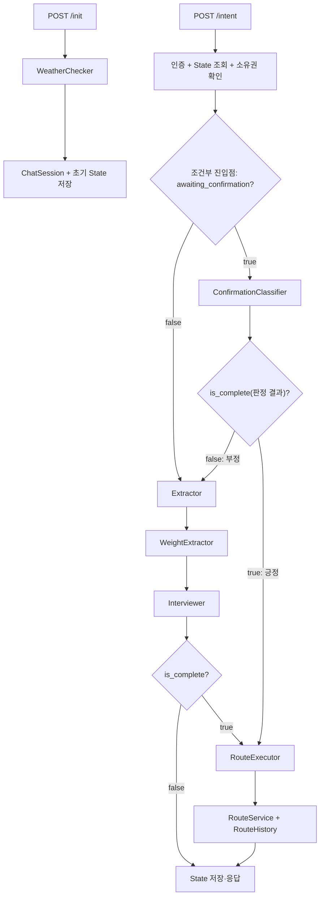

# 챗봇 Agent 하네스

> 상태: Current  
> 기준일: 2026-09-20
> 관련 코드: `src/agent/`, `src/service/chat/prewalk_service.py`, `src/schema/prewalk_schema.py`  
> 검증 상태: 코드 정적 대조 완료(2026-07-30, `ConfirmationClassifier` 추가·Graph 재배선·dev PR #310 profile/nearby_pois 반영) + `ConfirmationClassifier`·조건부 진입점 실행 검증 완료(2026-07-30, 로컬 PostgreSQL·Valkey·실제 Kakao·OpenAI, 프런트엔드 연동 안드로이드 기기 테스트). profile/nearby_pois(dev PR #310)는 정적 대조만 했고 격리 환경 실행 검증은 별도로 안 함. GPS Art 모드 배선(2026-08-06)은 정적 대조·문법 체크만 했고 실행 검증은 안 함(전용 테스트도 아직 없음) — 상세는 [경로 생성 엔진 GPS Art](../route_engine/README.md#gps-art) 참고. Waypoint 모드 배선(2026-08-07)은 정적 대조 + 단위 테스트(mock 엔진 기반)까지 확인했고, 추출·인터뷰 prompt 가이드(2026-08-07 추가)도 정적 대조(YAML 파싱·렌더링 확인)만 했다 — 실제 LLM·Kakao·그래프 실행 검증은 아직 없다 — 상세는 [경로 생성 엔진](../route_engine/README.md) 참고. `circular_random`/`oneway_random`의 후보 다양화(벡터 score, 2026-08-08)는 toy 그래프로 직접 실행 검증했지만 정식 `tests/` 회귀 테스트와 실서비스 그래프 검증은 아직 없다 — 상세는 [경로 생성 엔진](../route_engine/README.md)의 "후보 다양화(벡터 score 기반)" 절 참고. `Interviewer` 하드코딩 문구 전면 제거(2026-08-20, 확인·검색실패·서울밖 안내를 `interview.yaml` LLM 생성으로 통합 + LLM/Kakao 오류 시 raw exception 노출)는 문법·정적 대조만 했고 실제 LLM·Kakao 실행 검증은 아직 없다. `extraction.yaml`/`interview.yaml` 구조 개편과 `extractor.py` 결정론적 후처리 추가(2026-09-14, PR #429/refactor#400)는 `scripts/eval_extraction.py`·`scripts/eval_interviewer.py`로 실제 OpenAI 호출까지 실행 검증했다(DB·Kakao·Valkey는 쓰지 않음) — 상세와 실행 결과는 §9 "2026-09-14" 절 참고. `themes`/`TAG_WEIGHT_MAP` 기반 테마 추출과 `RouteExecutor._select_profile`(자동 accessible/convenient 선택)을 제거하고, `WeightExtractor` Node(`weight_extraction.yaml`, `PydanticOutputParser`)가 feature(`safety`/`comfort`)별 `preference_label`·`explicitness_label`을 추출해 `State.feature_labels`에 저장하도록 Graph를 `Extractor → WeightExtractor → Interviewer`로 재배선했다(2026-09-17). `RouteExecutor._build_weights`도 이 라벨을 EMA 블렌딩(`_PREFERENCE_TARGET_MAP`, `_EXPLICITNESS_ALPHA_MAP`, `_FEATURE_TO_WEIGHTS_KEY`)으로 반영하도록 바뀌었다 — 코드 정적 대조와 격리 단위 실행(schema round-trip, EMA 계산, 그래프 import 순서, 프롬프트 렌더링)까지는 확인했다. 온보딩 설문(`UserPreference`, `survey_service.py`)도 같은 날 후속 작업으로 safety/comfort 두 축만 남기게 정리했고, 그 과정에서 깨졌던 `TestRouteProfilePropagation`(옛 `_select_profile` 기준) 4개는 `TestRouteWeightPersonalization`으로 재작성해 전부 통과로 되돌렸으며, 컴파일된 LangGraph를 직접 실행해 `Extractor → WeightExtractor → Interviewer → RouteExecutor` 배선과 State 전달까지 확인했다 — 실제 OpenAI 호출·실제 DB/Kakao를 쓰는 전체 대화 흐름 실행 검증은 아직 없다. 같은 날 `origin/dev`(팀원의 waypoint 안전·편안 가중 연결 기능, #445)와 `route_executor.py`에서 병합 충돌이 나 두 기능을 모두 살리는 방향으로 정리했고(격리 단위 실행으로 재확인), `POST /api/prewalk/intent`에 `lat`/`lon`을 추가해 좌표가 바뀐 턴에만 서울 폴리곤·수계·고속도로 검증과 Kakao 역지오코딩을 다시 하도록 바꿨다(직접 호출 검증 완료) — 상세는 §9 "2026-09-17", "2026-09-17 후속", "2026-09-17 dev 병합", "2026-09-17 intent 좌표 수신" 절 참고

## 1. 책임

이 문서는 현재 챗봇의 파일 구조와 State·Node·Edge·Tool 계약을 정의한다. 사람이나 AI가 한 구성요소를 변경할 때 입력·출력·연결·저장·검증 범위를 찾는 기준이다.

미래 업그레이드 방향은 다루지 않는다. 현재 흐름의 실행 증거는 [챗봇 경로 추천 Workflow](../architecture/workflows/prewalk_conversation.md)에서 관리한다.

## 2. 입력

HTTP 입력:

| 진입점 | 입력 |
|---|---|
| `POST /api/prewalk/init` | `lat`, `lon`, `access_token` cookie |
| `POST /api/prewalk/intent` | `thread_id`, 공백이 아닌 `user_prompt`, `lat`, `lon`(2026-09-17부터 필수), `access_token` cookie |

공유 `State` 계약:

| 필드 | 최초 작성자 | 주요 소비·변경 주체 |
|---|---|---|
| `user_id` | Orchestrator init | 소유권 확인, `RouteExecutor` |
| `current_location` | Orchestrator init, intent Orchestrator(좌표가 이전 턴과 다를 때만 갱신, 2026-09-17부터) | `Extractor`, `Interviewer` |
| `access_token` | intent Orchestrator | `RouteExecutor` → `RouteService` |
| `user_prompt` | intent Orchestrator | `Extractor`, `Interviewer` |
| `mode` | `Extractor` | `RouteExecutor` |
| `user_context` | `Extractor` | `Interviewer`, `RouteExecutor` |
| `origin_candidate` | `Interviewer` | 다음 `Interviewer`(첫 번째 후보 자동 확정용) |
| `destination_candidate` | `Interviewer` | 다음 `Interviewer`(첫 번째 후보 자동 확정용) |
| `waypoint_candidates` | `Interviewer` | 다음 `Interviewer`(경유지 인덱스별 첫 번째 후보 자동 확정용, `waypoint` 모드 전용) |
| `feature_labels` | `WeightExtractor`(GPS Art·최단경로는 `{}`로 스킵) | `RouteExecutor._build_weights` 가중치 블렌딩 |
| `awaiting_confirmation` | `Interviewer`(True로 설정)·`ConfirmationClassifier`(False로 해제) | 다음 intent의 Graph 진입점 분기(`ConfirmationClassifier` vs `Extractor`) |
| `is_complete` | `Interviewer`·`ConfirmationClassifier` | Graph 분기(`RouteExecutor` 진입 여부)·완료 상태 |
| `response` | 각 대화 Node·Orchestrator | `ChatResponse.state` |
| `route_result` | `RouteExecutor` | API 응답·Valkey 저장 |

`user_context`는 모드에 따라 `CircularPreference`, `OnewayPreference`, `OnewayShortestPreference`, `GPSArtPreference`, `WayPointPreference` 중 하나다. `target_km`이 있는 Preference(`CircularPreference`/`OnewayPreference`/`GPSArtPreference`/`WaypointLegPreference`)는 `TargetKmPositiveMixin`으로 숫자 문자열을 숫자로 변환한 뒤 0 이하·NaN·양/음의 무한대·boolean을 차단한다(직접 경로 API `VAL-DIST-001`과 같은 검증 함수 재사용, 2026-09-20 갱신). 직접 경로 API의 10km 상한은 챗봇 Preference나 경유지 구간에 적용하지 않는다.

(2026-09-19 갱신) `State`에는 애초에 `profile` 필드가 없다 — `route_engine/profiles.py`
(`ScoringProfile`/`get_profile()`)가 8축→2축(safety/comfort) 축소로 완전히 삭제되면서, 위에
있던 "명시 profile이 없으면 ScoringProfile.DEFAULT" 절차 자체가 코드에서 사라졌다(2026-09-17
시점엔 이미 테마 기반 자동 선택만 제거되고 DEFAULT 폴백은 남아 있었으나, 그 이후 profile
개념 자체가 없어졌다). `safety`/`comfort` feature의 `preference_label`(중요도)·
`explicitness_label`(확신도)이 `RouteExecutor._build_weights`에서 연속적인 EMA 블렌딩으로
`Weights`에 반영되는 것이 지금의 유일한 경로다 — 이전에 프로필 전환이 하던 역할(안전·편안함
강조)을 대체한다. 저장된 설문값은 `Weights()`의 기본값과의 차이만 더한다.

## 3. 출력

- API 출력: `ChatResponse(status, thread_id, state)`
- PostgreSQL: init마다 `ChatSession(user_id, thread_id, START)` 추가
- Valkey: `chat_state:{thread_id}`에 전체 State JSON 저장, TTL 3,600초
- 경로 성공: `route_result`(`List[WalkRouteResponse]`)는 모드에 따라 최대 3개까지 담길 수 있다(2026-09-19 갱신 — `circular_random`은 `WaypointEngine`의 grasp+alns 다중 후보 규칙으로 3개, `oneway_random`은 지금 `oneway_shortest`와 같은 엔진이라 1개, `waypoint`는 leg 조합 다양화로 최대 3개 — 상세는 [경로 생성 엔진](../route_engine/README.md)의 "Engine 반환 계약"·"후보 다양화(벡터 score 기반)" 절 참고)
- 경로 성공: `RouteService`가 `RouteHistory`를 저장하고 `route_result[0].id`(대표 후보만)에 반영한다 — 나머지 후보의 `id`는 비어 있다(사용자가 실제로 고른 후보를 저장하는 흐름은 아직 없음, 알려진 개선 항목)
- 경로 성공: 성공한 후보 전부에 대해 그 경로 50m 안의 도보망 연결 POI를 `route_result[i].nearby_pois`로 반환
- LLM 출력: 초기 인사, 모드·거리·위치 추출, feature(safety/comfort)별 `preference_label`·`explicitness_label` 추출, 누락 질문, 확인 질문 긍정·부정 판정, 최종 확인 요청·검색 실패·서울 밖 안내(2026-08-20부터 전부 `interview.yaml` 생성, 하드코딩 문구 없음)
- 오류 출력: `Interviewer`의 LLM·Kakao API 호출이 실패하면 안내 문구 대신 발생한 예외 메시지를 `response`에 그대로 노출한다(2026-08-20부터, 의도된 동작)

현재 intent State에는 access JWT가 포함되며 API 응답과 Valkey JSON 양쪽으로 전달된다. `ChatSession.current_state`는 경로 완료 후에도 `START`로 남는다.

## 4. 실행 진입점

### 파일 구조

```text
src/agent/
├── nodes/
│   ├── weather_checker.py      # init 환경 인사, Graph 밖에서 실행
│   ├── extractor.py            # 모드·위치·거리 추출
│   ├── weight_extractor.py     # feature(safety/comfort)별 preference_label·explicitness_label 추출
│   ├── interviewer.py          # 누락 질문·장소 검색·확인 질문
│   ├── confirmation_classifier.py  # 확인 질문에 대한 긍정/부정 LLM 판정
│   └── route_executor.py       # 가중치 조합·경로 실행
├── tools/
│   ├── mode_tools.py           # preference 생성
│   ├── place_tools.py          # Kakao 주소·장소 검색
│   └── route_tools.py          # RouteService 비동기 호출
└── utils/
    └── chatbot_utils.py        # Pydantic 직렬화·Prompt 문자열 변환(2026-09-14: PydanticUtils.dump가 Enum을 .value까지 변환하도록 수정, PromptUtils.format_for_prompt의 반환값 누락 버그 수정. 2026-09-17: PromptUtils.sanitize_user_prompt 추가 — Extractor 로컬 함수였던 걸 이관)

src/service/chat/prewalk_service.py              # Orchestrator·Graph 조립
src/schema/prewalk_schema.py                     # State·Location·Preference
src/interfaces/api/prewalk_router.py             # HTTP 진입점
src/interfaces/schema/prewalk_schema.py          # 요청·응답·상태 schema
src/infrastructure/cache/repository/
└── chat_state_repository.py                     # Valkey State 저장
src/repository/chat/chat_session_repository.py   # PostgreSQL 세션 저장
src/prompt/                                      # LLM Prompt
```

**알려진 제약(2026-08-07): `WeatherCacheRepository` 미병합**

- `weather_checker.py`가 import하는 `src/infrastructure/cache/repository/weather_cache_repository.py`가 이 브랜치에는 아직 없다 — 다른 브랜치에서 추가될 예정이다.
- 그 모듈이 합쳐지기 전까지 `weather_checker.py`를 import하는 모든 경로(`src.agent.nodes` 패키지 전체, `src.service.chat.prewalk_service`, 이를 거치는 `src.service` 하위 대부분)가 `ModuleNotFoundError`로 즉시 실패한다 — 실제 서버 기동(`src/main.py`)과 `python -c "from src.service...`처럼 직접 import하는 스크립트 모두 영향을 받는다.
- `tests/`는 영향받지 않는다 — `tests/conftest.py`가 `src.agent.nodes.weather_checker`를 통째로 `MagicMock`으로 미리 등록해 real import를 우회한다.
- `WeatherCacheRepository`가 합쳐지면 이 제약은 자동으로 해소된다. 그 전까지 이 브랜치 단독으로 로컬 서버를 띄우거나 `src.service`를 직접 import하는 수동 확인은 할 수 없다.

### Node 입출력

| Node | 입력 | 출력·State 변경 | 외부 호출 |
|---|---|---|---|
| `WeatherChecker.run` | `lat`, `lon` | `init_message`(문자열) | 기상청·에어코리아·OpenAI |
| `Extractor.run` | `State` | `mode`, `user_context` | OpenAI, `ModeTool` |
| `WeightExtractor.run` | `State` | `feature_labels`(GPS Art·최단경로는 `custom_weights`를 안 쓰므로 호출 자체를 건너뛰고 `{}`) | OpenAI(`PydanticOutputParser`, tool 미바인딩) |
| `Interviewer.run` | `State` | 후보 위치, 보완된 context, `response`, 확인 상태 | OpenAI, `PlaceTool` |
| `ConfirmationClassifier.run` | `State` | `is_complete`(긍정/부정 판정 결과), `awaiting_confirmation=False` | OpenAI(`PydanticOutputParser`, tool 미바인딩) |
| `RouteExecutor.run` | `State` | `route_result` | 사용자 설문, `RouteTool`(GPS Art는 내부에서 `GpsArtService`도 호출; waypoint 모드는 `_build_weights`가 만든 `Weights`를 그대로 `args["preference"]`로도 함께 전달, 2026-09-17 dev 병합·#445 — 2026-09-19 갱신: 별도 `_build_preference_signal`/`SafetyComfortPreference` 변환 없이 재사용) |

모든 대화 Node는 전달받은 State 객체를 변경해 반환한다. Node별 별도 입출력 schema는 없다.

### Extractor 후처리(결정론적 보정, 2026-09-14)

`Extractor.run`이 LLM tool_call을 받은 뒤, `_apply_postprocessing`(`extractor.py`)이 `extraction.yaml` 지침만으로 못 잡는 경우를 결정론적 파이썬 로직으로 보정한다. LLM을 새로 호출하지 않는 순수 함수라 `scripts/eval_extraction.py`가 같은 tool_call에 대해 재현할 수 있다.

| 예외 | 보정 내용 |
|---|---|
| 3 | LLM이 필드값으로 문자열 `"null"`을 채운 경우 실제 `None`으로 정규화 |
| 4 | LLM이 스스로 채운 좌표를 검증 — 직전 place_name과 다르면 좌표를 지워 `Interviewer`의 Kakao 재검증을 강제, 같으면 직전에 확정된 좌표로 덮어씀 |
| 5 | origin·destination이 같은 장소명인데 명시적 출발 표현("에서"/"부터"/"출발"/"시작")이 없으면 origin을 null로 보정 |
| 6 | 모드가 바뀌었는데 새 도구의 정체성 필드(`destination`/`waypoints`/`shape`/`legs`)가 새로 채워지지도, 새 도구에 대응하는 명시적 전환 키워드(예: "최단", "편도", "거쳐")도 없으면 이전 도구로 되돌림 |
| 7 | 모드 변경 여부와 무관하게, 최종 도구가 받는 필드 중 이번 턴에 값이 없는 것은 직전 context 값으로 보존 |
| 8 | origin이 없으면 현재 위치(`state.current_location`)로 대체 |
| 9 | `target_minutes`가 있으면 도보 속도(4km/h, 근거: 정책브리핑 "시속 4km" 2011)로 `target_km`을 환산해 이번 턴의 옛 `target_km`보다 우선 적용. 시간·거리 언급이 모두 없으면 온보딩 `UserPreference.default_target_km`으로 채우고, 그마저 없으면 비워둔다(Interviewer 재질문에 맡김). 게이팅 조건은 args에 `target_km` 키가 실제로 있는지가 아니라 해당 도구가 `target_km` 필드를 받는지다(2026-09-14 버그 수정 — 이전 조건은 Context 없는 첫 요청에서 시간만 언급하면 LLM이 tool_call에 `target_km` 키를 아예 안 넣어 환산이 스킵되고 거리가 사라지는 문제가 있었다) |
| 10 | tool invoke 자체가 실패하면 State를 바꾸지 않고 종료 |

발화 정규화(HTML 태그·과도한 공백·반복 문자열 제거)는 더 이상 `Extractor` 내부가 아니라 `PrewalkOrchestrator.orchestrator()`가 그래프 실행 전에 `PromptUtils.sanitize_user_prompt`(`chatbot_utils.py`)로 한 번만 수행하고, 그 결과를 `State.user_prompt`에 직접 덮어쓴다(2026-09-17부터 — 이전에는 `Extractor`가 로컬로 정규화한 사본만 LLM에 넘기고 `State.user_prompt` 원본은 그대로 뒀다). 반복 문자열(`ㅋㅋㅋ`, `!!!` 등)은 강조 표현으로 보고 완전히 지우지 않고 2회로만 축약한다 — `WeightExtractor`가 `explicitness_label`을 판단할 때 이 반복이 신호로 쓰이기 때문이다. `Extractor`·`WeightExtractor`·`Interviewer`·`ConfirmationClassifier` 전부 같은 정규화된 `State.user_prompt`를 그대로 읽으며, 정규화 이전 원문을 보존하는 별도 필드는 없다.

`scripts/eval_extraction.py`(100개 — 001~070 첫 요청 강건성 케이스, 071~100 [Current Context]가 이미 채워진 "부분 수정" 시나리오)로 raw tool_call과 후처리 적용 후 결과를 각각 실행 검증했다(§9).

### Edge와 실제 분기



Graph 선언은 조건부 진입점(`awaiting_confirmation` 기준)에서 시작한다.

- `awaiting_confirmation=False` → `Extractor → WeightExtractor → Interviewer → (is_complete ? RouteExecutor : END)`
- `awaiting_confirmation=True` → `ConfirmationClassifier → (is_complete ? RouteExecutor : Extractor)`

`Interviewer`는 정보가 충분하면 `awaiting_confirmation=True`, `is_complete=False`로 확인 질문을 만들고 END로 끝난다. 다음 intent 턴에서 조건부 진입점이 이를 보고 `ConfirmationClassifier`로 보낸다. `ConfirmationClassifier`는 `confirmation.yaml`(`PydanticOutputParser`, tool 미바인딩)로 긍정/부정을 LLM 판정해 `is_complete`에 그대로 반영하고 `awaiting_confirmation`을 해제한다. 부정 판정이면 `Interviewer`로 바로 가지 않고 `Extractor`를 다시 거치는데, 부정 응답에 수정 정보가 섞여 있을 수 있어서다("아니, 5km로 바꿔줘"의 "5km"는 `Interviewer`가 아니라 `Extractor`의 `ModeTool`만 파싱 가능).

이전에는(2026-07-29 이전) `Interviewer`가 정보 충분 시 만든 `awaiting_confirmation=True` 상태를 Orchestrator가 Python if/else로 직접 처리하며 Graph 자체를 우회했고(긍정 시 `route_executor.run()` 직접 호출, 부정 시 하드코딩 문구 반환), 그래서 Graph에 선언된 조건부 Edge가 실행되지 않는 죽은 코드였다. 2026-07-30 `ConfirmationClassifier` 도입과 함께 이 우회 코드를 제거하고 확인 판정 자체를 Graph 안의 정식 Node·조건부 Edge로 옮겼다(근거: [챗봇 하드코딩 문구 처리 방안 제안](../proposals/chatbot_hardcoding_proposal.md) 1, 3번 항목).

2026-08-20에는 `Interviewer` 내부의 나머지 하드코딩 응답 문구(확인 질문 f-string, 검색 실패·서울 밖 안내 f-string, LLM/Kakao API 실패 시 fallback 문장)를 모두 제거했다. 확인 질문·검색 실패·서울 밖 안내는 `interview.yaml`에 추가한 우선순위 지침(0: 서울 밖, 1: 검색 실패, 2: 최종 확인)을 통해 LLM이 생성하고, LLM·Kakao API 호출이 실패한 경우에는 대체 문구 대신 발생한 예외를 그대로 `response`에 노출한다(근거: [챗봇 하드코딩 문구 처리 방안 제안](../proposals/chatbot_hardcoding_proposal.md) 2, 6, 9번 항목). 이 변경은 정적 대조만 했고, 실제 LLM이 새 지침을 얼마나 정확히 따르는지·raw exception 노출이 실제 대화에서 어떻게 보이는지는 아직 실행 검증하지 않았다.

### Tool과 Prompt

| 소유 Node | Tool | 입력 → 출력 |
|---|---|---|
| `Extractor` | `ModeTool` 5종(`select_gps_art`, `select_waypoint` 포함) | 위치·거리(`target_km`/`target_minutes`)·도형(shape)·경유지·leg별 이동 방식 → 모드별 Preference |
| `Interviewer` | `PlaceTool` 2종(`target`에 `waypoint`+`waypoint_index` 추가 지원) | keyword·category → Kakao 장소 결과 |
| `RouteExecutor` | `RouteTool` 5종(`gps_art_route`, `waypoint_route` 포함) | 좌표·거리·JWT·Profile·Weights → `WalkRouteResponse`. `gps_art_route`는 실행 전 `GpsArtService.get_shape_points`로 도형 이름을 좌표로 먼저 변환한다. `waypoint_route`는 `waypoints`/`leg_modes`/`leg_target_km`를 그대로 `RouteService.get_route`에 전달한다 |

| Node | 현재 사용하는 Prompt |
|---|---|
| `WeatherChecker` | `weather_checker.yaml` |
| `Extractor` | `extraction.yaml` |
| `WeightExtractor` | `weight_extraction.yaml`(도구 미바인딩, `PydanticOutputParser`로 `FeatureLabelMap`(`dict[FeatureTag, FeatureLabel]` `RootModel`) 파싱) |
| `Interviewer` | `interview.yaml` 단일 파일 — 도구 바인딩 1차 호출(장소 검색)과, 확인 요청·검색 실패·서울 밖 안내·재질문을 만드는 도구 미바인딩 호출(`_generate_response()`로 통합, `parser=str_parser`) 두 가지 방식으로 호출한다 |
| `ConfirmationClassifier` | `confirmation.yaml`(도구 미바인딩, `PydanticOutputParser`로 `ConfirmationResult.is_positive` 파싱) |
| `RouteExecutor` | 없음 |

`extraction.yaml`에 `select_waypoint` 선택 규칙, `interview.yaml`에 경유지 장소 검색(`target="waypoint"`+`waypoint_index`) 가이드가 추가됐다(2026-08-07, GPS Art 때의 `select_gps_art` 선택 규칙과 같은 패턴). 다만 정적 대조(YAML 파싱·`load_prompt(...).format(...)` 렌더링 확인)만 했고, 실제 대화에서 LLM이 이 모드를 언제 선택하고 경유지를 얼마나 정확히 태깅하는지는 아직 검증되지 않았다.

**2026-09-14 구조 개편**: `extraction.yaml`이 "[Current Context]가 비어 있는 첫 요청"과 "이미 채워진 부분 수정 요청"을 다른 규칙으로 분기하도록 바뀌었다 — 부분 수정에서는 사용자가 명시적으로 언급한 값만 바꾸고, 언급 안 한 필드는 [Current Context] 값을 그대로 다시 채운다(위 "Extractor 후처리" 예외7이 이를 코드 층에서 한 번 더 보강). 도구(모드)는 순환/편도 우회/최단/도형/경유지를 명시적으로 다르게 요구했을 때만 바뀐다(예외6이 같은 원칙을 코드로 재확인). `interview.yaml`의 지침0(무관한 주제 처리)도 "이 발화의 핵심 의도가 산책과 관련 있는가"라는 판단과 "무관할 때만 선을 긋는다"는 응답 방식을 분리해, 감정·날씨·음식 등이 산책 요청에 곁들여진 경우를 무관한 대화로 오인해 회피 응답을 내던 오탐을 줄였다. `scripts/eval_extraction.py`/`scripts/eval_interviewer.py`로 실제 OpenAI 호출까지 실행 검증했다(§9).

## 5. 의존하는 영역

- 인증: JWT 사용자 식별
- PostgreSQL: User, ChatSession, UserPreference, RouteHistory
- Valkey: 대화 State
- 외부 API: OpenAI `gpt-4o-mini`, Kakao Local, 기상청, 에어코리아
- 경로 영역: `RouteService`, 모드별 Engine, 메모리 Graph
- Prompt: `src/prompt/*.yaml`

## 6. 결과를 전달하는 영역

- `prewalk_router`가 State와 상태를 API 사용자에게 반환한다.
- `RouteExecutor`가 경로 입력을 `RouteService`에 전달한다.
- 최종 경로는 State·Valkey·RouteHistory에 연결된다.
- 다음 intent가 Valkey State와 후보 위치·context를 이어받는다.

## 7. 변경 시 영향 범위

| 변경 | 함께 확인할 대상 |
|---|---|
| State 필드 | API schema, Valkey 기존 JSON, 모든 Node, 직렬화 |
| Node 입출력 | Graph Edge, 조건부 진입점, Prompt |
| 확인 상태 | `ConfirmationClassifier` LLM 판정(`confirmation.yaml`), `is_complete`, Graph 조건부 Edge, RouteExecutor 진입 |
| Mode/Preference | ModeTool, Extractor prompt, Interviewer 완료 조건, RouteTool |
| 장소 필드 | Kakao schema, 후보 선택, 서울 bbox 검증 |
| intent 좌표(`current_location` 갱신) | `ChatRequest.lat/lon` 검증(coord/water/highway validator), `PrewalkOrchestrator.orchestrator()`의 동일 좌표 스킵 조건, Kakao 역지오코딩, `prewalk_router.py`의 `ValueError`→400 매핑 |
| `feature_labels`·가중치 | `WeightExtractor` prompt(`weight_extraction.yaml`), `FeatureTag`/`FeatureLabel`/`FeatureLabelMap` 스키마, `RouteExecutor._build_weights`(`_PREFERENCE_TARGET_MAP`, `_EXPLICITNESS_ALPHA_MAP`, `_FEATURE_TO_WEIGHTS_KEY`), 설문 `Weights` delta, 경로 scoring |
| Prompt | tool 이름·인자, parser, fallback, LLM 검증 |
| 저장 방식 | TTL, 세션 소유권, 만료·복구, API 응답 |

## 8. 실패·복구 방법

| 실패 지점 | 현재 동작 | 복구 |
|---|---|---|
| init 인증 실패 | 인증 상태 반환 | refresh·재로그인 |
| 날씨·주소 실패 | 빈 환경·기본 인사 또는 좌표 Location | 새 init 또는 계속 진행 |
| intent 좌표 검증 실패(서울 밖·수계·고속도로, 2026-09-17부터) | `ValueError` → HTTP 400(`prewalk_router.py`). 좌표가 이전 턴과 같으면 이 검증 자체를 건너뛰므로, 같은 위치를 유지하는 후속 턴에서는 발생하지 않는다 | 유효한 좌표로 재요청 |
| intent Kakao 역지오코딩 실패(좌표가 바뀐 턴에서만) | 주소·장소명 없이 좌표만 있는 Location으로 대체, 대화는 계속됨 | 다음 intent에서 재시도 |
| State 없음·만료 | `session_not_found` | init부터 재시작 |
| 타 사용자 State | `unaccessible` | 자신의 thread 사용 |
| Extractor LLM 실패 | 기존 State 유지 | 다음 intent에서 재시도 |
| WeightExtractor LLM·파싱 실패 | 직전 턴 `feature_labels`를 그대로 유지(재추출 없이 진행, 대화는 계속됨) | 다음 intent에서 재시도 |
| Interviewer LLM·Kakao API 실패 | 발생한 예외 메시지를 그대로 `response`에 노출(2026-08-20부터, 하드코딩 fallback 문구 없음) | 다음 intent에서 재시도 |
| ConfirmationClassifier LLM 실패 | `is_complete=False`로 처리해 `Extractor`로 진행(안전 측 기본값, 별도 fallback 문구 없음) | 다음 intent에서 재확인 질문 재생성 |
| RouteTool 실패 | 예외를 기록하고 기존 State 유지 | 조건 확인 후 재확인 |
| State 저장 실패 | 응답은 반환될 수 있음 | Valkey 복구 후 init 재시작 |

HTTP 200만으로 성공을 판단하지 않는다. `status`, `awaiting_confirmation`, `is_complete`, `route_result.status`를 함께 확인한다.

## 9. 검증 방법

**2026-07-27 (Orchestrator 우회 방식 기준, 격리 PostgreSQL·Valkey + 실제 Kakao·OpenAI·경로 엔진)**

이 실행 증거는 `ConfirmationClassifier` 도입 이전 구조 기준이라, 아래 관측값은 대화 흐름 자체(정보 수집·확인 대기)의 근거로만 유효하다.

- init → ChatSession 1건, Valkey TTL 3,600초
- 없는 thread → `session_not_found`
- 타 사용자 thread → `unaccessible`
- 발화 → 순환 모드·거리 추출 → 확인 대기
- 긍정 확인 → 당시 격리 실행(Orchestrator 우회 방식)에서 61좌표·3.10km 경로와 RouteHistory 저장 관측
- 경로 완료 State에 `is_complete=True`, PostgreSQL 세션은 `START`

위 경로 좌표 수와 거리는 2026-07-27 일회성 관측값이며 고정 회귀 기대값이 아니다. 재현 조건과 상세 결과는 [챗봇 경로 추천 Workflow](../architecture/workflows/prewalk_conversation.md)에서 관리한다.

**2026-07-30 (현재 Graph 구조, 로컬 PostgreSQL·Valkey + 실제 Kakao·OpenAI, 프런트엔드 연동 안드로이드 기기)**

격리된 일회성 환경이 아니라 로컬 개발 DB·Valkey를 그대로 사용한 실행 확인이다. 다음을 확인했다:

- 확인 질문에 긍정 응답 → `ConfirmationClassifier`가 긍정 판정 → `RouteExecutor` 진입까지 정상 동작
- 확인 질문에 부정 + 수정 정보(예: "아니, Nkm로 바꿔줘") 응답 → `ConfirmationClassifier`가 부정 판정 → `Extractor`로 재진입해 수정 정보 반영까지 정상 동작
- `awaiting_confirmation` 값에 따라 조건부 진입점이 `confirmation_classifier`/`extractor`로 정확히 분기함

**아직 확인 안 된 항목**: `confirmation.yaml` 프롬프트가 애매한 응답(명시적 긍/부정 단어가 없는 경우)을 얼마나 잘 판정하는지, `ConfirmationClassifier` LLM 호출 실패 시 fallback 동작(`is_complete=False` 처리), 격리된(공유 상태 없는) 환경에서의 재현. 인증·세션·소유권 실패 경로는 이번 확인 범위에 포함되지 않았다.

`tests/integration/test_api.py`는 router를 mock Orchestrator로 확인한다. 현재 실제 Node·Edge·State 저장·LLM tool call을 자동 검증하는 챗봇 전용 테스트는 없다.

**2026-08-07 (Waypoint 모드 배선, 격리 실행 없이 정적 대조 + 단위 테스트)**

- `prewalk_schema.py`(`WayPointPreference`/`WaypointLegPreference`/`State.user_context` Union·`waypoint_candidates`), `mode_tools.py`(`select_waypoint`), `place_tools.py`(`target="waypoint"`+`waypoint_index`), `interviewer.py`(완료 조건·확인 문구·경유지 장소 검색 보완), `route_tools.py`(`waypoint_route`), `route_executor.py`(`MODE_TOOL_MAP`, `legs`→`leg_modes`/`leg_target_km` 변환), `route_service.py`(`base_engines`·`_build_engine`의 `WaypointRouteInput` 구성과 leg 패딩)까지 코드 정적 대조를 마쳤다.
- `tests/unit/test_routue_service.py::TestWaypointRouting`(4개: leg 패딩 2개, nearest-node 없음, 경유지 없는 단일 leg) + `TestOnewayWithoutDestination`/`TestModeRouting` 파라미터라이즈에 `WAYPOINT` 추가 + 기존 `test_waypoint_engine.py`(엔진 자체 단위 테스트)까지 총 38개 테스트 통과.
- `extraction.yaml`/`interview.yaml`에 waypoint 관련 prompt 가이드를 추가했다(2026-08-07, YAML 파싱·렌더링만 정적 확인).
- **아직 확인 안 된 것**: 실제 PostgreSQL 그래프·Valkey·OpenAI·Kakao를 사용한 실행 검증(prompt 가이드가 실제 LLM 판단에 얼마나 효과적인지 포함), 프런트엔드 연동.

**2026-09-14 (extraction.yaml/interview.yaml 구조 개편 + extractor.py 결정론적 후처리, DB·Kakao·Valkey 없이 실제 OpenAI 호출)**

- `scripts/eval_extraction.py`: 100개(001~070 "첫 요청" 강건성 케이스 + 071~100 [Current Context]가 이미 채워진 "부분 수정" 시나리오, 상세 구성은 스크립트 docstring 참고). 이 100개를 실제로 돌리는 과정에서 실제 프로덕션 버그 하나를 발견해 같은 날 고쳤다: **Context 없는 첫 요청에서 "OO분"처럼 시간만 말하면 목표 거리가 조용히 사라지는 문제**(`extractor.py` 예외9) — LLM이 tool_call에 `target_km` 키 자체를 안 넣는 경우가 있는데, 예외9의 분→km 환산 블록이 `"target_km" in args`로 게이팅돼 있어 이 경우 통째로 스킵됐다. 이제 args에 그 키가 실제로 있는지가 아니라 해당 도구가 애초에 `target_km` 필드를 받는지로 판단하도록 수정했다. 부분 수정 상황에서는 예외7(직전 context 필드 보존)이 먼저 `target_km` 키를 채워 넣어 이 조건을 우연히 만족시켰기 때문에 지금까지 드러나지 않았다.
  버그 수정과 별개로, 데이터셋 자체의 기대값도 두 가지 보정했다: (a) `origin`을 언급하지 않은 케이스 다수가 후처리 후 `origin: None`을 기대하고 있었는데, 예외8("origin 없으면 현재 위치로 채움")이 항상 적용되는 게 의도된 정상 동작이라 실제 장소명을 명시한 케이스(4개)만 계속 검증하고 나머지는 `DONT_CARE`로 바꿨다. (b) 거리·시간을 전혀 언급하지 않은 케이스가 기대하던 `target_km` 기본값(3.0 등, 예전 정책 가정)을, 지금 `extraction.yaml`이 명시하는 "미언급 시 null 유지"에 맞게 `None`으로 고쳤다. 시간을 언급한 케이스는 `_WALK_SPEED_KMH`(4km/h) 환산이 원래도 맞았다.
  버그 수정 + 기대값 보정 후 로컬 1회 실행(`./.venv/Scripts/python.exe scripts/eval_extraction.py`) 결과: raw tool_call 기준 70/100 PASS, `_apply_postprocessing` 적용 후 84/100 PASS. 남은 후처리 실패 16건 중 상당수는 "최단 경로로 갔을 때의 거리 알려줘"처럼 장소·거리·시간이 전혀 없어 `extraction.yaml` 0번 규칙("구체적 정보가 없으면 도구 호출 안 함")이 정상 발동해 도구를 호출하지 않는 케이스로, 데이터셋이 애초에 도구 호출을 기대한 것 자체가 그 규칙과 어긋난다 — 코드 결함이 아니라 데이터셋과 프롬프트 설계 의도 사이의 불일치다. `case_032`(음수 시간)는 분→km 환산값이 음수가 돼 `TargetKmPositiveMixin`(VAL-DIST-001)이 정상적으로 거부하는 의도된 실패다.
- `scripts/eval_interviewer.py`: Phase 1(001~030, API 호출 없이 `_is_complete`/`_get_missing_info`만 결정론적으로 대조) + Phase 2(031~100, 실제 OpenAI로 `interview.yaml` 생성 문구를 키워드로 느슨하게 검사) 100개. 로컬 1회 실행 결과 97/100 PASS. 실패 3건(049, 051, 087)은 자유 생성 문구라 재실행마다 결과가 달라질 수 있는 known issue — 특히 051("최단 목적지 미정, 약속 언급이 섞인 발화")은 반복적으로 재현되는 편이라, few-shot 예산(≤5개) 안에서 더 밀어붙일지 이 상태로 둘지는 사용자 판단 대기 중이다.
- 두 스크립트 모두 PostgreSQL·Valkey·Kakao는 쓰지 않는다(Phase 2만 `OPENAI_API_KEY` 필요, `UserPreferenceRepository`는 "온보딩 선호 없음"으로 모킹). `scripts/test_prewalk_conversation.py`처럼 서비스 그래프 전체를 도는 것은 아니라서 Kakao 장소검색·bbox 필터·`RouteExecutor` 이후 단계는 이 실행 범위 밖이다.
- 위 PASS/FAIL 수치는 2026-09-14 로컬 1회 실행의 일회성 관측값이며 고정 회귀 기대값이 아니다. LLM 비결정성 때문에 재실행 시 달라질 수 있고, 스크립트 자체가 `--repeat` 옵션으로 다회 실행을 권장한다.
- **아직 확인 안 된 것**: 049/051/087 실패의 근본 원인 수정 여부(interview.yaml few-shot 조정으로 완화를 시도했으나 완전히 해소되지 않음), `--repeat` 다회 실행으로 본 정확한 flakiness 재현율, `eval_extraction.py` 남은 16건 중 "데이터셋 기대값 자체를 0번 규칙에 맞게 다시 고칠지"는 사용자 판단 대기, GPS Art·경유지 모드에 대한 이 계열 eval(현재 두 스크립트 모두 순환/편도 우회/최단만 대상).

**2026-09-17 (WeightExtractor 도입 + `_select_profile` 제거, DB·Kakao·OpenAI 실행 없이 정적 대조 + 격리 단위 실행)**

- `prewalk_schema.py`(`FeatureTag`(safety/comfort) `str, Enum`, `FeatureLabel`, `FeatureLabelMap` `RootModel[dict[FeatureTag, FeatureLabel]]`, `State.feature_labels`), `weight_extractor.py`(신규 Node), `weight_extraction.yaml`(신규 prompt), `prewalk_service.py`(`Extractor → WeightExtractor → Interviewer` 배선), `dependencies.py`/`nodes/__init__.py`(의존성 조립)까지 코드 정적 대조를 마쳤다.
- 앱이 실제로 기동하는 import 순서(`src.service` → `src.agent.nodes`)로 직접 import해 순환 참조 없이 로드되고 `WeightExtractor()`가 정상 인스턴스화됨을 확인했다.
- `FeatureTag`/`FeatureLabel`/`FeatureLabelMap`/`State`를 실제로 만들어 JSON 직렬화까지 실행 — `FeatureTag` enum 키가 `"safety"`처럼 순수 문자열로 나와 Valkey 저장과 호환됨을 확인했다.
- `WeightExtractor.run()`의 GPS Art·최단경로 스킵 분기를 실행해, 이 두 모드에서는 LLM 호출 없이 `feature_labels={}`가 되는 것을 확인했다.
- `weight_extraction.yaml`을 실제 `PydanticOutputParser(FeatureLabelMap).get_format_instructions()`와 함께 렌더링 — `user_input`/`feature_tags`/`format_instructions` 세 변수가 전부 치환되고 예시의 중괄호 이스케이프가 깨지지 않음을 확인했다.
- `RouteExecutor._build_weights`를 `UserPreferenceRepository.get_by_user_id`만 mock하고 직접 호출 — `safety`(`must`+`explicit_hard`)가 `alpha*target+(1-alpha)*base` 공식대로 baseline 0.5에서 0.905로 계산되고, `comfort`(`low`+`inferred`, alpha=0)는 baseline 0.5가 그대로 유지됨(= "미언급과 동일"이라는 설계 의도)을 assert로 확인했다.
- **회귀 발견(2026-09-17 후속 작업으로 해소, 아래 절 참고)**: 당시 `tests/unit/test_routue_service.py::TestRouteProfilePropagation`의 5개 테스트 중 4개가 제거된 `_select_profile`을 직접 호출하거나 옛 자동 프로필 선택을 기대해 실패했었다.

**2026-09-17 후속 (설문 축 정리 + 회귀 테스트 재작성 + 전체 파이프라인 실행 검증, DB·Kakao·OpenAI 없이 정적 대조 + 격리 단위 실행)**

- 온보딩 설문(`survey_service.py`, `UserPreference` 엔티티, `survey_schema.py`)도 같은 이유로 safety/comfort 두 축만 남기고 정리했다 — `UserPreference.weights_nature/slope/running/landmark/child/convenience/accessibility` 7개 컬럼 제거, `weights_comfort` 추가(`DB_AUTO_MIGRATE=full` 기본값이라 다음 서버 재시작 때 드랍된 컬럼의 기존 데이터가 삭제됨, 백업 없이 진행하기로 사용자가 확인함). `TAG_WEIGHT_MAP`도 FE가 실제로 보내는 태그("안전"/"편안") 두 개로 단순화했다. `route_executor.py`의 `_SURVEY_AXES`/`_FEATURE_TO_WEIGHTS_KEY`도 내부적으로 전부 `"comfort"`로 통일했고, `route_schema.Weights`의 실제 필드명인 `"slope"`는 `Weights(safety=..., slope=base["comfort"])`를 생성하는 마지막 한 줄에서만 등장한다(그 외 Weights 8개 필드·`route_engine`·`profiles.py`·`/api/walk/route`는 이번 정리 대상이 아니며 손대지 않았다 — 그쪽까지 safety/comfort로 좁히는 건 별도의, 훨씬 큰 범위의 결정이라 보류 중이다).
- `tests/unit/test_routue_service.py::TestRouteProfilePropagation`(옛 `_select_profile` 기준, 4/5 실패)를 `TestRouteWeightPersonalization`으로 재작성 — 설문 delta가 safety/comfort에만 반영되고 나머지 6축은 스키마 기본값을 유지하는지, `profile` 명시/미명시 시 `run()`이 각각 어떻게 동작하는지 검증. `tests/unit/test_survey_service.py::TestCalculateWeights`도 "안전"/"편안" 두 태그 기준으로 재작성.
- 이 과정에서 `tests/integration/test_api.py::TestSurveyAPI`가 옛 `weights_nature`/`weights_slope` 필드로 mock 응답을 만들고 있던 것을 추가로 발견해 `weights_safety`/`weights_comfort` 기준으로 고쳤다.
- **실행 검증**: `tests/unit/test_survey_service.py` + `tests/unit/test_routue_service.py` 42/42 통과, `tests/integration/test_api.py` 통과(단 `AuthService.get_access_token()` 인자 불일치로 인한 기존 실패 6건은 이번 작업과 무관, 위 "알려진 미해결" 항목 참고). `tests/unit` 전체 644 passed / 42 failed — 실패 42개는 전부 `graph_repository`/`base_collector`/`banner_service` 등 다른 도메인이라 무관함을 확인.
- **전체 그래프 실행 시뮬레이션**: 각 Node의 LLM 호출부만 얇게 대체하고 `PrewalkOrchestrator._build_graph`가 만든 실제 컴파일된 LangGraph를 직접 `ainvoke`로 실행 — (1) `Extractor → WeightExtractor → Interviewer → RouteExecutor` 정상 흐름에서 `weight_extractor`가 채운 `feature_labels`가 `route_executor._build_weights`까지 그대로 전달돼 `safety=0.905`로 정확히 계산됨을 확인 (2) `awaiting_confirmation=True → ConfirmationClassifier(부정) → Extractor 재진입 → WeightExtractor → Interviewer` 재진입 경로도 정확한 순서로 실행됨을 확인.
- **아직 확인 안 된 것**: 실제 OpenAI 호출로 `weight_extraction.yaml`이 발화에서 `preference_label`/`explicitness_label`을 얼마나 정확히 뽑는지(전용 eval 스크립트 없음), `scripts/test_prewalk_conversation.py`/실기기 연동으로 본 실제 LLM·Kakao·DB 기반 전체 대화 흐름 실행 검증.

**2026-09-17 dev 병합 (`route_executor.py` 충돌 해소, 이슈 #445 waypoint 가중 연결 반영, 정적 대조 + 격리 단위 실행)**

- `refactor/448`(이 문서가 다루는 챗봇 EMA 개인화 작업)과 `origin/dev`(팀원의 waypoint "안전·편안 가중 연결" 기능, #445)가 `route_executor.py`의 같은 자리를 각자 고쳐 병합 충돌이 났다. 두 작업은 경쟁하지 않는 별개 기능이라(계산 로직은 우리, 그 결과의 새 소비처는 dev) 전부 살리는 방향으로 정리했다: `_build_weights`의 safety/comfort EMA 계산은 그대로 두고, `run()`이 계산된 `weights`를 재사용해 waypoint 모드에서만 `_build_preference_signal(weights)`로 `SafetyComfortPreference`를 만들어 `args["preference"]`로 추가 전달한다. dev 쪽의 `Weights(**base)`(`base`에 `"comfort"` 키가 있어 `TypeError`가 나는 버그)는 채택하지 않고 우리 쪽 `Weights(safety=..., slope=base["comfort"])`를 유지했다.
  **(2026-09-19 갱신)** 위 문단은 그 시점의 기록이다 — 이후 `_build_preference_signal()`/`SafetyComfortPreference`는 둘 다 삭제됐고, `RouteExecutor._build_weights()`가 만든 `Weights`를 별도 변환 없이 그대로 `args["preference"]`로 재사용하는 방식으로 단순화됐다(위 "1. State 필드"의 `RouteExecutor.run` 행 참고). `route_engine/profiles.py`도 8축→2축(safety/comfort) 축소로 완전히 삭제됐다 — 위 "그 외 Weights 8개 필드·`route_engine`·`profiles.py`... 이번 정리 대상이 아니며 손대지 않았다"는 §9 "2026-09-17 후속" 절의 서술은 그 시점 기준이며, `profiles.py`는 그 이후 별도 작업에서 삭제됐다.
- `preference` 인자는 waypoint 모드에서 사용자가 leg 이동 방식을 명시하지 않은 구간에만 영향을 준다 — `route_service.py::_resolve_fill_leg_mode`가 그 구간을 기존 `oneway_shortest`(순수 거리 최단) 대신 `oneway_preferred`(같은 `OnewayAstarEngine`이지만 `scoring_engine.py`의 `WeightedEdgeCost` 페널티형 비용 함수 사용, 2026-09-19 갱신 — 원래 `weighted_edge_cost.py`에 있었으나 `scoring_engine.py`에 합쳐졌다)로 채운다. 사용자가 명시한 leg, `oneway_random`이 섞인 요청, 선호가 없거나 0인 요청, 그래프 점수 커버리지가 부족한 경우는 그대로 `oneway_shortest`를 쓴다.
- `tests/unit/test_weighted_cost_runtime.py::test_executor_forwards_survey_and_conversation_blend` 중 2개가 mock `UserPreference`에 `weights_slope`(dev 쪽이 작성 당시 쓰던 옛 컬럼명)를 쓰고 있어 실패한다 — 우리 엔티티는 이미 `weights_comfort`로 확정돼 있어(§9 "2026-09-17 후속" 참고) 이 테스트가 낡은 것으로 보이나, 팀원의 새 테스트 파일이라 임의로 고치지 않고 **사용자 판단 대기 중**이다.
- 이 과정에서 함께 병합된 `docs/proposals/route_engine_detour_policy_proposal.md`/`detour_cap.py`(우회 상한 정책)는 **팀 미합의 실험**으로 명시돼 있고 실제 파이프라인에는 연결돼 있지 않다 — 이 문서의 범위 밖이며 참고만 한다.
- **실행 검증**: `git merge-tree`로 사전에 충돌 파일이 `route_executor.py` 하나뿐임을 확인, 충돌 해소 후 `tests/unit/test_routue_service.py`+`tests/unit/test_survey_service.py` 42/42 통과, dev가 새로 가져온 `test_weighted_cost_runtime.py`/`test_waypoint_detour_cap.py`/`test_oneway_astar_weighted.py`/`test_weighted_edge_cost.py`/`test_graph_repository_scores.py` 262개 중 260 통과(위 2개 제외).
- **아직 확인 안 된 것**: `weights_slope`/`weights_comfort` 불일치를 어느 쪽 기준으로 맞출지(팀 확인 필요), 실제 waypoint 요청으로 `oneway_preferred` 분기가 프런트엔드까지 연동된 상태에서 정상 동작하는지.

**2026-09-17 intent 좌표 수신 (`/api/prewalk/intent`에 `lat`/`lon` 추가, 정적 대조 + 격리 단위 실행)**

- `ChatRequest`(`lat`, `lon` 필수, `InitRequest`와 동일한 검증 체인 재사용), `prewalk_router.py`(`/intent`가 좌표를 `orchestrator()`에 전달, `ValueError`→400 매핑 추가 — 이전엔 `/init`에만 있던 처리), `prewalk_service.py::orchestrator()`(`state.current_location`과 새 좌표가 다를 때만 `validate_seoul_polygon_contains`→`snap_coordinate_from_water`→`validate_no_highway`→Kakao 역지오코딩을 실행, 같으면 전부 건너뜀)까지 반영했다.
- **실행 검증**: `orchestrator()`를 직접 두 번 호출 — 동일 좌표로 재호출 시 DB 세션·검증 함수·Kakao 호출이 전혀 발생하지 않음을 확인, 다른 좌표로 호출 시 전부 정상 실행됨을 확인. `tests/integration/test_api.py::TestPrewalkIntentAPI`(요청 바디에 좌표 추가) + `scripts/test_prewalk_conversation.py`(`orchestrator()` 호출에 `LAT`/`LON` 추가)도 같이 고쳐 `tests/integration/test_api.py` 전체 재실행(70 passed, 무관한 기존 auth 실패 6건 제외) 확인.
- **아직 확인 안 된 것**: 실제 이동 중인 사용자가 여러 턴에 걸쳐 좌표를 바꿔 보내는 실기기 시나리오, FE가 이미 `/intent`를 호출하고 있다면 `lat`/`lon` 필수화가 breaking change라는 점(FE 쪽 반영 여부는 별도 확인 필요).

## 10. 완료 기준

- 파일·State·Node·Edge·Tool 표가 현재 코드와 일치한다.
- 선언 Graph가 실제 실행 경로와 일치한다(2026-07-30 기준 Orchestrator 우회 코드 제거됨).
- State 작성자·소비자·저장소가 추적 가능하다.
- 정상 대화와 인증·세션·소유권 실패를 실행 증거로 확인한다.
- 변경 시 영향 대상과 복구 시작점을 찾을 수 있다.
- 미래 구조 제안은 이 Current 문서와 분리한다.
