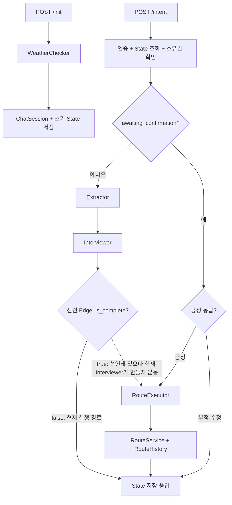

# 챗봇 Agent 하네스

> 상태: Current  
> 기준일: 2026-07-30
> 관련 코드: `src/agent/`, `src/service/chat/prewalk_service.py`, `src/schema/prewalk_schema.py`  
> 검증 상태: 현재 코드 대조·프로필 전달 단위 테스트 완료·기존 격리 통합 확인

## 1. 책임

이 문서는 현재 챗봇의 파일 구조와 State·Node·Edge·Tool 계약을 정의한다. 사람이나 AI가 한 구성요소를 변경할 때 입력·출력·연결·저장·검증 범위를 찾는 기준이다.

미래 업그레이드 방향은 다루지 않는다. 현재 흐름의 실행 증거는 [챗봇 경로 추천 Workflow](../architecture/workflows/prewalk_conversation.md)에서 관리한다.

## 2. 입력

HTTP 입력:

| 진입점 | 입력 |
|---|---|
| `POST /api/prewalk/init` | `lat`, `lon`, `access_token` cookie |
| `POST /api/prewalk/intent` | `thread_id`, 공백이 아닌 `user_prompt`, `access_token` cookie |

공유 `State` 계약:

| 필드 | 최초 작성자 | 주요 소비·변경 주체 |
|---|---|---|
| `user_id` | Orchestrator init | 소유권 확인, `RouteExecutor` |
| `current_location` | Orchestrator init | `Extractor`, `Interviewer` |
| `access_token` | intent Orchestrator | `RouteExecutor` → `RouteService` |
| `user_prompt` | intent Orchestrator | `Extractor`, `Interviewer` |
| `mode` | `Extractor` | `RouteExecutor` |
| `user_context` | `Extractor` | `Interviewer`, `RouteExecutor` |
| `origin_candidate` | `Interviewer` | 다음 `Interviewer`(첫 번째 후보 자동 확정용) |
| `destination_candidate` | `Interviewer` | 다음 `Interviewer`(첫 번째 후보 자동 확정용) |
| `themes` | `Extractor` | `RouteExecutor` 가중치 |
| `profile` | API State 또는 `RouteExecutor` | 명시값 우선, 없으면 테마에서 결정 |
| `awaiting_confirmation` | `Interviewer`·Orchestrator | 다음 intent 분기 |
| `is_complete` | `Interviewer`·Orchestrator | Graph 분기·완료 상태 |
| `response` | 각 대화 Node·Orchestrator | `ChatResponse.state` |
| `route_result` | `RouteExecutor` | API 응답·Valkey 저장 |

`user_context`는 모드에 따라 `CircularPreference`, `OnewayPreference`, `OnewayShortestPreference` 중 하나다.

명시 `profile`이 없으면 `유모차`·`계단이 불편한` 테마는 내부 `accessible`,
`활기찬`·`힙한` 테마는 `convenient`를 선택한다. 접근성 테마가 편의 테마보다
우선한다. 사용자에게는 `accessible`을 `이동이 편한 길`로 안내하며 완전한 무장애
경로를 뜻하지 않는다. 저장된 설문값은 선택 프로필을 교체하지 않고 공통 baseline과의
차이만 더한다.

## 3. 출력

- API 출력: `ChatResponse(status, thread_id, state)`
- PostgreSQL: init마다 `ChatSession(user_id, thread_id, START)` 추가
- Valkey: `chat_state:{thread_id}`에 전체 State JSON 저장, TTL 3,600초
- 경로 성공: `RouteService`가 `RouteHistory`를 저장하고 `route_result.id` 반환
- 경로 성공: 경로 50m 안의 도보망 연결 POI를 `route_result.nearby_pois`로 반환
- LLM 출력: 초기 인사, 모드·거리·위치·테마 추출, 누락 질문

현재 intent State에는 access JWT가 포함되며 API 응답과 Valkey JSON 양쪽으로 전달된다. `ChatSession.current_state`는 경로 완료 후에도 `START`로 남는다.

## 4. 실행 진입점

### 파일 구조

```text
src/agent/
├── nodes/
│   ├── weather_checker.py      # init 환경 인사, Graph 밖에서 실행
│   ├── extractor.py            # 모드·위치·거리·테마 추출
│   ├── interviewer.py          # 누락 질문·장소 검색·확인 질문
│   └── route_executor.py       # 가중치 조합·경로 실행
├── tools/
│   ├── mode_tools.py           # preference 생성
│   ├── place_tools.py          # Kakao 주소·장소 검색
│   └── route_tools.py          # RouteService 비동기 호출
└── utils/
    └── chatbot_utils.py        # Pydantic 직렬화·Prompt 문자열 변환

src/service/chat/prewalk_service.py              # Orchestrator·Graph 조립
src/schema/prewalk_schema.py                     # State·Location·Preference
src/interfaces/api/prewalk_router.py             # HTTP 진입점
src/interfaces/schema/prewalk_schema.py          # 요청·응답·상태 schema
src/infrastructure/cache/repository/
└── chat_state_repository.py                     # Valkey State 저장
src/repository/chat/chat_session_repository.py   # PostgreSQL 세션 저장
src/prompt/                                      # LLM Prompt
```

### Node 입출력

| Node | 입력 | 출력·State 변경 | 외부 호출 |
|---|---|---|---|
| `WeatherChecker.run` | `lat`, `lon` | `init_message`(문자열) | 기상청·에어코리아·OpenAI |
| `Extractor.run` | `State` | `mode`, `user_context`, `themes` | OpenAI, `ModeTool` |
| `Interviewer.run` | `State` | 후보 위치, 보완된 context, `response`, 확인 상태 | OpenAI, `PlaceTool` |
| `RouteExecutor.run` | `State` | `profile`, `route_result` | 사용자 설문, `RouteTool` |

모든 대화 Node는 전달받은 State 객체를 변경해 반환한다. Node별 별도 입출력 schema는 없다.

### Edge와 실제 분기



Graph 선언은 `Extractor → Interviewer → (is_complete ? RouteExecutor : END)`다. 현재 `Interviewer`는 정보가 충분하면 `awaiting_confirmation=True`, `is_complete=False`로 반환하므로 Graph 안의 `RouteExecutor` Edge는 실행되지 않는다. 긍정 확인 턴에서 Orchestrator가 Graph를 우회해 직접 호출한다.

Git 이력 기준으로 조건부 Edge는 `0ed8073b`에서 추가됐다. `e42c36d`에서 경로 생성 전 확인 단계가 추가되며 `Interviewer`가 `awaiting_confirmation=True`, `is_complete=False`로 종료하고 다음 긍정 응답에서 Orchestrator가 `RouteExecutor`를 직접 호출하도록 바뀌었지만, 기존 조건부 Edge는 제거되지 않았다.

### Tool과 Prompt

| 소유 Node | Tool | 입력 → 출력 |
|---|---|---|
| `Extractor` | `ModeTool` 3종 | 위치·거리 → 모드별 Preference |
| `Interviewer` | `PlaceTool` 2종 | keyword·category → Kakao 장소 결과 |
| `RouteExecutor` | `RouteTool` 3종 | 좌표·거리·JWT·Profile·Weights → `WalkRouteResponse` |

| Node | 현재 사용하는 Prompt |
|---|---|
| `WeatherChecker` | `weather_checker.yaml` |
| `Extractor` | `extraction.yaml`, `themes.yaml` |
| `Interviewer` | `interview.yaml`(도구 바인딩 1차 호출 + 검색 결과 반영용 2차 재호출, 2차는 도구 미바인딩) |
| `RouteExecutor` | 없음 |

## 5. 의존하는 영역

- 인증: JWT 사용자 식별
- PostgreSQL: User, ChatSession, UserPreference, RouteHistory
- Valkey: 대화 State
- 외부 API: OpenAI `gpt-4o-mini`, Kakao Local, 기상청, 에어코리아
- 경로 영역: `RouteService`, 모드별 Engine, 메모리 Graph
- Prompt: `src/prompt/*.yaml`

## 6. 결과를 전달하는 영역

- `prewalk_router`가 State와 상태를 API 사용자에게 반환한다.
- `RouteExecutor`가 경로 입력을 `RouteService`에 전달한다.
- 최종 경로는 State·Valkey·RouteHistory에 연결된다.
- 다음 intent가 Valkey State와 후보 위치·context를 이어받는다.

## 7. 변경 시 영향 범위

| 변경 | 함께 확인할 대상 |
|---|---|
| State 필드 | API schema, Valkey 기존 JSON, 모든 Node, 직렬화 |
| Node 입출력 | Graph Edge, Orchestrator 직접 호출, Prompt |
| 확인 상태 | 긍정·부정 단어 판정, `is_complete`, RouteExecutor 진입 |
| Mode/Preference | ModeTool, Extractor prompt, Interviewer 완료 조건, RouteTool |
| 장소 필드 | Kakao schema, 후보 선택, 서울 bbox 검증 |
| 가중치·테마 | 설문 `TAG_WEIGHT_MAP`, `Weights`, 경로 scoring |
| Prompt | tool 이름·인자, parser, fallback, LLM 검증 |
| 저장 방식 | TTL, 세션 소유권, 만료·복구, API 응답 |

## 8. 실패·복구 방법

| 실패 지점 | 현재 동작 | 복구 |
|---|---|---|
| init 인증 실패 | 인증 상태 반환 | refresh·재로그인 |
| 날씨·주소 실패 | 빈 환경·기본 인사 또는 좌표 Location | 새 init 또는 계속 진행 |
| State 없음·만료 | `session_not_found` | init부터 재시작 |
| 타 사용자 State | `unaccessible` | 자신의 thread 사용 |
| Extractor LLM 실패 | 기존 State 유지 | 다음 intent에서 재시도 |
| Interviewer LLM 실패 | fallback 문장 | 다음 intent에서 재시도 |
| RouteTool 실패 | 예외를 기록하고 기존 State 유지 | 조건 확인 후 재확인 |
| State 저장 실패 | 응답은 반환될 수 있음 | Valkey 복구 후 init 재시작 |

HTTP 200만으로 성공을 판단하지 않는다. `status`, `awaiting_confirmation`, `is_complete`, `route_result.status`를 함께 확인한다.

## 9. 검증 방법

2026-07-27 격리 PostgreSQL·Valkey와 실제 Kakao·OpenAI·경로 엔진으로 다음을 확인했다.

- init → ChatSession 1건, Valkey TTL 3,600초
- 없는 thread → `session_not_found`
- 타 사용자 thread → `unaccessible`
- 발화 → 순환 모드·거리 추출 → 확인 대기
- 긍정 확인 → 당시 격리 실행에서 61좌표·3.10km 경로와 RouteHistory 저장 관측
- 경로 완료 State에 `is_complete=True`, PostgreSQL 세션은 `START`

위 경로 좌표 수와 거리는 2026-07-27 일회성 관측값이며 고정 회귀 기대값이 아니다. 재현 조건과 상세 결과는 [챗봇 경로 추천 Workflow](../architecture/workflows/prewalk_conversation.md)에서 관리한다.

`tests/integration/test_api.py`는 router를 mock Orchestrator로 확인한다. 현재 실제 Node·Edge·State 저장·LLM tool call을 자동 검증하는 챗봇 전용 테스트는 없다.

## 10. 완료 기준

- 파일·State·Node·Edge·Tool 표가 현재 코드와 일치한다.
- 선언 Graph와 Orchestrator 우회 경로를 구분한다.
- State 작성자·소비자·저장소가 추적 가능하다.
- 정상 대화와 인증·세션·소유권 실패를 실행 증거로 확인한다.
- 변경 시 영향 대상과 복구 시작점을 찾을 수 있다.
- 미래 구조 제안은 이 Current 문서와 분리한다.
